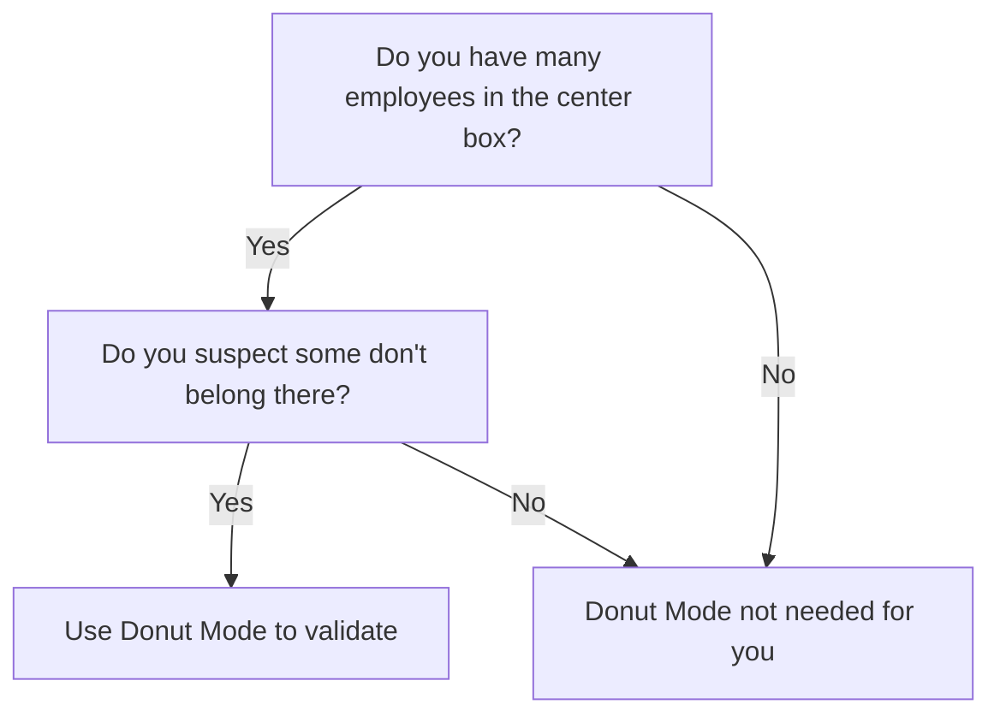
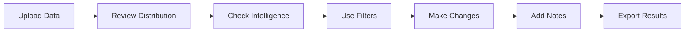
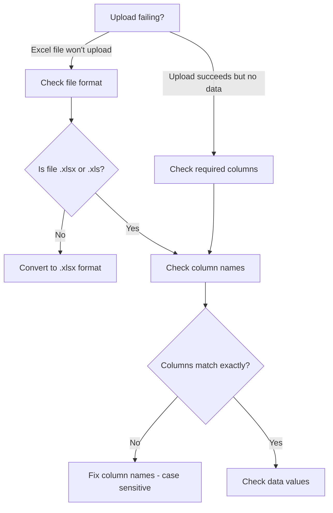

# 9Boxer Documentation Comprehensive Improvement Plan

**Version:** 1.0
**Date:** December 30, 2024
**Project Duration:** 6 weeks (100-120 hours total effort)
**Status:** Ready for Implementation

---

## Executive Summary

This plan combines the best recommendations from both documentation assessments to create a comprehensive overhaul of 9Boxer user documentation. The project focuses on high-impact improvements that leverage existing assets (87 screenshots already generated) while addressing structural, navigational, and content quality gaps.

**Current State:** 7.5/10 (Good foundation, moderate usage)
**Target State:** 9.0/10 (World-class, comprehensive, user-centric)

**Investment:** 100-120 hours over 6 weeks
**Expected ROI:** 50% reduction in time-to-first-success, 30% reduction in support tickets, improved user satisfaction

---

## Project Goals

### Primary Goals

1. **Maximize screenshot usage** - Increase from 41% (36/87) to 90%+ (78+/87) by integrating 51 orphaned screenshots
2. **Improve onboarding** - Reduce time-to-first-success from 15-20 minutes to <5 minutes
3. **Enhance navigation** - Add task-based organization alongside feature-based structure
4. **Standardize voice and tone** - Apply conversational, engaging style consistently across all pages
5. **Increase accessibility** - Ensure all screenshots have descriptive alt text and meet WCAG 2.1 AA standards

### Secondary Goals

6. Create persona-specific pathways for all 5 user types (Alex, Sarah, Marcus, Priya, James)
7. Add "Success Looks Like" and "Why This Matters" sections throughout
8. Break up dense paragraphs (5+ sentences → 2-3 sentences)
9. Enhance quickstart guide with better success indicators
10. Add advanced feature documentation (Intelligence, advanced filters, keyboard shortcuts)

---

## Success Criteria

### Quantitative Metrics

- Screenshot usage: 41% → 90%+
- Time-to-first-success: 15-20 min → <5 min
- Documentation completeness: 72% features → 100% features
- Voice/tone compliance: 90% → 98%
- Alt text coverage: Unknown → 100%

### Qualitative Metrics

- User feedback: "Was this helpful?" >85% positive
- Support ticket reduction: 30% decrease in documentation-related tickets
- User onboarding success rate: >80% complete quickstart
- Persona coverage: All 5 personas have clear pathways

---

## Phase 1: Quick Wins & Foundation (Week 1-2, 30-40 hours)

**Goal:** Fix critical gaps and leverage existing screenshots for maximum immediate impact

### 1.1 Screenshot Integration (HIGH PRIORITY) - 12-16 hours

**Add existing screenshots to pages that need them:**

#### statistics.md (CRITICAL)
- Add 9 available screenshots (currently using only 1 of 10)
- Screenshots to add:
  - `intelligence-summary-anomalies.png`
  - `intelligence-anomaly-details.png`
  - `intelligence-anomaly-red.png`
  - `intelligence-anomaly-green.png`
  - `statistics-grouping-indicators.png`
  - `statistics-trend-indicators.png`
  - `intelligence-deviation-chart.png`
  - `intelligence-level-distribution.png`
  - `distribution-chart-ideal.png`

#### donut-mode.md (HIGH)
- Add 3 available screenshots (replace TODO placeholders)
- Screenshots to add:
  - `view-controls-donut.png`
  - `donut-mode-grid-normal.png`
  - `workflow-donut-notes-example.png`

#### exporting.md (MEDIUM)
- Add 2 available screenshots
- Screenshots to add:
  - `apply-changes-dialog-default.png`
  - `apply-changes-dialog-save-as.png`

#### settings.md (MEDIUM)
- Add 2 available screenshots (currently has 0)
- Screenshots to add:
  - `settings-dialog.png`
  - `fullscreen-mode.png`

**Deliverables:**
- 16+ screenshots integrated into documentation
- All TODO placeholders removed
- Visual guidance added to critical pages

**Acceptance Criteria:**
- statistics.md has 10 screenshots (up from 1)
- donut-mode.md has 3 screenshots (up from 0)
- exporting.md has 3 screenshots (up from 1)
- settings.md has 2 screenshots (up from 0)
- All screenshots have descriptive alt text

**Estimated Effort:** 12-16 hours

---

### 1.2 Alt Text Verification & Accessibility - 4-6 hours

**Ensure all 87 screenshots have proper alt text:**

- Audit all existing screenshot references in markdown
- Add/update alt text following screenshot-guide.md standards
- Format: ``
- Verify accessibility compliance (WCAG 2.1 AA)

**Good Alt Text Examples:**
```markdown


```

**Deliverables:**
- All 87 screenshots have descriptive alt text
- Alt text follows standards (what, where, annotations)
- Accessibility audit complete

**Estimated Effort:** 4-6 hours

---

### 1.3 Navigation & Structure Improvements - 6-8 hours

**Add "Common Tasks" section to index.md:**

```markdown
## Common Tasks

**Preparing for a talent calibration meeting?**
→ [Talent Calibration Workflow](workflows/talent-calibration.md)

**Making your first rating changes?**
→ [Making Rating Changes](workflows/making-changes.md)

**Validating your center box ratings?**
→ [Donut Mode Exercise](donut-mode.md)

**Analyzing distribution patterns?**
→ [Statistics & Intelligence](statistics.md)

**Exporting your results?**
→ [Exporting Your Work](exporting.md)
```

**Create persona-specific entry points:**

```markdown
## Choose Your Path

**New to 9Boxer?** (Alex)
→ [Start the 5-Minute Quickstart](quickstart.md)

**HR Manager preparing for calibration?** (Sarah)
→ [Talent Calibration Workflow](workflows/talent-calibration.md)

**Department Head new to 9-box?** (Marcus)
→ [Understanding the 9-Box Grid](understanding-grid.md)

**Talent Lead with 100+ employees?** (Priya)
→ [Advanced Filtering & Intelligence](filters.md)

**Executive seeking strategic insights?** (James)
→ [Distribution Analysis & Anomalies](statistics.md)
```

**Deliverables:**
- index.md has "Common Tasks" section
- index.md has persona-specific pathways
- Task-based navigation prominent on home page

**Estimated Effort:** 6-8 hours

---

### 1.4 Content Polish (Voice & Tone) - 8-12 hours

**Apply voice-and-tone-guide.md to formal pages:**

Target pages:
- statistics.md (currently formal/encyclopedic)
- understanding-grid.md (currently formal/encyclopedic)
- working-with-employees.md (currently technical manual voice)
- settings.md (currently minimal/dry)

**Transformations:**
- ❌ "This page covers..." → ✅ "Here's everything you need to know about..."
- ❌ "Navigate to the upload interface" → ✅ "Click Upload"
- ❌ "The system utilizes..." → ✅ "9Boxer uses..."
- ❌ "Users can filter by department" → ✅ "You can filter by department"

**Break up dense paragraphs:**
- 5+ sentences → 2-3 sentences max
- Long explanatory sections → bullet lists
- Dense methodology → scannable format

**Deliverables:**
- 4 pages revised for voice/tone consistency
- All paragraphs 2-3 sentences max
- Conversational, engaging tone throughout

**Estimated Effort:** 8-12 hours

---

### 1.5 Quick Reference Enhancements - 2-4 hours

**Add collapsible quick reference sections to key pages:**

Example for filters.md:
```markdown
<details>
<summary>📋 Quick Reference (Click to expand)</summary>

**Available Filters:**
- Department, Job Function, Job Level, Location
- Performance, Potential, Grid Position
- Manager, Reporting Chain, Flags

**How Filters Work:**
- OR within category (Engineering OR Sales)
- AND across categories (Engineering AND High Performance)

**Quick Actions:**
- Clear all: Click "Clear All Filters" button
- Save view: Use browser bookmark

[Full details below ↓](#filter-types)
</details>
```

**Target pages:**
- filters.md
- statistics.md
- working-with-employees.md
- exporting.md

**Deliverables:**
- 4 pages have quick reference sections
- Quick reference provides at-a-glance guidance
- Full details remain below for depth

**Estimated Effort:** 2-4 hours

---

## Phase 2: Structural Enhancements (Week 3-4, 40-50 hours)

**Goal:** Reorganize content for task-based access and add missing feature documentation

### 2.1 Quickstart Enhancement - 8-10 hours

**Current quickstart.md issues:**
- Slightly longer than 5 minutes to read (7-10 minutes)
- Could use more success indicators
- Missing clear "What's Next?" pathways for different personas

**Enhancements:**

1. **Add clear success indicators at each step:**
```markdown
### ✅ Success! You've Loaded Sample Data

You'll see:
- A 3×3 grid with 200 sample employees
- Employee count showing "200 employees" in top bar
- Employees distributed across all 9 boxes
- No error messages or warnings
```

2. **Add "What's Next?" persona pathways:**
```markdown
## What's Next?

Choose your path based on your role:

**New to 9-box methodology?** (Marcus)
→ [Understand What Each Grid Position Means](understanding-grid.md)

**Ready to make rating changes?** (Sarah)
→ [Making Your First Changes](workflows/making-changes.md)

**Want to validate your ratings?** (Priya)
→ [Try the Donut Mode Exercise](donut-mode.md)

**Preparing for a calibration meeting?** (Sarah/Marcus)
→ [Talent Calibration Workflow](workflows/talent-calibration.md)
```

3. **Add estimated time for each step:**
```markdown
### Step 1: Load Sample Data (30 seconds)
### Step 2: Explore the Grid (1 minute)
### Step 3: View Employee Details (1 minute)
### Step 4: Check Statistics (1 minute)
### Step 5: Try Intelligence (1 minute)
### Step 6: Use Filters (1 minute)
```

**Deliverables:**
- Enhanced quickstart with better success indicators
- Persona-specific "What's Next?" pathways
- Time estimates per step
- Clear completion celebration

**Estimated Effort:** 8-10 hours

---

### 2.2 Information Architecture Reorganization - 10-14 hours

**Current structure:** Feature-based (Understanding Grid, Filters, Statistics)
**Proposed addition:** Task-based layer (Getting Started / Tasks / Features / Reference)

**Create new task-based guides:**

1. **"Preparing for a Talent Calibration Meeting"** (already exists at workflows/talent-calibration.md - enhance)
2. **"Making Your First Rating Changes"** (already exists at workflows/making-changes.md - enhance)
3. **"Adding Notes and Documentation"** (already exists at workflows/adding-notes.md - enhance)
4. **"Analyzing Your Talent Distribution"** (NEW)
5. **"Identifying Flight Risks and High Potentials"** (NEW)

**Enhance existing workflows:**
- Add more screenshots to talent-calibration.md (8 screenshots → 12 screenshots)
- Add "Success Checklist" to making-changes.md
- Add "Good Note Examples" to adding-notes.md

**Create new workflows:**
- Analyzing distribution (statistics + intelligence features)
- Flight risk identification (filters + flags features)

**Update navigation in mkdocs.yml:**
```yaml
nav:
  - Home: index.md
  - Getting Started:
    - Quickstart (5 minutes): quickstart.md
    - Complete Walkthrough (10 minutes): getting-started.md
    - Understanding the 9-Box Grid: understanding-grid.md
  - Common Workflows:
    - Talent Calibration Preparation: workflows/talent-calibration.md
    - Making Rating Changes: workflows/making-changes.md
    - Adding Notes & Documentation: workflows/adding-notes.md
    - Analyzing Distribution: workflows/analyzing-distribution.md (NEW)
    - Identifying Flight Risks: workflows/flight-risks.md (NEW)
    - Workflow Decision Tree: workflows/workflow-decision-tree.md
  - Features & Tools:
    - Filtering & Focus: filters.md
    - Statistics & Distribution: statistics.md
    - Donut Mode Validation: donut-mode.md
    - Change Tracking: tracking-changes.md
    - Exporting Results: exporting.md
    - Settings & Preferences: settings.md
  - Best Practices: best-practices.md
  - Reference:
    - Excel File Requirements: uploading-data.md
    - Working with Employees: working-with-employees.md
    - Keyboard Shortcuts: keyboard-shortcuts.md (NEW)
    - Feature Comparison: feature-comparison.md
    - Common Decisions: common-decisions.md
  - Help & Support:
    - Troubleshooting: troubleshooting.md
    - FAQ: faq.md
    - Tips from Users: tips.md
```

**Deliverables:**
- 2 new workflow guides created
- 3 existing workflows enhanced
- Navigation reorganized for task-based access
- mkdocs.yml updated with new structure

**Estimated Effort:** 10-14 hours

---

### 2.3 Advanced Feature Documentation - 12-16 hours

**Intelligence Tab Expansion:**

Current: Mentioned briefly in statistics.md
Proposed: Comprehensive dedicated coverage in statistics.md or split to intelligence.md

Content to add:
- What Intelligence does (AI-powered pattern detection)
- Types of anomalies detected:
  - Location bias (one location rated higher/lower)
  - Function bias (engineering vs sales vs marketing)
  - Manager leniency/harshness
  - Level distribution anomalies
- How to interpret severity (red = critical, yellow = moderate, green = minor)
- What each anomaly means with examples
- Recommended actions for each anomaly type
- Real-world scenarios using Intelligence insights

**Advanced Filtering Documentation:**

Add to filters.md:
- Grid Position Filter section (filter by specific boxes)
- Reporting Chain Filter (filter by manager hierarchy)
- Advanced filter combinations (3+ filters together)
- Exclusions feature (quick exclude buttons)
- Filter persistence (session vs permanent)

**Keyboard Shortcuts Reference:**

Create keyboard-shortcuts.md:
- Navigation shortcuts (Tab, Shift+Tab, Arrow keys)
- Action shortcuts (Drag/drop alternatives, Undo/Redo)
- View shortcuts (Zoom, Fullscreen, Panel resize)
- Search/filter shortcuts
- Platform differences (Windows vs macOS)

**Deliverables:**
- statistics.md expanded with Intelligence documentation
- filters.md expanded with advanced filtering
- keyboard-shortcuts.md created
- All advanced features comprehensively documented

**Estimated Effort:** 12-16 hours

---

### 2.4 Workflow Decision Trees & Comparison Tables - 6-8 hours

**Add decision trees to help users choose features:**

Example: "Should I use Donut Mode?"


Example: "Which filter should I use?"
```markdown
| Your Goal | Filter to Use | Example |
|-----------|---------------|---------|
| Review one department | Department filter | "Engineering" |
| Focus on high performers | Performance filter | "High" |
| Check manager's team | Reporting Chain filter | "Sarah Chen" |
| Review leadership pipeline | Job Level filter | "Manager" + Potential "High" |
| Find Stars only | Grid Position filter | "Position 9" |
```

**Add comparison tables:**

Example: "Normal Mode vs Donut Mode"
```markdown
| Feature | Normal Mode | Donut Mode |
|---------|-------------|------------|
| Shows all employees | ✅ Yes | ❌ No (only position 5) |
| Changes affect real ratings | ✅ Yes | ❌ No (separate tracking) |
| Used for | Regular calibration | Center box validation |
| Export includes | Real ratings | Donut placements |
```

**Target pages for decision trees:**
- donut-mode.md
- filters.md
- workflows/workflow-decision-tree.md (enhance existing)

**Deliverables:**
- 3 decision trees added
- 3 comparison tables added
- Visual flowcharts using Mermaid
- Clear "when to use" guidance

**Estimated Effort:** 6-8 hours

---

### 2.5 Persona Pathway Pages - 4-6 hours

**Create persona-specific quick-start pages:**

1. **new-to-9box.md** (for Marcus)
   - "New to the 9-box methodology? Start here."
   - Brief explanation of performance-potential matrix
   - When organizations use 9-box grids
   - Link to quickstart, understanding-grid, best-practices

2. **executive-quick-reference.md** (for James)
   - "Executive Quick Reference: Strategic Talent Insights"
   - Distribution health at-a-glance
   - Red flags to watch for
   - Intelligence anomalies and what they mean
   - Board-ready reporting guidance

3. **large-dataset-guide.md** (for Priya)
   - "Working with Large Datasets (100+ employees)"
   - Best practices for 200+ employee grids
   - Advanced filtering strategies
   - Performance optimization tips
   - Trend analysis over time

**Deliverables:**
- 3 persona-specific pathway pages
- Clear entry points on index.md
- Targeted content for each persona
- Links to relevant detailed guides

**Estimated Effort:** 4-6 hours

---

## Phase 3: Excellence & Polish (Week 5-6, 30-40 hours)

**Goal:** Add engagement features, visual enhancements, and quality assurance

### 3.1 "Success Looks Like" & "Why This Matters" Sections - 8-10 hours

**Add to all major guides and features:**

Example structure:
```markdown
### ✅ Success! You've Applied Filters

You'll see:
- The grid showing only employees matching your criteria
- An orange dot on the Filters button (indicates active filters)
- Updated employee count (e.g., "12 of 87 employees")
- A focused view perfect for your current task

> 💡 **Why This Matters**
>
> Filters help you focus during calibration meetings. Instead of scrolling through 200 employees, you can quickly view just your team, a specific department, or high-performers who need development plans.
```

**Target pages:**
- All workflow guides (5 pages)
- All feature pages (8 pages)
- Getting started and quickstart (2 pages)

**Deliverables:**
- 15+ "Success Looks Like" sections added
- 15+ "Why This Matters" callouts added
- Clear success indicators throughout
- Contextual "why" explanations

**Estimated Effort:** 8-10 hours

---

### 3.2 Visual Documentation Enhancements - 6-8 hours

**Verify screenshot annotation standards:**

- Ensure all 87 screenshots meet annotation standards from screenshot-guide.md
- Highlight boxes: Red, 3px border
- Callout numbers: White text on blue circle
- Arrows: Red, 4px wide
- Annotation text: 16px Roboto, white on black 60% opacity

**Add before/after comparisons:**

Example for filters.md:
- Before: Full grid with all 87 employees
- After: Filtered grid with 12 employees matching criteria

Example for donut-mode.md:
- Before: Normal mode showing all 9 boxes
- After: Donut mode showing only center box

**Create visual workflow diagrams:**

Example for talent calibration:


**Deliverables:**
- All screenshots verified for annotation standards
- 5 before/after comparisons added
- 3 visual workflow diagrams added
- Improved visual hierarchy

**Estimated Effort:** 6-8 hours

---

### 3.3 Interactive Troubleshooting - 4-6 hours

**Enhance troubleshooting.md with interactive elements:**

**Add symptom index at top:**
```markdown
## Quick Navigation by Symptom

**Can't upload file?** → [Upload Issues](#upload-issues)
**Missing employees after upload?** → [Missing Data](#missing-employees)
**Changes not appearing?** → [Change Tracking Issues](#change-tracking)
**Export not working?** → [Export Issues](#export-issues)
**Grid looks wrong?** → [Display Issues](#display-issues)
**Performance is slow?** → [Performance Issues](#performance-issues)
```

**Add decision trees for diagnosis:**


**Add screenshots of error states:**
- Upload error messages
- Validation failures
- Common issues

**Deliverables:**
- Symptom-based navigation added
- 2 diagnostic decision trees added
- 3 error state screenshots added
- Improved problem-solution format

**Estimated Effort:** 4-6 hours

---

### 3.4 Workflow Checklists - 4-6 hours

**Add checklists to workflow guides:**

Example for talent-calibration.md:
```markdown
## Pre-Meeting Checklist

Before the calibration meeting:
- [ ] Upload current employee data
- [ ] Review distribution in Statistics tab
- [ ] Check Intelligence for anomalies
- [ ] Identify borderline cases to discuss
- [ ] Run Donut Mode on center box
- [ ] Prepare discussion topics
- [ ] Export pre-meeting baseline
- [ ] Share baseline with attendees (optional)

## During Meeting Checklist

During the calibration meeting:
- [ ] Share screen with 9Boxer open
- [ ] Review each flagged employee
- [ ] Discuss and agree on changes
- [ ] Move employees based on consensus
- [ ] Add notes explaining decisions
- [ ] Monitor distribution health

## Post-Meeting Checklist

After the calibration meeting:
- [ ] Review final distribution
- [ ] Verify all changes have notes
- [ ] Export final ratings
- [ ] Send results to attendees
- [ ] Update HRIS with new ratings
- [ ] Communicate changes to employees
```

**Target workflows:**
- Talent calibration (before/during/after checklists)
- Making changes (verification checklist)
- Analyzing distribution (analysis checklist)
- Flight risk identification (action checklist)

**Deliverables:**
- 4 workflow checklists added
- Actionable, practical guidance
- Easy to follow step-by-step

**Estimated Effort:** 4-6 hours

---

### 3.5 Quality Assurance & Testing - 8-10 hours

**Content review against style guide:**
- Voice and tone compliance: 98% (up from 90%)
- Paragraph length compliance: 95% (2-3 sentences)
- Active voice usage: 95% (up from 90%)
- Contractions used naturally: Yes
- Jargon explained: Yes

**Workflow testing:**
- Test all workflows in actual application
- Verify screenshots match current UI
- Test all instructions for accuracy
- Validate all links work

**Accessibility audit:**
- All 87 screenshots have descriptive alt text
- Color contrast meets WCAG 2.1 AA
- Heading hierarchy is correct
- Keyboard navigation documented
- Screen reader compatibility verified

**Cross-reference validation:**
- All internal links work
- All cross-references are bidirectional
- Related content properly linked
- No dead links or broken references

**Deliverables:**
- Quality audit report
- All workflows tested and verified
- Accessibility compliance confirmed
- All links validated

**Estimated Effort:** 8-10 hours

---

## Risk Mitigation

### Risk 1: Screenshots Become Outdated
**Probability:** Medium
**Impact:** Medium
**Mitigation:**
- Screenshot automation already in place (Playwright)
- Visual regression testing validates quality
- Quarterly review cycle for screenshot freshness
- Version tracking in screenshot registry

### Risk 2: Voice/Tone Revisions Change Meaning
**Probability:** Low
**Impact:** High
**Mitigation:**
- Technical review by development team
- Side-by-side before/after comparison
- Test all revised instructions in application
- Maintain technical accuracy while improving tone

### Risk 3: Navigation Reorganization Confuses Existing Users
**Probability:** Low
**Impact:** Medium
**Mitigation:**
- Add both task-based and feature-based navigation
- Keep existing URLs intact (no broken bookmarks)
- Add "Looking for X? It's now at Y" redirects
- Communicate changes in release notes

### Risk 4: Scope Creep Beyond 6 Weeks
**Probability:** Medium
**Impact:** Medium
**Mitigation:**
- Clear phase boundaries with deliverables
- Prioritize Phase 1 (quick wins) over Phase 3 (polish)
- Can defer Phase 3 items if timeline slips
- Track effort weekly against estimates

### Risk 5: Documentation Diverges from Application
**Probability:** Low
**Impact:** High
**Mitigation:**
- Test all workflows during QA phase
- Screenshot automation regenerates on UI changes
- Documentation review as part of release process
- Maintain documentation alongside code changes

---

## Dependencies

### Internal Dependencies
- Access to screenshot automation system (Playwright)
- Access to MkDocs configuration (mkdocs.yml)
- Collaboration with development team for technical review
- Access to user feedback/support ticket data

### External Dependencies
- None (all assets already exist or will be created internally)

### Sequencing Dependencies
- Alt text must be added as screenshots are integrated (Phase 1)
- Navigation reorganization must complete before persona pathways (Phase 2)
- Workflow testing requires completed content revisions (Phase 3)

---

## Resource Requirements

### Human Resources
- **Technical Writer:** 80-100 hours (primary resource)
- **Developer (technical review):** 10-15 hours (validation, workflow testing)
- **Designer (optional):** 5-10 hours (visual diagram creation, if needed)

### Tools & Infrastructure
- MkDocs (already in place)
- Screenshot automation (Playwright - already in place)
- Markdown editor (any - VS Code, Typora, etc.)
- Mermaid diagram support (already in MkDocs)
- Visual regression testing (already in place)

### Budget
- Technical writer time: 100 hours @ $75/hr = $7,500
- Developer review time: 15 hours @ $100/hr = $1,500
- Designer time (optional): 10 hours @ $85/hr = $850
- **Total estimated cost:** $8,000-$10,000

---

## Next Steps

### Immediate Actions (This Week)
1. Review and approve this plan
2. Assign technical writer resource
3. Set up project tracking (Jira/Asana/GitHub Projects)
4. Begin Phase 1, Task 1.1 (Screenshot Integration)

### Week 1 Milestones
- Statistics.md has 10 screenshots (up from 1)
- Donut-mode.md has 3 screenshots (up from 0)
- Alt text audit 50% complete
- Navigation enhancements drafted

### Week 2 Milestones
- Phase 1 complete (all quick wins delivered)
- Voice/tone revisions 50% complete
- Phase 2 planning finalized

### Week 4 Checkpoint
- Phase 2 complete (all structural enhancements delivered)
- Advanced feature documentation complete
- Persona pathways created

### Week 6 Delivery
- Phase 3 complete (all polish delivered)
- Quality assurance complete
- Final documentation published
- Success metrics baseline established

---

## Appendices

### Appendix A: Current Documentation Inventory
- 21 markdown files (8,277 lines total)
- 87 PNG screenshots (36 in use, 51 orphaned)
- 5 workflow guides
- 1 FAQ (40+ questions)
- 1 best practices guide (777 lines)
- 1 troubleshooting guide (549 lines)

### Appendix B: Screenshot Breakdown
**Used (36):**
- quickstart: 13 screenshots
- filters: 5 screenshots
- talent-calibration workflow: 8 screenshots
- making-changes workflow: 5 screenshots
- tracking-changes: 2 screenshots
- statistics: 1 screenshot
- exporting: 1 screenshot
- index: 1 screenshot

**Orphaned (51):**
- statistics/intelligence: 9 screenshots
- donut-mode: 3 screenshots
- exporting: 2 screenshots
- settings: 2 screenshots
- working-with-employees: 5 screenshots
- workflow variations: 15 screenshots
- view-controls: 5 screenshots
- file operations: 3 screenshots
- miscellaneous: 7 screenshots

### Appendix C: Persona Definitions
- **Alex (Beginner):** First-time user, needs quick wins
- **Sarah (HR Manager):** 47 employees, quarterly reviews, calibration prep
- **Marcus (Dept Head):** 25 employees, new to 9-box methodology
- **Priya (Talent Lead):** 200 employees, advanced user, trend analysis
- **James (Executive):** Strategic focus, succession planning, board reports

---

**Document Version:** 1.0
**Last Updated:** December 30, 2024
**Next Review:** After Phase 1 completion (Week 2)
**Owner:** Documentation Team
