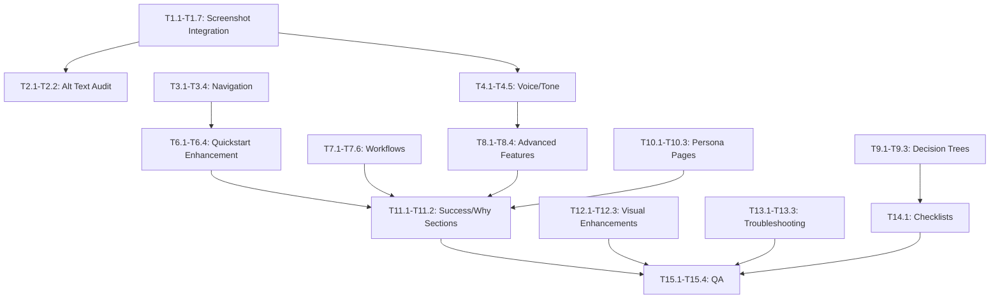

# 9Boxer Documentation: Detailed Task Breakdown

**Version:** 1.0
**Date:** December 30, 2024
**Total Tasks:** 38
**Total Estimated Effort:** 100-120 hours

---

## Task Index

| ID | Task Name | Phase | Priority | Effort | Owner |
|----|-----------|-------|----------|--------|-------|
| T1.1 | Add screenshots to statistics.md | 1 | CRITICAL | 4h | Writer |
| T1.2 | Add screenshots to donut-mode.md | 1 | HIGH | 2h | Writer |
| T1.3 | Add screenshots to exporting.md | 1 | MEDIUM | 1h | Writer |
| T1.4 | Add screenshots to settings.md | 1 | MEDIUM | 1h | Writer |
| T1.5 | Add screenshots to working-with-employees.md | 1 | MEDIUM | 2h | Writer |
| T1.6 | Add screenshots to troubleshooting.md | 1 | LOW | 1h | Writer |
| T1.7 | Add screenshots to best-practices.md | 1 | LOW | 1h | Writer |
| T2.1 | Audit all screenshot alt text | 1 | HIGH | 4h | Writer |
| T2.2 | Write missing alt text | 1 | HIGH | 2h | Writer |
| T3.1 | Add "Common Tasks" to index.md | 1 | HIGH | 2h | Writer |
| T3.2 | Add persona pathways to index.md | 1 | HIGH | 2h | Writer |
| T3.3 | Create hero CTA on index.md | 1 | MEDIUM | 1h | Writer |
| T3.4 | Reorganize index.md structure | 1 | MEDIUM | 1h | Writer |
| T4.1 | Apply voice/tone to statistics.md | 1 | HIGH | 3h | Writer |
| T4.2 | Apply voice/tone to understanding-grid.md | 1 | HIGH | 3h | Writer |
| T4.3 | Apply voice/tone to working-with-employees.md | 1 | MEDIUM | 2h | Writer |
| T4.4 | Apply voice/tone to settings.md | 1 | LOW | 1h | Writer |
| T4.5 | Break up dense paragraphs (all pages) | 1 | MEDIUM | 3h | Writer |
| T5.1 | Add quick reference to filters.md | 1 | MEDIUM | 1h | Writer |
| T5.2 | Add quick reference to statistics.md | 1 | MEDIUM | 1h | Writer |
| T5.3 | Add quick reference to working-with-employees.md | 1 | LOW | 1h | Writer |
| T5.4 | Add quick reference to exporting.md | 1 | LOW | 1h | Writer |
| T6.1 | Enhance quickstart success indicators | 2 | HIGH | 3h | Writer |
| T6.2 | Add persona "What's Next?" to quickstart | 2 | HIGH | 2h | Writer |
| T6.3 | Add time estimates to quickstart steps | 2 | MEDIUM | 1h | Writer |
| T6.4 | Test quickstart workflow | 2 | HIGH | 2h | Dev |
| T7.1 | Create "Analyzing Distribution" workflow | 2 | HIGH | 4h | Writer |
| T7.2 | Create "Identifying Flight Risks" workflow | 2 | MEDIUM | 4h | Writer |
| T7.3 | Enhance talent-calibration.md | 2 | MEDIUM | 2h | Writer |
| T7.4 | Enhance making-changes.md | 2 | MEDIUM | 2h | Writer |
| T7.5 | Enhance adding-notes.md | 2 | LOW | 2h | Writer |
| T7.6 | Update mkdocs.yml navigation | 2 | HIGH | 2h | Writer |
| T8.1 | Expand Intelligence documentation in statistics.md | 2 | CRITICAL | 6h | Writer |
| T8.2 | Expand advanced filtering in filters.md | 2 | HIGH | 4h | Writer |
| T8.3 | Create keyboard-shortcuts.md | 2 | MEDIUM | 3h | Writer |
| T8.4 | Document flags system in working-with-employees.md | 2 | MEDIUM | 3h | Writer |
| T9.1 | Create decision trees (3) | 2 | MEDIUM | 3h | Writer |
| T9.2 | Create comparison tables (3) | 2 | MEDIUM | 2h | Writer |
| T9.3 | Add Mermaid flowcharts (3) | 2 | MEDIUM | 3h | Writer |
| T10.1 | Create new-to-9box.md | 2 | MEDIUM | 2h | Writer |
| T10.2 | Create executive-quick-reference.md | 2 | MEDIUM | 2h | Writer |
| T10.3 | Create large-dataset-guide.md | 2 | LOW | 2h | Writer |
| T11.1 | Add "Success Looks Like" sections (15 pages) | 3 | HIGH | 5h | Writer |
| T11.2 | Add "Why This Matters" callouts (15 pages) | 3 | HIGH | 5h | Writer |
| T12.1 | Verify screenshot annotation standards | 3 | MEDIUM | 2h | Writer |
| T12.2 | Add before/after comparisons (5) | 3 | MEDIUM | 2h | Writer |
| T12.3 | Create visual workflow diagrams (3) | 3 | MEDIUM | 2h | Writer |
| T13.1 | Add symptom index to troubleshooting.md | 3 | HIGH | 2h | Writer |
| T13.2 | Add diagnostic decision trees to troubleshooting.md | 3 | MEDIUM | 2h | Writer |
| T13.3 | Add error state screenshots to troubleshooting.md | 3 | MEDIUM | 2h | Writer |
| T14.1 | Add checklists to 4 workflow guides | 3 | MEDIUM | 4h | Writer |
| T15.1 | Content review against style guide | 3 | HIGH | 3h | Writer |
| T15.2 | Workflow testing in application | 3 | CRITICAL | 4h | Dev |
| T15.3 | Accessibility audit | 3 | HIGH | 2h | Writer |
| T15.4 | Cross-reference validation | 3 | MEDIUM | 2h | Writer |

---

## Phase 1: Quick Wins & Foundation (Week 1-2)

### T1.1: Add Screenshots to statistics.md ⚠️ CRITICAL

**Priority:** CRITICAL
**Effort:** 4 hours
**Owner:** Technical Writer
**Dependencies:** None

**Description:**
Add 9 existing screenshots to statistics.md to provide visual guidance for Statistics and Intelligence features.

**Current State:**
- statistics.md has 1 screenshot
- 9 additional screenshots available but unused

**Target State:**
- statistics.md has 10 screenshots
- Full visual coverage of Statistics and Intelligence tabs

**Screenshots to Add:**
1. `intelligence-summary-anomalies.png` - Intelligence tab with anomalies highlighted
2. `intelligence-anomaly-details.png` - Detailed anomaly card
3. `intelligence-anomaly-red.png` - Critical severity anomaly example
4. `intelligence-anomaly-green.png` - Minor severity anomaly example
5. `statistics-grouping-indicators.png` - Statistics grouping options
6. `statistics-trend-indicators.png` - Trend indicators in statistics
7. `intelligence-deviation-chart.png` - Deviation chart visualization
8. `intelligence-level-distribution.png` - Level distribution chart
9. `distribution-chart-ideal.png` - Ideal distribution example

**Tasks:**
1. Review each screenshot to understand what it shows
2. Identify appropriate location in statistics.md for each screenshot
3. Add markdown image reference with descriptive alt text
4. Write 1-2 sentences before/after each screenshot explaining what users see
5. Test rendering in MkDocs preview
6. Verify all images display correctly

**Alt Text Examples:**
```markdown


```

**Acceptance Criteria:**
- [ ] All 9 screenshots added to statistics.md
- [ ] Each screenshot has descriptive alt text (20+ words)
- [ ] Screenshots placed in logical sections
- [ ] Contextual text explains what users see
- [ ] All images render correctly in MkDocs
- [ ] No broken image links

**Testing:**
- View statistics.md in MkDocs preview
- Verify images display at correct size
- Check alt text reads correctly
- Verify contextual text flows naturally

---

### T1.2: Add Screenshots to donut-mode.md ⚠️ HIGH

**Priority:** HIGH
**Effort:** 2 hours
**Owner:** Technical Writer
**Dependencies:** None

**Description:**
Replace "Screenshot to be added" placeholders in donut-mode.md with 3 existing screenshots.

**Current State:**
- donut-mode.md has TODO placeholders
- 3 screenshots available but not integrated

**Target State:**
- donut-mode.md has 3 screenshots showing donut mode activation, grid layout, and note examples
- All TODO placeholders removed

**Screenshots to Add:**
1. `view-controls-donut.png` - Donut Mode button highlighted
2. `donut-mode-grid-normal.png` - Grid showing only position 5 employees
3. `workflow-donut-notes-example.png` - Good note example in donut mode

**Acceptance Criteria:**
- [ ] All 3 screenshots added
- [ ] All TODO placeholders removed
- [ ] Descriptive alt text for each screenshot
- [ ] Images render correctly

---

### T1.3: Add Screenshots to exporting.md

**Priority:** MEDIUM
**Effort:** 1 hour
**Owner:** Technical Writer
**Dependencies:** None

**Description:**
Add 2 screenshots showing export dialog states to exporting.md.

**Screenshots to Add:**
1. `apply-changes-dialog-default.png` - Export dialog default state
2. `apply-changes-dialog-save-as.png` - Export dialog with Save As option

**Acceptance Criteria:**
- [ ] 2 screenshots added
- [ ] Descriptive alt text
- [ ] Contextual explanation

---

### T1.4: Add Screenshots to settings.md

**Priority:** MEDIUM
**Effort:** 1 hour
**Owner:** Technical Writer
**Dependencies:** None

**Description:**
Add 2 screenshots to settings.md (currently has 0 screenshots).

**Screenshots to Add:**
1. `settings-dialog.png` - Settings dialog showing theme options
2. `fullscreen-mode.png` - Fullscreen mode example

**Acceptance Criteria:**
- [ ] 2 screenshots added
- [ ] settings.md no longer has 0 screenshots
- [ ] Visual guidance provided

---

### T1.5: Add Screenshots to working-with-employees.md

**Priority:** MEDIUM
**Effort:** 2 hours
**Owner:** Technical Writer
**Dependencies:** None

**Description:**
Add 5 screenshots showing employee interactions and panel views.

**Screenshots to Add:**
1. `employee-tile-normal.png` - Normal employee tile
2. `employee-details-panel-expanded.png` - Full details panel view
3. `workflow-employee-modified.png` - Modified employee tile with orange border
4. `workflow-employee-timeline.png` - Timeline view
5. `working-with-employees/employee-details-panel-expanded.png` - Alternative panel view

**Acceptance Criteria:**
- [ ] 5 screenshots added
- [ ] Visual examples of all employee states
- [ ] Panel views documented

---

### T2.1: Audit All Screenshot Alt Text ⚠️ HIGH

**Priority:** HIGH
**Effort:** 4 hours
**Owner:** Technical Writer
**Dependencies:** T1.1-T1.7 (screenshot integration)

**Description:**
Audit all 87 screenshots to ensure they have proper, descriptive alt text following screenshot-guide.md standards.

**Process:**
1. Create spreadsheet inventory of all screenshots
2. List current alt text for each
3. Identify gaps (missing, vague, or insufficient alt text)
4. Prioritize screenshots by importance
5. Write new alt text for gaps

**Good Alt Text Structure:**
- What: What's shown in the image
- Where: Location in UI if relevant
- Annotations: Describe any callouts or highlights
- Minimum length: 20 words for complex screenshots

**Acceptance Criteria:**
- [ ] All 87 screenshots audited
- [ ] Spreadsheet inventory created
- [ ] Gaps identified and prioritized
- [ ] Alt text follows screenshot-guide.md standards

**Deliverable:**
- Screenshot Alt Text Audit spreadsheet (CSV/Excel)

---

### T2.2: Write Missing Alt Text ⚠️ HIGH

**Priority:** HIGH
**Effort:** 2 hours
**Owner:** Technical Writer
**Dependencies:** T2.1

**Description:**
Write descriptive alt text for all screenshots identified as missing or insufficient in T2.1.

**Acceptance Criteria:**
- [ ] All gaps from T2.1 filled
- [ ] 100% of screenshots have descriptive alt text
- [ ] Alt text tested with screen reader (if possible)

---

### T3.1: Add "Common Tasks" to index.md ⚠️ HIGH

**Priority:** HIGH
**Effort:** 2 hours
**Owner:** Technical Writer
**Dependencies:** None

**Description:**
Add a "Common Tasks" section to index.md with task-based navigation.

**Content to Add:**
```markdown
## Common Tasks

**Preparing for a talent calibration meeting?**
→ [Talent Calibration Workflow](workflows/talent-calibration.md)

**Making your first rating changes?**
→ [Making Rating Changes](workflows/making-changes.md)

**Validating your center box ratings?**
→ [Donut Mode Exercise](donut-mode.md)

**Analyzing distribution patterns?**
→ [Statistics & Intelligence](statistics.md)

**Exporting your results?**
→ [Exporting Your Work](exporting.md)

**Need help troubleshooting?**
→ [Troubleshooting Guide](troubleshooting.md)
```

**Acceptance Criteria:**
- [ ] "Common Tasks" section added
- [ ] 6 task-based links included
- [ ] Links tested and working
- [ ] Positioned prominently on page

---

### T3.2: Add Persona Pathways to index.md ⚠️ HIGH

**Priority:** HIGH
**Effort:** 2 hours
**Owner:** Technical Writer
**Dependencies:** None

**Description:**
Add persona-specific entry points on index.md for all 5 personas.

**Content to Add:**
```markdown
## Choose Your Path

**New to 9Boxer?** (Alex - Beginner)
→ [Start the 5-Minute Quickstart](quickstart.md)

**HR Manager preparing for calibration?** (Sarah)
→ [Talent Calibration Workflow](workflows/talent-calibration.md)

**Department Head new to 9-box?** (Marcus)
→ [Understanding the 9-Box Grid](understanding-grid.md)

**Talent Lead with 100+ employees?** (Priya)
→ [Advanced Filtering & Intelligence](filters.md)

**Executive seeking strategic insights?** (James)
→ [Distribution Analysis & Anomalies](statistics.md)
```

**Acceptance Criteria:**
- [ ] All 5 personas have pathways
- [ ] Persona names included in parentheses
- [ ] Links point to appropriate starting pages
- [ ] Section clearly labeled

---

### T4.1: Apply Voice/Tone to statistics.md ⚠️ HIGH

**Priority:** HIGH
**Effort:** 3 hours
**Owner:** Technical Writer
**Dependencies:** None

**Description:**
Revise statistics.md to apply voice-and-tone-guide.md standards (conversational, engaging, active voice).

**Current Issues:**
- Formal/encyclopedic tone ("This page covers...")
- Passive voice constructions
- Dense paragraphs (5+ sentences)
- Lacks "you" voice

**Transformations Needed:**
- ❌ "View comprehensive data analysis and insights..." → ✅ "Here's how to analyze your talent distribution..."
- ❌ "The Statistics tab displays..." → ✅ "The Statistics tab shows you..."
- ❌ "Distribution can be viewed..." → ✅ "You can view distribution..."

**Process:**
1. Read through entire statistics.md
2. Identify formal/passive sections
3. Rewrite in active, conversational voice
4. Break up 5+ sentence paragraphs
5. Add "Success Looks Like" sections
6. Add "Why This Matters" callouts
7. Technical review by developer

**Acceptance Criteria:**
- [ ] All passive voice converted to active
- [ ] "You/your" voice used throughout
- [ ] Paragraphs 2-3 sentences max
- [ ] Conversational tone maintained
- [ ] Technical accuracy verified
- [ ] Before/after comparison documented

**Estimated Lines Changed:** ~100-150 lines

---

### T4.2: Apply Voice/Tone to understanding-grid.md ⚠️ HIGH

**Priority:** HIGH
**Effort:** 3 hours
**Owner:** Technical Writer
**Dependencies:** None

**Description:**
Revise understanding-grid.md for conversational, engaging tone.

**Current Issues:**
- 441 lines (very long)
- Formal/educational tone
- Dense position descriptions

**Target:**
- More scannable structure
- Active, engaging voice
- Shorter paragraphs

**Acceptance Criteria:**
- [ ] Voice/tone applied throughout
- [ ] Dense paragraphs broken up
- [ ] Maintains educational value
- [ ] Technical accuracy verified

---

### T4.5: Break Up Dense Paragraphs (All Pages)

**Priority:** MEDIUM
**Effort:** 3 hours
**Owner:** Technical Writer
**Dependencies:** T4.1, T4.2, T4.3, T4.4

**Description:**
Systematically break up all paragraphs exceeding 5 sentences across all documentation pages.

**Target:** 2-3 sentences per paragraph max

**Process:**
1. Search all .md files for paragraphs >5 sentences
2. Identify natural breaking points
3. Split into 2-3 sentence chunks
4. Add bullet lists where appropriate
5. Verify flow and readability

**Acceptance Criteria:**
- [ ] 95% of paragraphs are 2-3 sentences
- [ ] Natural flow maintained
- [ ] Bullet lists added where helpful
- [ ] Content meaning unchanged

---

## Phase 2: Structural Enhancements (Week 3-4)

### T6.1: Enhance Quickstart Success Indicators ⚠️ HIGH

**Priority:** HIGH
**Effort:** 3 hours
**Owner:** Technical Writer
**Dependencies:** None

**Description:**
Add clear success indicators at each step of quickstart.md to build user confidence.

**Format:**
```markdown
### ✅ Success! You've [Completed Action]

You'll see:
- [Specific visual indicator 1]
- [Specific visual indicator 2]
- [Specific outcome 1]
- [Specific outcome 2]
```

**Locations:**
- After sample data load
- After exploring grid
- After viewing employee details
- After checking statistics
- After using Intelligence
- After applying filters

**Acceptance Criteria:**
- [ ] 6 success indicator sections added
- [ ] Checkmark emoji used (✅)
- [ ] Specific, verifiable success criteria listed
- [ ] Users can self-confirm completion

---

### T8.1: Expand Intelligence Documentation in statistics.md ⚠️ CRITICAL

**Priority:** CRITICAL
**Effort:** 6 hours
**Owner:** Technical Writer
**Dependencies:** T1.1, T4.1

**Description:**
Comprehensively document Intelligence feature in statistics.md (currently minimal).

**Content to Add:**

1. **What Intelligence Does** (200 words)
   - AI-powered pattern detection
   - Statistical analysis of distribution
   - Anomaly identification
   - When to use Intelligence insights

2. **Types of Anomalies** (400 words)
   - Location bias (one location rated higher/lower)
   - Function bias (engineering vs sales vs marketing)
   - Manager leniency/harshness
   - Level distribution anomalies
   - Each with example screenshot

3. **Severity Levels** (200 words)
   - Red (Critical - needs attention)
   - Yellow (Moderate - review recommended)
   - Green (Minor - informational)
   - What each severity means
   - How to prioritize

4. **Interpreting Anomalies** (300 words)
   - What "expected vs actual" means
   - How statistical significance is determined
   - When anomalies are false positives
   - Context matters (company size, industry)

5. **Recommended Actions** (400 words)
   - For each anomaly type, what to do
   - Location bias → Review hiring/promotion practices
   - Function bias → Examine role-specific standards
   - Manager leniency → Calibrate with peers
   - Level distribution → Check org structure

6. **Real-World Scenarios** (300 words)
   - Sarah discovers manager leniency
   - Priya identifies function bias
   - James spots succession risk
   - Each scenario with workflow

**Acceptance Criteria:**
- [ ] 1,800+ words of Intelligence documentation added
- [ ] All 4 anomaly types explained
- [ ] Severity levels documented with examples
- [ ] Recommended actions for each anomaly
- [ ] 3 real-world scenarios included
- [ ] 9 Intelligence screenshots integrated
- [ ] Technical accuracy verified by developer

**Estimated Addition:** ~100-120 lines

---

### T8.2: Expand Advanced Filtering in filters.md ⚠️ HIGH

**Priority:** HIGH
**Effort:** 4 hours
**Owner:** Technical Writer
**Dependencies:** None

**Description:**
Document advanced filtering features currently under-explained in filters.md.

**Content to Add:**

1. **Grid Position Filter** (150 words)
   - Filter by specific boxes (1-9)
   - Use cases: "Review only Stars", "Focus on bottom-left", "Compare middle boxes"
   - How to use (step-by-step)
   - Screenshot example

2. **Reporting Chain Filter** (200 words)
   - Filter by manager hierarchy
   - Use cases: View one manager's team, Compare managers
   - How to use
   - Example workflow

3. **Advanced Filter Combinations** (300 words)
   - Combining 3+ filters
   - Example: Engineering + High Potential + Manager level
   - Example: Sales + Position 5 + Not Excluded
   - Example: Specific location + Function + Performance level
   - Screenshots of complex filter combinations

4. **Exclusions Feature** (200 words)
   - Quick exclude buttons (Exclude VPs, Exclude Directors+)
   - Manage Exclusions dialog
   - When to exclude vs filter
   - How excluded employees appear
   - Re-including excluded employees

5. **Filter Persistence** (100 words)
   - Session vs permanent filters
   - Clearing all filters
   - Bookmark filtered views

**Acceptance Criteria:**
- [ ] All advanced filtering features documented
- [ ] 5 sections added (~950 words total)
- [ ] 4 screenshots added
- [ ] Real-world examples included
- [ ] Step-by-step instructions clear

**Estimated Addition:** ~60-80 lines

---

### T8.3: Create keyboard-shortcuts.md

**Priority:** MEDIUM
**Effort:** 3 hours
**Owner:** Technical Writer
**Dependencies:** Developer input for keyboard shortcuts inventory

**Description:**
Create comprehensive keyboard shortcuts reference page.

**Content Structure:**

```markdown
# Keyboard Shortcuts Reference

Quick access to 9Boxer using keyboard shortcuts.

## Navigation Shortcuts

| Shortcut | Action | Description |
|----------|--------|-------------|
| ++tab++ | Focus next element | Move focus to next UI element |
| ++shift+tab++ | Focus previous element | Move focus backward |
| ++arrow-up++ ++arrow-down++ | Navigate employees | Scroll through employee tiles |
| ++enter++ | Open details | Open employee details panel |
| ++esc++ | Close panel | Close details panel or dialog |

## View Shortcuts

| Shortcut | Windows/Linux | macOS | Action |
|----------|---------------|-------|--------|
| Fullscreen | ++f11++ | ++cmd+ctrl+f++ | Toggle fullscreen mode |
| Zoom in | ++ctrl+plus++ | ++cmd+plus++ | Increase grid zoom |
| Zoom out | ++ctrl+minus++ | ++cmd+minus++ | Decrease grid zoom |
| Reset zoom | ++ctrl+0++ | ++cmd+0++ | Reset zoom to 100% |

## Action Shortcuts

| Shortcut | Action | Description |
|----------|--------|-------------|
| ++f1++ | Open help | Open help menu |
| ++ctrl+s++ | Save/Export | Trigger Apply Changes dialog |
| ++ctrl+f++ | Open filters | Open filter drawer |

## Power User Tips

- Combine shortcuts: ++ctrl+f++ to open filters, ++tab++ to navigate, ++enter++ to select
- Grid navigation: ++arrow-up++ ++arrow-down++ ++arrow-left++ ++arrow-right++ to move between boxes
- Quick export: ++ctrl+s++ from anywhere
```

**Acceptance Criteria:**
- [ ] All keyboard shortcuts documented
- [ ] Organized by category (Navigation, View, Action)
- [ ] Platform differences noted (Windows vs macOS)
- [ ] MkDocs keyboard formatting used (++key++)
- [ ] Power user tips included
- [ ] Linked from Help menu and settings.md

---

## Phase 3: Excellence & Polish (Week 5-6)

### T11.1: Add "Success Looks Like" Sections (15 pages) ⚠️ HIGH

**Priority:** HIGH
**Effort:** 5 hours
**Owner:** Technical Writer
**Dependencies:** Phase 1 and 2 content complete

**Description:**
Add "Success Looks Like" sections to all major guides and feature pages.

**Format:**
```markdown
### ✅ Success! You've [Completed Action]

You'll see:
- ✅ [Specific visual indicator 1]
- ✅ [Specific visual indicator 2]
- ✅ [Specific outcome 1]
- ✅ [Specific outcome 2]
```

**Target Pages (15):**
1. quickstart.md (6 success sections)
2. getting-started.md (5 success sections)
3. filters.md (2 success sections)
4. statistics.md (2 success sections)
5. donut-mode.md (2 success sections)
6. working-with-employees.md (2 success sections)
7. tracking-changes.md (1 success section)
8. exporting.md (2 success sections)
9. workflows/talent-calibration.md (3 success sections)
10. workflows/making-changes.md (2 success sections)
11. workflows/adding-notes.md (1 success section)
12. workflows/analyzing-distribution.md (2 success sections - new)
13. workflows/flight-risks.md (2 success sections - new)
14. best-practices.md (1 success section)
15. troubleshooting.md (2 success sections)

**Acceptance Criteria:**
- [ ] 30+ success sections added across 15 pages
- [ ] Each success section has 3-5 specific indicators
- [ ] Checkmark emoji used (✅)
- [ ] Success criteria are verifiable by users

**Estimated Addition:** ~150-200 lines total

---

### T11.2: Add "Why This Matters" Callouts (15 pages) ⚠️ HIGH

**Priority:** HIGH
**Effort:** 5 hours
**Owner:** Technical Writer
**Dependencies:** Phase 1 and 2 content complete

**Description:**
Add "Why This Matters" callouts throughout documentation to provide contextual "why" explanations.

**Format:**
```markdown
> 💡 **Why This Matters**
>
> [1-2 sentences explaining real-world benefit and context]
```

**Example:**
```markdown
> 💡 **Why This Matters**
>
> Filters help you focus during calibration meetings. Instead of scrolling through 200 employees, you can quickly view just your team, a specific department, or high-performers who need development plans.
```

**Target:** 2-3 callouts per page across 15 major pages = 30-45 callouts

**Acceptance Criteria:**
- [ ] 30+ "Why This Matters" callouts added
- [ ] Each callout 1-2 sentences (20-40 words)
- [ ] Real-world benefit explained
- [ ] Contextual to surrounding content
- [ ] Lightbulb emoji used (💡)

**Estimated Addition:** ~60-90 lines total

---

### T15.2: Workflow Testing in Application ⚠️ CRITICAL

**Priority:** CRITICAL
**Effort:** 4 hours
**Owner:** Developer
**Dependencies:** All Phase 1-3 content revisions complete

**Description:**
Test all documented workflows in actual 9Boxer application to verify accuracy.

**Workflows to Test:**
1. Quickstart tour (5-7 minutes)
2. Getting started guide (10 minutes)
3. Upload workflow
4. Making changes workflow
5. Talent calibration workflow
6. Donut mode workflow
7. Filtering workflow
8. Statistics & Intelligence workflow
9. Exporting workflow
10. All advanced features

**Process:**
1. Open 9Boxer application
2. Follow each workflow step-by-step as documented
3. Verify UI matches screenshots
4. Verify instructions are accurate
5. Note any discrepancies
6. Report issues to technical writer
7. Re-test after fixes

**Acceptance Criteria:**
- [ ] All 10 workflows tested in application
- [ ] All instructions verified accurate
- [ ] All screenshots match current UI
- [ ] All discrepancies documented and fixed
- [ ] Testing report delivered

**Deliverable:**
- Workflow Testing Report (document discrepancies found)

---

### T15.3: Accessibility Audit ⚠️ HIGH

**Priority:** HIGH
**Effort:** 2 hours
**Owner:** Technical Writer
**Dependencies:** All Phase 1-3 content complete

**Description:**
Audit all documentation for accessibility compliance (WCAG 2.1 AA).

**Audit Checklist:**

**Alt Text:**
- [ ] All 87 screenshots have descriptive alt text
- [ ] Alt text describes what, where, and annotations
- [ ] Alt text is 20+ words for complex images

**Color Contrast:**
- [ ] Text meets 4.5:1 contrast ratio
- [ ] Links are distinguishable from text
- [ ] Color not sole method of conveying information

**Heading Hierarchy:**
- [ ] Heading levels sequential (no skipping h1→h3)
- [ ] Only one h1 per page
- [ ] Headings descriptive and meaningful

**Keyboard Navigation:**
- [ ] All interactive elements documented
- [ ] Keyboard shortcuts provided
- [ ] No keyboard traps

**Screen Reader Compatibility:**
- [ ] Test with screen reader (if possible)
- [ ] Verify alt text reads correctly
- [ ] Verify heading hierarchy makes sense

**Acceptance Criteria:**
- [ ] Accessibility audit checklist completed
- [ ] All issues documented
- [ ] All critical issues fixed
- [ ] WCAG 2.1 AA compliance achieved

**Deliverable:**
- Accessibility Audit Report

---

## Task Dependencies Diagram



---

## Assignee Recommendations

### Technical Writer (Primary Resource)
**Total Effort:** 80-100 hours

**Phase 1 Tasks:** T1.1-T1.7, T2.1-T2.2, T3.1-T3.4, T4.1-T4.5, T5.1-T5.4 (30-40 hours)
**Phase 2 Tasks:** T6.1-T6.3, T7.1-T7.6, T8.1-T8.4, T9.1-T9.3, T10.1-T10.3 (40-50 hours)
**Phase 3 Tasks:** T11.1-T11.2, T12.1-T12.3, T13.1-T13.3, T14.1, T15.1, T15.3, T15.4 (20-30 hours)

### Developer (Technical Review & Testing)
**Total Effort:** 10-15 hours

**Tasks:** T6.4, T15.2 (workflow testing, technical review)
**Additional:** Technical review of voice/tone revisions for accuracy

### Designer (Optional)
**Total Effort:** 5-10 hours

**Tasks:** T9.3, T12.3 (visual diagrams, Mermaid flowcharts)
**Note:** Technical writer can do this if designer unavailable

---

**Document Version:** 1.0
**Last Updated:** December 30, 2024
**Next Update:** Weekly during execution
