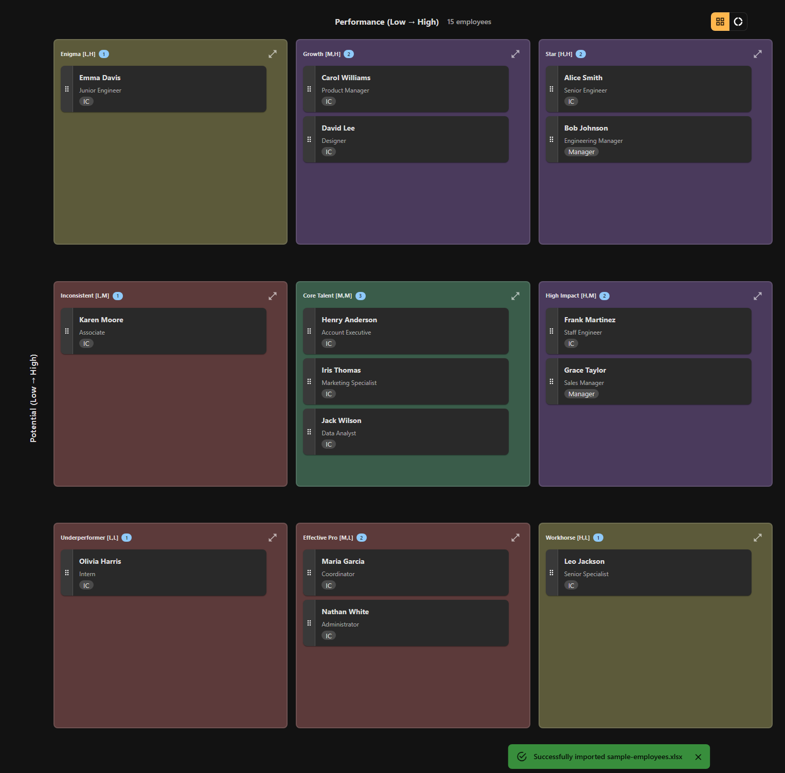

# Getting Started

Get up and running with 9Boxer in just a few minutes. This guide covers installation, first-time setup, and a quick 5-minute tour to familiarize you with the key features.

---

## Installation

### Installing the Application

1. **Download the installer** for your operating system:
   - Windows: `.exe` installer
   - macOS: `.dmg` installer
   - Linux: `.AppImage` installer

2. **Run the installer**
   - Double-click the downloaded file
   - Follow the on-screen installation prompts

3. **Handle security warnings** (if prompted):

!!! warning "Windows Security Warning"
    **Windows users** may see a "Windows protected your PC" security screen:

    1. Click **"More info"**
    2. Click **"Run anyway"**

    This warning appears because the app is not yet signed with a Microsoft certificate. 9Boxer is safe to run.

!!! warning "macOS Gatekeeper Warning"
    **macOS users** may see a "9Boxer can't be opened" message:

    1. Open **System Preferences** > **Security & Privacy**
    2. Click **"Open Anyway"** next to the 9Boxer message
    3. Confirm by clicking **"Open"**

    This warning appears because the app is not yet notarized with Apple. 9Boxer is safe to run.

4. **Launch the application**
   - Windows: Find 9Boxer in your Start Menu or desktop shortcut
   - macOS: Open 9Boxer from your Applications folder
   - Linux: Run the AppImage or find 9Boxer in your application menu

The application will start with an empty dashboard, ready for you to upload your employee data.

---

## Quick Tour: Your First 5 Minutes

Here's a guided walkthrough to help you get familiar with 9Boxer's key features.

### 1. Import Your Data (2 minutes)

**Click the "Upload" button** in the top application bar and select your Excel file containing employee data.

**Required columns** (case-sensitive):

- `Employee ID` - Unique ID for each person
- `Worker` - Full name
- `Performance` - Rating: Low, Medium, or High
- `Potential` - Rating: Low, Medium, or High

**Optional columns** for additional context:

- `Job Level - Primary Position` - Job level (e.g., IC, Manager, VP)
- `Business Title` - Job title or function
- `Manager` - Manager's name
- `Organization Name - Level 01` - Organizational hierarchy

!!! tip "Sample File Available"
    Don't have a file ready? Use the built-in sample file to explore 9Boxer:

    - Look for `Sample_People_List.xlsx` bundled with the application
    - This contains example employee data to help you learn the interface

Once uploaded, you'll see employee tiles arranged in a 3×3 grid based on their performance and potential ratings.

*Figure 1: The 9-box talent grid with employee tiles*

---

### 2. Arrange the Grid (1 minute)

**Drag and drop employees** between boxes to adjust their ratings:

1. **Click and hold** an employee tile
2. **Drag** to a different box on the grid
3. **Release** to drop the employee in the new position
4. **Notice** the tile turns yellow to indicate it's been modified

The **"Apply" button** in the top bar shows a badge with the count of how many changes you've made.

!!! note "Changes Are Not Saved Automatically"
    Remember: Changes are NOT saved until you click "Apply" and export the file!

---

### 3. Customize Your View (1 minute)

#### Using Filters

**Click the "Filters" button** in the top bar to focus on specific groups:

- Filter by job level, manager, department, or performance ratings
- Use "Manage Exclusions" to temporarily hide specific employees
- Quick filter buttons let you exclude VPs, Directors, or Managers with one click

The employee count updates to show how many are currently displayed vs. total.

#### Adjusting Theme Settings

**Click the "Settings" button** (gear icon) in the top bar to customize your experience:

**Theme Options:**

- **Light Mode** - Always use light theme
- **Dark Mode** - Always use dark theme
- **Auto (Follow System)** - Automatically match your system theme preferences

!!! tip "Theme Persistence"
    Your theme preference is saved automatically and will be remembered the next time you open 9Boxer.

---

### 4. View Employee Details and Insights (30 seconds)

**Click any employee tile** to open the right panel with four tabs:

- **Details** - Employee info, job level, manager, organizational hierarchy, and movement timeline
- **Changes** - Track all employee movements with notes on why changes were made
- **Statistics** - Distribution charts showing your talent spread across the grid
- **Intelligence** - Advanced analytics identifying patterns, anomalies, and rating biases

*Figure 2: Employee details panel with tabs*

---

### 5. Export Your Changes (30 seconds)

**Click the "Apply" button** to save your changes:

1. The button shows a badge with your change count
2. Click the button to download a new Excel file
3. File name format: `modified_[original_filename].xlsx`
4. The file downloads to your default download folder
5. Contains all employees with updated performance/potential ratings
6. Your original file remains unchanged

!!! warning "Important: No Auto-Save"
    Your changes are NOT auto-saved. Always export before closing the application to preserve your work!

---

## What's Next?

Now that you've completed the quick tour, here are some suggested next steps:

**Learn More About the Grid:**

- [Understanding the Grid](understanding-grid.md) - Detailed explanation of the 9-box grid positions and what they mean

**Explore Advanced Features:**

- [Donut Mode](donut-mode.md) - Validate center box placements with an interactive exercise
- [Working with Employees](working-with-employees.md) - View details, track history, and manage employee tiles
- [Tracking Changes](tracking-changes.md) - Document your rationale and review all movements
- [Filters](filters.md) - Advanced filtering techniques for large datasets
- [Statistics](statistics.md) - Understand distribution analysis and intelligence insights

**Prepare Your Data:**

- [Uploading Data](uploading-data.md) - Detailed Excel file requirements and troubleshooting upload errors

**Best Practices:**

- [Tips & Best Practices](tips.md) - Expert recommendations for effective talent reviews

---

## Quick Reference

### Keyboard Shortcuts

- ++esc++ - Close expanded grid box
- ++ctrl+f++ - Search (if filtering is open)

### Common Actions

| Action | How to Do It |
|--------|-------------|
| Upload file | Click "Upload" button in top bar |
| Move employee | Drag and drop employee tile to new box |
| View details | Click employee tile to open right panel |
| Filter view | Click "Filters" button in top bar |
| Change theme | Click "Settings" button (gear icon) in top bar |
| Export changes | Click "Apply" button in top bar |
| Expand a box | Click expand icon (⛶) on any box |
| Collapse expanded box | Click collapse icon (⛶) or press ++esc++ |

---

## Need Help?

- **Tooltips**: Hover over buttons and UI elements for helpful tooltips
- **Error Messages**: Read error messages carefully—they explain what went wrong and how to fix it
- **Troubleshooting**: Visit [Troubleshooting](troubleshooting.md) for solutions to common issues

---

**Ready to dive deeper?** Continue to [Understanding the Grid](understanding-grid.md) to learn about the 9-box positions and what they mean.
