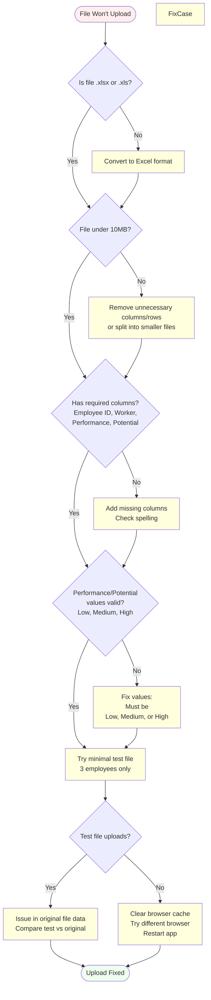
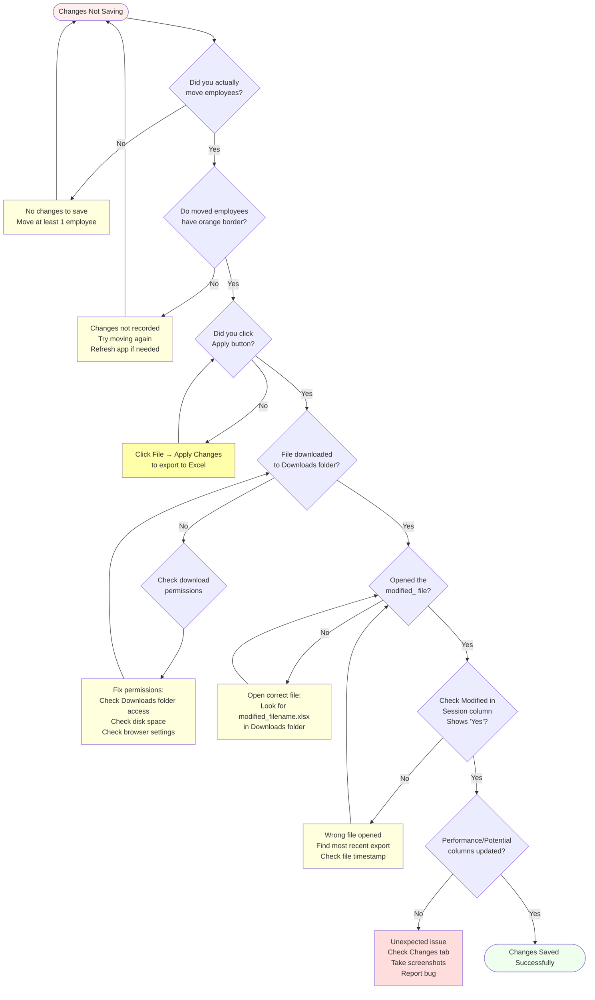
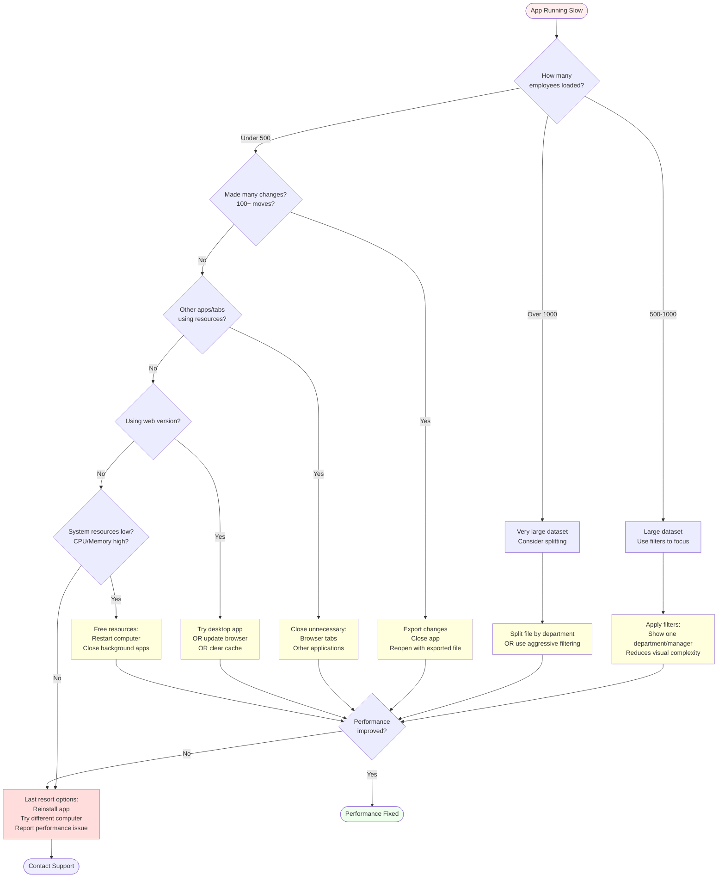

# Troubleshooting

Common issues and solutions for 9Boxer desktop application.

---

## Quick Navigation - Find Your Issue

**Data & Upload Issues:**

- [File won't upload](#file-wont-upload) - Wrong format, missing columns, invalid data
- [Missing required columns error](#3-required-columns-missing) - Column names don't match exactly
- [Invalid data values](#4-invalid-data-values) - Performance/Potential values incorrect
- [Empty grid after upload](#employees-dont-appear-after-upload) - Data uploaded but nothing displays
- [File too large error](#2-file-size) - Excel file exceeds 10MB limit

**Performance & Display:**

- [App running slow](#performance-is-slow) - Sluggish, laggy, unresponsive
- [Grid not displaying correctly](#grid-looks-wrong-or-incomplete) - Broken layout, overlapping tiles
- [Right panel won't open](#right-panel-wont-open) - Employee details not appearing

**Drag & Drop Issues:**

- [Can't drag employees](#cant-drag-employees) - Tiles won't move when dragging

**Saving & Exporting:**

- [Changes not in exported file](#changes-not-in-exported-file) - Changes made but not in export
- [Can't export/apply changes](#no-modifications-to-export) - No modifications to export error
- [Export failed error](#export-failed) - File won't download
- [Can't find exported file](#cant-find-exported-file) - Downloaded file missing
- [Missing columns in export](#export-is-missing-columns) - Expected columns not in Excel file

**Installation Issues:**

- [App won't start](#application-wont-start) - Nothing happens when launching
- [Windows security warning](#windows-security-warning) - SmartScreen blocks installation
- [macOS Gatekeeper warning](#macos-gatekeeper-warning) - Unidentified developer error

**Session & Data Management:**

- [Lost changes/session cleared](#lost-changes-session-cleared) - Work disappeared
- [Can't resume previous session](#cant-load-previous-session) - Want to continue from yesterday

---

## Diagnostic Decision Trees

Use these flowcharts to quickly diagnose and fix common issues.

### Data Won't Upload - Diagnostic Flow



### Changes Not Saving - Diagnostic Flow



### Performance Issues - Diagnostic Flow



---

## Installation Issues

### Application Won't Start

**Symptoms:**

- Application doesn't launch after installation
- Nothing happens when clicking the application icon
- Application crashes immediately on startup

**Solutions:**

1. **Check installation** - Ensure the app installed completely without errors
2. **Restart your computer** - Sometimes a restart is needed after installation
3. **Check antivirus** - Security software may be blocking the application
    - Add 9Boxer to your antivirus exceptions/whitelist
    - Temporarily disable antivirus to test if it's the issue
4. **Reinstall** - Uninstall and reinstall the application
    - Windows: Use "Add or Remove Programs" to uninstall
    - macOS: Move app to Trash, empty Trash, then reinstall
    - Linux: Use your package manager to remove, then reinstall

### Windows Security Warning

**Symptom:**

- During installation, Windows shows "Windows protected your PC" warning
- Message says "Microsoft Defender SmartScreen prevented an unrecognized app from starting"

**Why this happens:**

- The app is not yet signed with a Microsoft certificate
- This is a standard warning for unsigned applications

**Solution:**

1. Click **"More info"** link in the warning dialog
2. Click **"Run anyway"** button
3. Installation will proceed normally

::: info Security Note
This warning appears because the application is not code-signed. The application is safe to install and run. All code is open source and can be reviewed.

:::

### macOS Gatekeeper Warning

**Symptom:**

- macOS shows "cannot be opened because it is from an unidentified developer"
- App won't launch due to security settings

**Solution:**

1. **Right-click** (or Control-click) the app icon
2. Select **"Open"** from the context menu
3. Click **"Open"** in the security dialog
4. The app will launch and be whitelisted for future use

Alternatively, go to **System Preferences → Security & Privacy** and allow the app to run.

---

## File Upload Issues

### File Won't Upload

**Symptom:**

- Upload button doesn't work
- File selection dialog closes but nothing happens
- Error message after selecting file

**Check these common issues:**

#### 1. File Format

**Problem:** Wrong file format

**Solution:**

- File **MUST** be .xlsx or .xls (Excel format)
- **NOT supported:** .csv, .txt, .ods, .numbers, or other formats
- Convert your file to Excel format before uploading

#### 2. File Size

**Problem:** File too large

**Error message:** "File size must be less than 10MB"

**Solutions:**

- File must be **less than 10MB**
- If too large, remove unnecessary columns or rows
- Split into multiple smaller files if needed
- Remove embedded images or formatting

#### 3. Required Columns Missing

**Error messages:**

- "Missing required columns"
- "No sheet found containing employee data"

**Required columns:**

- `Employee ID`
- `Worker`
- `Performance`
- `Potential`

**Solutions:**

- Verify your Excel file has these column names
- Check for extra spaces in column names
- Ensure columns are in the first row (header row)

**Example of correct column names:**

```
Employee ID | Worker       | Performance | Potential
```

#### 4. Invalid Data Values

**Problem:** Performance/Potential columns contain invalid values

**Valid values:**

- `Low`
- `Medium`
- `High`

**Common mistakes:**

- `L`, `M`, `H` (abbreviations) - WRONG
- `1`, `2`, `3` (numbers) - WRONG

**Solution:** Ensure all Performance and Potential values are `Low`, `Medium`, or `High`

#### 5. Try a Minimal Test File

Create a minimal test file with just 3 employees to verify upload works:

```
Employee ID | Worker       | Performance | Potential
1           | John Doe     | High        | High
2           | Jane Smith   | Medium      | High
3           | Bob Johnson  | High        | Medium
```

If the minimal file uploads successfully, the issue is with your original file data.

---

## Display Issues

### Employees Don't Appear After Upload

**Symptoms:**

- Upload succeeds but grid is empty
- Employee count shows 0 or incorrect number
- Grid appears blank

**Solutions:**

1. **Check filters** - Look for an **orange dot** on the Filters button
    - Active filters may be hiding employees
    - Click Filters button and clear all selections
2. **Check exclusions** - Open "Manage Exclusions" in the Filters drawer
    - Some employees may be excluded
    - Uncheck all exclusions and apply
3. **Verify upload succeeded** - Did you see a success notification?
    - Green notification should appear after successful upload
    - Check browser console for errors
4. **Check employee count** - Does the top bar show employees (e.g., "150 employees")?
    - If count is 0, upload may have failed
    - If count is correct, employees may be filtered or excluded
5. **Restart and retry** - Close and reopen the application, then re-upload

### Grid Looks Wrong or Incomplete

**Symptoms:**

- Grid layout is broken
- Boxes missing or overlapping
- Employee tiles not displaying correctly

**Solutions:**

1. **Refresh** - Close and reopen the application
2. **Re-upload** - Upload your file again
3. **Check data** - Verify your Excel file has correct Performance/Potential values
    - All values must be: Low, Medium, or High
4. **Expand boxes** - Some boxes may be collapsed
    - Click the expand button (⛶ icon) on collapsed boxes
5. **Clear browser cache** (web version) - Clear cache and reload
6. **Update application** - Ensure you're running the latest version

### Right Panel Won't Open

**Symptoms:**

- Clicking employee tiles does nothing
- Details panel doesn't appear
- Panel is stuck closed

**Solutions:**

1. **Click the tile directly** - Click on the employee tile itself, not the box background
2. **Check filters** - Employee might be filtered out
    - Clear all filters and try again
3. **Try different employee** - Select a different employee tile
4. **Restart** - Close and reopen the application

---

## Drag and Drop Issues

### Can't Drag Employees

**Symptoms:**

- Clicking and holding on employee tile doesn't work
- Tiles won't move when dragging
- Drop doesn't register

**Solutions:**

1. **Click and hold** - Make sure you're clicking and holding (not just clicking)
    - Press and hold mouse button on the tile
    - Drag to desired box
    - Release mouse button to drop
2. **Wait for load** - Ensure the page is fully loaded before trying to drag
    - Wait for all employee tiles to appear
    - Check that no loading indicators are showing
3. **Click on the tile** - Make sure you're clicking on the employee tile itself
    - Don't click on the box background
    - Don't click on box headers
4. **Check browser compatibility** (web version) - Use a modern browser
    - Chrome, Edge, Firefox, Safari supported
    - Update to latest browser version
5. **Restart the app** - Close and reopen if dragging still doesn't work

---

## Export Issues

### "No modifications to export"

**Problem:** You haven't moved any employees yet

**Solution:** Drag at least one employee to a new box before clicking "Apply"

### "Export failed"

**Symptoms:**

- File menu "Apply Changes to Excel" clicked but file doesn't download
- Error message "Export failed"

**Possible causes:**

- Download folder is full
- No write permissions to download location
- Disk space issues
- Browser blocking download
- Original file is read-only or locked


When the original file can't be updated, 9Boxer automatically falls back to "Save to different file" mode to ensure your work is never lost.

**Solutions:**

1. **Check download folder** - Ensure your download folder has available space
2. **Check permissions** - Ensure you have write access to your download directory
    - Windows: Right-click download folder → Properties → Security
    - macOS: Check folder permissions in Get Info
3. **Free up disk space** - Delete unnecessary files to free space
4. **Try closing and reopening** - Restart the application and try again
5. **Check browser settings** (web version) - Ensure browser allows downloads
    - Check if download was blocked in browser address bar
6. **Remove read-only attribute** - If original file is read-only:
    - Windows: Right-click file → Properties → Uncheck "Read-only"
    - macOS: Get Info → Unlock file if locked
    - Or use the "Save to different file" option to create a new copy

### Can't Find Exported File

**Problem:** Export succeeded but can't locate the file

**Solutions:**

1. **Check default download folder**
    - Windows: `C:\Users\YourName\Downloads`
    - macOS: `/Users/YourName/Downloads`
    - Linux: `/home/yourname/Downloads`
2. **Search for file** - Search your computer for files starting with `modified_`
3. **Check browser download history** (web version)
    - View recent downloads in browser
    - Click to show in folder
4. **Check desktop** - File may have downloaded to desktop
5. **Try exporting again** - Export and watch where the file saves

### Export is Missing Columns

**Problem:** Expected columns are missing from export

**Possible causes:**

- Donut columns only appear if you used Donut Mode
- Columns may be hidden in Excel
- Export may be incomplete

**Solutions:**

1. **Check hidden columns** - Some columns may be hidden in Excel
    - Excel: Home → Format → Unhide Columns
    - Select all columns and unhide
2. **Verify Donut Mode usage** - Donut exercise columns only appear if you used Donut Mode
    - See [Donut Mode](donut-mode.md) for details
3. **Re-upload and export** - Try uploading your file and exporting again
4. **Check original file** - Ensure all original columns were in uploaded file

### Changes Not in Exported File

**Problem:** Changes made but not reflected in exported file

**Solutions:**

1. **Click "Apply"** - Export creates an Excel file with your changes
    - Look for the Apply button in the File menu
    - Badge shows number of changes to export
2. **Check download folder** - The exported file downloads to your default location
    - Look for files starting with `modified_`
3. **Verify changes were made** - Check the Changes tab to see tracked movements
    - If no changes appear, employees weren't moved
4. **Check permissions** - Ensure you have write access to download folder

---

## Performance Issues

### Performance is Slow

**Symptoms:**

- Application is sluggish or unresponsive
- Dragging is laggy
- Long load times

**Possible causes:**

- Large file with thousands of employees
- Many changes made in one session
- System resource limitations

**Solutions:**

1. **Large datasets** - Files with thousands of employees may load slowly
    - Use [filters](filters.md) to show fewer employees at once
    - Work on smaller subsets of data
2. **Many changes** - Hundreds of drag-and-drop operations can slow the app
    - Export your changes to save progress
    - Restart with the exported file to clear change tracking
3. **Export and restart** - If app is slow:
    - Export your changes
    - Close the application
    - Reopen and upload the exported file
    - Change tracking resets, improving performance
4. **Filter the view** - Use filters to show fewer employees
    - Focus on one department or level at a time
    - Reduce visual complexity
5. **Close other applications** - Free up system resources
    - Close unnecessary browser tabs (web version)
    - Close other applications using CPU/memory

---

## Session and Data Issues

### Lost Changes (Session Cleared)

**Symptom:** Changes disappeared or session was cleared

**Common causes:**

- Uploaded a new file (replaces current session)
- App crashed before changes were saved

**Prevention:**

- **Export frequently** - Save your work after major changes
- **Export before closing** - Always export before closing the app
- **Export before uploading new file** - Current session is replaced

::: tip Unsaved Changes Protection
9Boxer now warns you before you lose work! If you try to import new data or close the file with unsaved changes, you'll see a protection dialog:


- **Apply Changes** - Export your work first, then proceed
- **Discard Changes** - Lose all changes and proceed
- **Cancel** - Return to your session without losing anything

This protection ensures you don't accidentally lose hours of work!

:::

**Recovery:**

- If you lost changes, there is no recovery method
- Upload your most recent export and resume work

### Can't Load Previous Session

**Problem:** Want to resume work from a previous session

**How sessions work:**

- 9Boxer does NOT maintain persistent sessions
- Each upload starts a fresh session
- Changes are only saved when you export

**Solution:**

1. **Upload your most recent export** - Use the exported Excel file to resume
2. **The exported file becomes your new starting point**
3. **Make new changes and export again**

**Workflow:**

- Day 1: Upload `employees.xlsx`, make changes, export `modified_employees.xlsx`
- Day 2: Upload `modified_employees.xlsx` to continue from where you left off

---

## Testing with Sample Data

Not sure if it's a bug or a data issue? Sample data is your troubleshooting friend!

### When to Use Sample Data for Testing

**Load sample data to:**

- **Verify the app works correctly** - If sample data loads and behaves normally, the issue is likely with your data file
- **Test features safely** - Try drag-and-drop, filters, and Intelligence without affecting real data
- **Isolate the problem** - If sample data works but your file doesn't, compare file formats
- **Learn expected behavior** - See how features should work with clean, validated data

**How to load sample data:**

1. Open the **File menu** (top-left)
2. Select **"Load Sample Dataset..."**
3. Sample data replaces your current session (200 employees)
4. Test the feature you're having trouble with

If the feature works with sample data, check your Excel file format - see [Employee Data](employee-data.md) for requirements.

---

## Getting Help

### In-Application Help

- **Tooltips** - Hover over buttons and elements for helpful tooltips
- **Error messages** - Read error messages carefully; they usually explain the issue
- **Success notifications** - Green notifications confirm your actions

### Before Requesting Support

1. **Review this Troubleshooting guide** - Check common issues above
2. **Test with sample data** - Load sample data to verify the app works correctly
3. **Check your workflow** - Review [Getting Started](getting-started.md) for correct steps
4. **Verify Excel file requirements** - See [Employee Data](employee-data.md)
5. **Test with minimal file** - Try uploading a minimal 3-employee test file
6. **Check browser/system** - Ensure you're using a supported environment
    - Modern browser (Chrome, Edge, Firefox, Safari)
    - Sufficient disk space
    - Write permissions to download folder

### Support Resources

- **User Guide** - This documentation covers all features and workflows
- **Getting Started** - [Quick start guide](getting-started.md)
- **README.md** - Technical setup and development information (in project repository)
- **Submit issues** - Report bugs or request features in the project repository

### Providing Information for Support

When requesting help, include:

1. **Description of the problem** - What happened vs. what you expected
2. **Steps to reproduce** - Exact steps that led to the issue
3. **Error messages** - Any error messages displayed (screenshot if possible)
4. **File details** - Number of employees, file size, Excel version used
5. **Environment** - Operating system, browser (if web version), application version
6. **What you've tried** - Solutions you've already attempted

---

## Quick Troubleshooting Checklist

Use this checklist for quick diagnosis:

**Upload Issues:**

- [ ] File is .xlsx or .xls format (not .csv or .txt)
- [ ] File is less than 10MB
- [ ] File has required columns: `Employee ID`, `Worker`, `Performance`, `Potential`
- [ ] Performance/Potential values are: Low, Medium, High

**Display Issues:**

- [ ] Check for active filters (orange dot on Filters button)
- [ ] Check for exclusions (open Manage Exclusions)
- [ ] Verify employee count in top bar is correct
- [ ] Try refreshing/restarting the application

**Export Issues:**

- [ ] At least one employee was moved (check Changes tab)
- [ ] Clicked "Apply" button to trigger export
- [ ] Check default download folder for `modified_*.xlsx`
- [ ] Verify write permissions to download folder

**Performance Issues:**

- [ ] Filter the view to show fewer employees
- [ ] Export changes and restart with new file
- [ ] Close other applications to free resources

**Session Issues:**

- [ ] Export before closing to save work
- [ ] Export before uploading new file
- [ ] Upload most recent export to resume work

---

## Related Topics

- [Getting Started](getting-started.md) - Quick start guide and basic workflow
- [Employee Data](employee-data.md) - Excel file requirements and upload process
- [Exporting Your Changes](exporting.md) - Export process and troubleshooting
- [Best Practices](best-practices.md) - Best practices to avoid common issues
