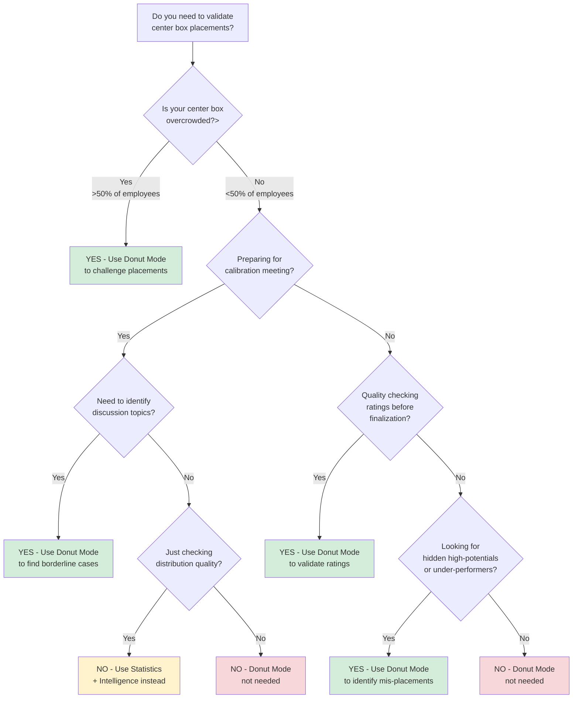

# Donut Mode Exercise

**Donut Mode** is a special exercise mode designed to validate that employees in the center "Core Talent" box truly belong there. The name comes from the visualization: you're looking at everyone in the center hole of the donut and asking, "Where would they go if they couldn't stay in the center?"

## When to Use This

### When Should I Use Donut Mode?

Use this decision tree to decide if Donut Mode is right for your situation:

**Quick decision guide:**

- **Yes, use Donut Mode if**: Center box >50%, preparing calibration, validating ratings, finding mis-placements
- **No, use alternatives if**: Just checking distribution (use Statistics), reviewing specific employees (use Filters)
- **When in doubt**: Try Donut Mode - it's exploratory and won't change actual ratings

### Common Scenarios

You'll want to use Donut Mode when:

- **Before calibration meetings** - Validate your center box placements to prepare discussion topics ([see Preparing for Talent Calibration](workflows/talent-calibration.md))
- **Center box is overcrowded** - Challenge the 65% of employees sitting "safely" in Medium/Medium to find hidden stars or under-performers
- **Quality checking ratings** - Ensure your Core Talent ratings are accurate and not just default placements
- **Identifying rising stars** - Find high-potential employees who may be under-rated in the center
- **Preparing for performance reviews** - Validate that all Medium/Medium ratings are truly justified

### Related Workflows

- [Preparing for Talent Calibration](workflows/talent-calibration.md) - Use Donut Mode to identify borderline cases and prepare calibration talking points
- [Understanding the Grid](understanding-grid.md) - Learn what Position 5 (Core Talent) means and when employees belong there

### Real-World Example

> 📋 **Scenario**
>
> David's Core Talent box has 45 employees - 65% of his workforce. During the Donut Exercise, he discovers 8 are actually High Potential and 5 are really just Solid Performers. This insight helps him recalibrate ratings and identify development opportunities before the quarterly talent review.

---

## What is the Donut Exercise?

The Donut Exercise is a talent management technique that helps identify:

- Employees who may be misplaced in the Core Talent box
- People who are on an upward trajectory (should be High Potential or Stars)
- People who may be slipping (should be Solid Performers or lower)
- Whether your center box is properly calibrated

!!! question "The Key Question"
    For each employee in the center box, if they couldn't be rated as "Medium Performance, Medium Potential," where would they actually belong?

## When to Use Donut Mode

Use Donut Mode during:

- **Talent calibration sessions** - Validate center box placements across teams
- **Performance review cycles** - Ensure Core Talent ratings are accurate
- **Succession planning** - Identify hidden stars or under-performers
- **Quality checks** - Verify your 9-box ratings are properly differentiated

## How to Activate Donut Mode

> 📋 **Real-World Scenario**
>
> Marcus's Core Talent box has 45 employees - 65% of his workforce. During the Donut Exercise, he discovers 8 are actually High Potential and 5 are really just Solid Performers. This insight helps him recalibrate ratings and identify development opportunities before the quarterly talent review.

!!! tip "Practice Donut Mode with Sample Data"
    Want to try this safely first? Load sample data (200 employees) and activate Donut Mode. You'll see a realistic center box population to practice with - experiment without affecting real performance data!

1. **Upload your employee data** as normal (or load sample data)
2. **Click the "Donut Mode" button** in the top application bar
    - Located next to the Filters button
    - Has a donut icon
3. **The grid changes** to show only employees currently in position 5 (Core Talent box)
4. **An "ACTIVE" indicator** appears next to the button showing donut mode is on

Click the Donut Mode button in the toolbar to activate the exercise. The button will turn purple and show an "ACTIVE" indicator when enabled.

**To deactivate:**

- Click the "Donut Mode" button again
- The grid returns to normal view showing all employees

## What Happens in Donut Mode

When you activate Donut Mode:

### Grid Changes

- Only employees in position 5 (Core Talent [M,M]) are displayed
- All other employees are temporarily hidden
- Box labels remain the same (you can still place people in any box)
- Drag-and-drop continues to work normally

### Visual Indicators

- "Donut Mode" button turns purple and shows "contained" style
- "ACTIVE" chip appears next to the button
- The employee count shows only position 5 employees

!!! warning "Key Principle"
    Donut placements are **separate from actual positions**. Moving someone in Donut Mode does NOT change their real performance/potential ratings. This is purely an exercise to explore "what-if" scenarios.

## Working in Donut Mode

### Placing Employees

1. **Review the employees** currently shown (all from position 5)
2. **Drag an employee** to where they would go if they couldn't be Medium/Medium:
    - Drag to position 9 (Stars) if they're actually high performers with potential
    - Drag to position 2 (Solid Performer) if they're really just meeting minimum standards
    - Place anywhere that reflects their true capability
3. **The employee's appearance changes** to show they've been "donut-placed":
    - Becomes semi-transparent (ghostly, 70% opacity)
    - Gets a purple border
    - Shows a purple "Donut" badge
4. **The placement is tracked** separately from their actual position

!!! tip "Important"
    - You can place employees in any box, including back to position 5 if you think they're correctly placed
    - Moving someone back to position 5 removes their donut placement (clears the exercise data)
    - You can move the same employee multiple times; only the final placement is tracked

### Visual Indicators in Donut Mode

When an employee has been placed in Donut Mode, they display:

**Ghostly Appearance**
: Semi-transparent (70% opacity) to indicate this is an exploratory placement
: Clearly distinguishable from regular employee tiles

**Purple Border**
: 2px solid purple border around the tile
: Distinct from the orange border used for regular modifications

**Purple "Donut" Badge**
: Small purple badge with "Donut" text
: Appears on the employee tile
: Confirms this is a donut exercise placement

**Position Label**
: Shows the donut position (e.g., "Donut: Star [H,H]")
: Italic text to differentiate from regular position labels

When Donut Mode is active, the grid filters to show only Core Talent (position 5) employees. All other boxes appear empty and dimmed, letting you focus exclusively on center box validation.

## Tracking Donut Changes

Donut Mode changes are tracked separately from regular changes to keep the exercise data isolated.

### When Donut Mode is Active

1. **Click the "Changes" tab** in the right panel
2. **You'll see two tabs:**
    - **Regular Changes** - Normal employee movements and notes
    - **Donut Changes** - Donut exercise placements and notes
3. **The "Donut Changes" tab** shows:
    - Employee name
    - Movement from Core Talent to their donut position
    - Notes field for documenting your reasoning
    - Count of donut placements in the tab label

The change tracker automatically:

- Adds an entry when you place someone in donut mode
- Updates the entry if you move them again (shows net change)
- Removes the entry if you move them back to position 5
- Keeps donut changes separate from regular changes

### When Donut Mode is Inactive

- You can still see the donut changes in the Changes tab if any exist
- This lets you review your donut exercise conclusions in normal mode
- Regular changes continue to track actual position changes

## Adding Notes to Donut Placements

Notes help you document why someone should (or shouldn't) be in the center box.

### To add a note:

1. **Open the Changes tab** in the right panel
2. **Switch to "Donut Changes" tab** (if not already selected)
3. **Click in the Notes field** for the employee
4. **Type your reasoning**:
    - "Actually exceeds expectations, should be High Performer"
    - "Struggling with recent projects, may need development"
    - "Ready for advancement, High Potential trajectory"
    - "Correctly placed in Core Talent"
5. **Click outside the field or press ++tab++** to save
    - Notes save automatically
    - No need to wait for confirmation

Good notes in Donut Mode explain your reasoning with specific evidence. This helps during calibration discussions and documents your thought process for future reference.

!!! tip "Note Tips"
    - Be specific about what makes them not-quite-center-box
    - Reference specific achievements or concerns
    - Document trajectory (improving vs. declining)
    - Note if they're correctly placed (confirms calibration)

## Switching Between Modes

You can toggle between Donut Mode and normal mode at any time.

### Toggling to Donut Mode

- Grid filters to position 5 employees only
- Employees with donut placements appear at their donut positions
- Donut visual indicators (ghostly, purple border, badge) appear
- Donut Changes tab becomes visible

### Toggling to Normal Mode

- Grid shows all employees
- All employees appear at their actual positions
- Donut visual indicators disappear
- Regular changes display normally
- Donut placements remain saved (not lost)

!!! warning "Placements Persist"
    - Donut placements are saved when you make them
    - They persist when you toggle modes on and off
    - They remain in your session until you upload a new file
    - They're included in your Excel export

!!! info "Important"
    When in normal mode, employees appear at their actual positions, NOT their donut positions. The donut placements are only visible when Donut Mode is active.

## Exporting Donut Data

When you export your changes (click "Apply" button), the Excel file includes donut exercise data in dedicated columns.

> 📋 **Real-World Scenario**
>
> After completing her Donut Exercise, Priya exports the results showing 15 employees she identified as under-rated high-potentials. She shares this file with department heads to discuss which employees should be moved from Core Talent to High Potential in the next calibration session. The separate donut columns let her show exploratory findings without changing actual ratings.

### Four New Columns Are Added

1. **Donut Exercise Position** - The position number (1-9) from the exercise
2. **Donut Exercise Label** - The box label (e.g., "Star [H,H]")
3. **Donut Exercise Change Description** - Formatted text like "Donut: Moved from Core Talent [M,M] to Star [H,H]"
4. **Donut Exercise Notes** - Your notes explaining the donut placement

### For Employees with Donut Placements

- All four columns are populated with their donut exercise data
- The regular performance/potential columns show their ACTUAL ratings (unchanged)
- This gives you both actual ratings and exercise findings side-by-side

### For Employees without Donut Placements

- The four donut columns are empty
- Only employees you placed in Donut Mode have donut data

### For Employees with Regular Changes

- Regular changes appear in "Modified in Session" and "9Boxer Change Notes" columns
- Donut changes appear in separate "Donut Exercise" columns
- You can have both regular and donut data for the same employee

This separation ensures:

- Actual talent ratings remain intact
- Exercise findings are clearly documented
- You can review donut conclusions without affecting real data
- Full audit trail of both actual and exploratory placements

Learn how donut exercise data appears in your exported file in the [Exporting Your Changes guide](exporting.md).

## Use Cases and Examples

### Example 1: Calibration Meeting

During a talent calibration session, you notice your Core Talent box has 45 employees - more than expected.

=== "Scenario"
    Your Core Talent box seems overcrowded with 45 employees. You suspect some ratings need adjustment.

=== "Process"
    1. **Activate Donut Mode** to see only those 45 employees
    2. **Review each one** and ask: "If they can't be Medium/Medium, where do they really belong?"
    3. **Place employees** at their true level:
        - 8 people → High Potential (they're actually exceeding)
        - 5 people → Solid Performers (just meeting minimums)
        - 32 people → Back to position 5 (correctly placed)
    4. **Add notes** explaining each decision
    5. **Export the results** to review with leadership

=== "Outcome"
    Use the findings to recalibrate actual ratings in a future session. You've identified 8 rising stars and 5 people who need development focus.

### Example 2: Identifying Hidden Stars

You suspect some Core Talent employees are actually rising stars.

=== "Scenario"
    Looking for high-potential employees who might be under-rated in the Core Talent box.

=== "Process"
    1. **Activate Donut Mode**
    2. **Look for patterns**:
        - Recent promotions
        - Consistently exceeding goals
        - Taking on leadership roles
    3. **Place high-performers** in High Potential or Stars boxes
    4. **Add notes** with evidence (projects, metrics, feedback)
    5. **Review Donut Changes tab** to see your "promoted" list

=== "Outcome"
    Export to create a development/succession plan. You've built a pipeline of future leaders.

### Example 3: Performance Review Validation

Before finalizing performance reviews, validate your center box.

=== "Scenario"
    You want to ensure all performance ratings are accurate before submitting final reviews.

=== "Process"
    1. **Activate Donut Mode** before submitting ratings
    2. **Challenge each placement**: Does this person truly belong in Core Talent?
    3. **Move anyone** who's borderline to their more accurate box
    4. **Document reasoning** in notes for each move
    5. **Review the findings** with managers

=== "Outcome"
    Adjust actual ratings based on donut exercise insights. You've improved rating accuracy and defensibility.

## Best Practices

### Before the Exercise

- Upload current employee data
- Ensure position 5 placements are up to date
- Have clear criteria for what "Core Talent" means
- Gather recent performance data

### During the Exercise

- Focus only on position 5 employees
- Ask: "Where would they go if not Medium/Medium?"
- Be specific in your notes
- Consider trajectory, not just current state
- Challenge assumptions about "safe" middle ratings

### After the Exercise

- Review the Donut Changes tab for all placements
- Look for patterns (many moving up? many moving down?)
- Discuss findings with stakeholders
- Export for documentation and reference
- Plan to address any significant discrepancies

## Tips for Effective Donut Exercises

!!! tip "Collaboration"
    1. **Do it with others** - Calibration meetings are ideal for donut exercises
    2. **Be honest** - The exercise only works if you're truthful about placements
    3. **Document everything** - Add notes for every placement, even "correctly placed"

!!! tip "Analysis"
    4. **Look for patterns** - If many people move to High Potential, your center box may be too broad
    5. **Use as validation** - Donut mode confirms (or challenges) your current ratings
    6. **Review before export** - Check the Donut Changes tab to ensure all notes are complete

!!! tip "Action"
    7. **Compare both views** - Toggle between modes to see actual vs. exercise placements
    8. **Act on findings** - Use donut insights to recalibrate actual ratings in a future session

## Common Findings and Interpretation

| Finding | Interpretation |
|---------|---------------|
| **Many move to High Potential** | Your "Core" bar may be too low |
| **Many move to Solid Performer** | You may be over-rating average performance |
| **Even split up and down** | Good differentiation, Core Talent is well-calibrated |
| **Most stay at position 5** | Either correct calibration or need to challenge more |

## How Donut Mode Differs from Regular Changes

| Aspect | Regular Mode | Donut Mode |
|--------|-------------|------------|
| **Purpose** | Update actual talent ratings | Validate center box placements |
| **Data Impact** | Changes performance/potential ratings | No impact on actual ratings |
| **Visual** | Full orange border for changes | Full purple border + "Donut" badge |
| **Tracking** | "Regular Changes" tab | "Donut Changes" tab (separate) |
| **Export** | Updates Performance/Potential columns | Separate "Donut Exercise" columns |
| **Persistence** | Changes saved to actual ratings | Exercise data saved separately |

## Related Topics

- [Understanding the Grid](understanding-grid.md) - Learn about the 9-box positions
- [Tracking Changes](tracking-changes.md) - How change tracking works
- [Working with Employees](working-with-employees.md) - Moving and managing employees
- [Exporting Your Changes](exporting.md) - How to export donut data
- [Statistics and Intelligence](statistics.md) - Analyze distribution patterns
