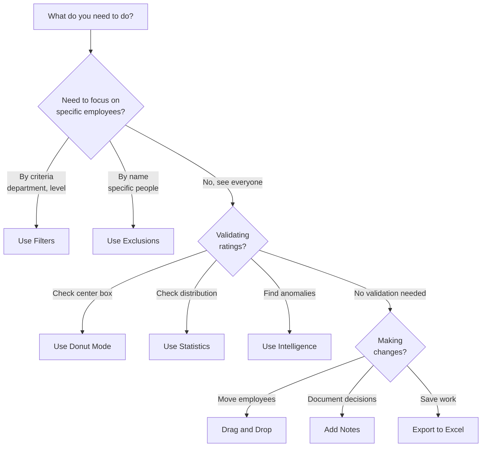

# Feature Comparison Guide

Which feature should you use? This guide helps you understand what each feature does and when to use it.

---

## Quick Feature Selector

---

## Feature Capabilities Comparison

### Focus & Filtering Features

| Feature | Best For | When to Use | When NOT to Use | Reversible? |
|---------|----------|-------------|-----------------|-------------|
| **[Filters](filters.md)** | Viewing specific groups by criteria | Review by department, job level, performance rating | When you need to see entire population | Yes, toggle on/off |
| **[Exclusions](filters.md#employee-exclusions)** | Hiding specific individuals | Remove outliers, people on leave, not yet rated | When you need criteria-based filtering | Yes, uncheck to restore |
| **[Search](working-with-employees.md)** | Finding one person quickly | Looking for a specific employee by name | When you want to see multiple people | N/A (instant) |

**Key Differences:**

- **Filters** = Hide groups based on attributes (all ICs, all Engineering, all High Performers)
- **Exclusions** = Hide specific named individuals (John Smith, Jane Doe)
- **Search** = Highlight one person temporarily

---

### Analysis & Validation Features

| Feature | Best For | When to Use | Output | Time Required |
|---------|----------|-------------|--------|---------------|
| **[Statistics](statistics.md)** | Checking overall distribution | Before calibration, quarterly reviews, ensuring balance | Distribution table and chart | 2 minutes |
| **[Intelligence](statistics.md#intelligence-tab)** | Finding rating anomalies | Spotting bias, identifying inconsistencies across managers | Anomaly alerts by location, function, level, tenure | 5 minutes |
| **[Donut Mode](donut-mode.md)** | Validating center box (position 5) | Quality-checking Core Talent placements, calibration prep | Exploratory placements, discussion topics | 15-20 minutes |

**Key Differences:**

- **Statistics** = Passive viewing of distribution data
- **Intelligence** = Active analysis highlighting problems
- **Donut Mode** = Interactive validation exercise

---

### Change & Documentation Features

| Feature | Purpose | What It Does | Where It's Saved |
|---------|---------|--------------|------------------|
| **[Drag & Drop](working-with-employees.md)** | Move employees to new positions | Updates Performance/Potential ratings | Browser session until export |
| **[Changes Tab](tracking-changes.md)** | Track all movements | Shows old → new position for all moves | Browser session until export |
| **[Notes](workflows/adding-notes.md)** | Document decisions | Adds text explanations for each change | Exported to Excel in "9Boxer Change Notes" column |
| **[Timeline](working-with-employees.md#viewing-employee-timeline)** | View rating history | Shows historical positions over time | Imported from Excel, updated by changes |
| **[Export](exporting.md)** | Save your work | Creates Excel file with updated ratings and notes | Downloads to your computer |

**Key Differences:**

- **Making changes** (drag & drop) vs. **Tracking changes** (Changes tab)
- **Regular changes** vs. **Donut changes** (exploratory, not real)
- **Session changes** (temporary) vs. **Exported changes** (permanent file)

---

## Common Decision Points

### "Should I use Filters or Exclusions?"

**Use Filters when:**

- ✅ You want to see a group (all managers, all high performers)
- ✅ You're reviewing by department or team
- ✅ You want to focus calibration on specific levels
- ✅ You need to compare groups (Engineering vs. Sales)

**Use Exclusions when:**

- ✅ You want to hide specific named individuals
- ✅ Someone is on leave or shouldn't be rated yet
- ✅ You need to remove outliers from analysis
- ✅ Certain people shouldn't be in calibration discussion

**Use Both when:**

- ✅ Filter to "All ICs" then exclude specific people on leave
- ✅ Focus on "High Performers" but exclude recent promotions not yet ready

---

### "Statistics vs. Intelligence vs. Donut Mode - which one?"

**Use Statistics when:**

- ✅ You want to see overall distribution at a glance
- ✅ Checking if your ratings are balanced
- ✅ Preparing reports for stakeholders
- ✅ Quick health check before calibration

**Use Intelligence when:**

- ✅ You suspect rating bias or inconsistencies
- ✅ You want to find specific anomalies automatically
- ✅ Comparing ratings across managers or departments
- ✅ Looking for patterns in the data

**Use Donut Mode when:**

- ✅ You think too many people are in the center box
- ✅ You want to validate Core Talent placements
- ✅ Preparing discussion topics for calibration
- ✅ You need to challenge "safe" middle ratings

**Use All Three when:**

- ✅ Preparing for calibration: Statistics (health check) → Intelligence (find problems) → Donut Mode (validate center)

---

### "When should I add Notes?"

**Always add notes when:**

- ✅ Making changes during calibration meetings
- ✅ Moving someone multiple positions (big change)
- ✅ Rating decisions that might be questioned later
- ✅ Performance concerns or succession planning decisions

**Consider adding notes when:**

- ✅ Correcting initial upload errors (explain what was wrong)
- ✅ Recent promotions or role changes
- ✅ Borderline ratings (why this box not another)

**Skip notes when:**

- ✅ Just exploring the app without making real decisions
- ✅ Practicing drag-and-drop to learn the interface
- ✅ Using Donut Mode for private validation (add Donut notes if needed)

**Pro tip:** When in doubt, add a note. Your future self will thank you!

---

### "Export now or wait?"

**Export immediately when:**

- ✅ You've finished your work session
- ✅ You need to share results with others
- ✅ Before uploading a new file
- ✅ After calibration meeting (capture decisions)

**Wait to export when:**

- ✅ You're still making changes
- ✅ You want to review your changes first
- ✅ You're experimenting and might undo everything

**Export multiple times when:**

- ✅ Long calibration session (save progress every 30 min)
- ✅ You want before/after comparison (export pre-meeting and post-meeting)
- ✅ Sharing with different stakeholders (different filters/views)

---

## Feature Combinations That Work Well Together

### Combo 1: Calibration Preparation

1. **Statistics** - Check overall distribution health
2. **Intelligence** - Find anomalies to discuss
3. **Filters** - Review one manager at a time
4. **Donut Mode** - Validate center box placements
5. **Notes** - Document discussion topics

**Purpose:** Prepare comprehensive talking points for calibration meeting

---

### Combo 2: Manager-Specific Review

1. **Filters** - Select one manager's direct reports
2. **Statistics** - See their team's distribution
3. **Intelligence** - Check if their ratings are outliers
4. **Drag & Drop** - Make rating adjustments
5. **Notes** - Document calibration decisions

**Purpose:** Review and calibrate one manager's team

---

### Combo 3: Succession Planning

1. **Filters** - Show only "High Potential" employees
2. **Statistics** - Confirm you have enough for pipeline
3. **Working with Employees** - Review individual details
4. **Notes** - Document development plans
5. **Export** - Create succession planning report

**Purpose:** Identify and plan for future leaders

---

### Combo 4: Quick Rating Updates

1. **Search** or **Filters** - Find the employees
2. **Drag & Drop** - Move to new positions
3. **Notes** - Explain the changes
4. **Export** - Save updated ratings

**Purpose:** Fast updates after performance reviews

---

## Comparison Tables

### Filters vs. Exclusions vs. Donut Mode

| Aspect | Filters | Exclusions | Donut Mode |
|--------|---------|------------|------------|
| **Purpose** | Focus on groups | Hide individuals | Validate center box |
| **When to Use** | Review specific teams, levels, ratings | Remove outliers, people on leave | Quality check position 5 |
| **What's Hidden** | Employees not matching criteria | Specific selected employees | Everyone except position 5 |
| **Affects Export?** | No (all data exported) | No (all data exported) | Donut placements in separate columns |
| **Reversible?** | Yes, clear filters | Yes, uncheck exclusions | Yes, toggle mode off |
| **Can Combine?** | Yes, with exclusions | Yes, with filters | No, shows only position 5 |

---

### Regular Changes vs. Donut Changes

| Aspect | Regular Changes | Donut Changes |
|--------|----------------|---------------|
| **Purpose** | Update actual ratings | Explore "what-if" scenarios |
| **Activated by** | Drag & drop in normal mode | Drag & drop in Donut Mode |
| **Visual Indicator** | Orange left border | Purple border + ghostly appearance |
| **Data Impact** | Changes Performance/Potential | No impact on actual ratings |
| **Export Column** | "Modified in Session" = Yes | "Donut Exercise" columns |
| **Notes Field** | "9Boxer Change Notes" | "Donut Exercise Notes" |
| **When to Use** | Making real rating decisions | Validating placements, prep work |

---

### Statistics vs. Intelligence

| Aspect | Statistics Tab | Intelligence Tab |
|--------|---------------|------------------|
| **What It Shows** | Distribution table and chart | Anomaly detection analysis |
| **Type of Analysis** | Descriptive (what is) | Diagnostic (what's wrong) |
| **Output** | Counts and percentages | Alerts and warnings |
| **Use For** | Overall health check | Finding specific problems |
| **Skill Level** | Beginner-friendly | Intermediate/Advanced |
| **Action Required** | None (just view) | Investigate flagged anomalies |

---

## Features by Use Case

### "I need to find specific employees"

| Goal | Best Feature | Why |
|------|-------------|-----|
| Find one person by name | **Search** | Instant, highlights the person |
| See all high performers | **Filters** (Performance: High) | Shows everyone meeting criteria |
| Review specific department | **Filters** (Org Chain/Department) | Focus on one team |
| Hide people on leave | **Exclusions** | Remove specific individuals |

---

### "I need to validate ratings"

| Goal | Best Feature | Why |
|------|-------------|-----|
| Check overall distribution | **Statistics** | Quick health check, visual chart |
| Find rating bias | **Intelligence** | Automated anomaly detection |
| Validate center box | **Donut Mode** | Dedicated validation exercise |
| Compare to targets | **Statistics** | See percentages vs. guidelines |

---

### "I need to make changes"

| Goal | Best Feature | Why |
|------|-------------|-----|
| Move employees | **Drag & Drop** | Simple, visual, immediate |
| Track what I changed | **Changes Tab** | Shows all movements in session |
| Document why I changed | **Notes** | Creates audit trail |
| See movement history | **Timeline** | Shows past ratings over time |

---

### "I need to prepare for a meeting"

| Goal | Best Feature | Why |
|------|-------------|-----|
| Identify discussion topics | **Intelligence** + **Donut Mode** | Find anomalies and validate center |
| Focus on one team | **Filters** | Review manager-by-manager |
| Create talking points | **Notes** | Document issues to discuss |
| Save baseline | **Export** | Capture pre-meeting state |

---

## Quick Reference: Feature Purpose

| Feature | In One Sentence | Learn More |
|---------|----------------|------------|
| **Filters** | Show only employees matching specific criteria | [Filters Guide](filters.md) |
| **Exclusions** | Hide specific named individuals | [Filters Guide](filters.md#employee-exclusions) |
| **Statistics** | View distribution table and chart | [Statistics Guide](statistics.md) |
| **Intelligence** | Find rating anomalies automatically | [Statistics Guide](statistics.md#intelligence-tab) |
| **Donut Mode** | Validate center box placements | [Donut Mode Guide](donut-mode.md) |
| **Drag & Drop** | Move employees to new positions | [Making Changes Guide](workflows/making-changes.md) |
| **Changes Tab** | See all movements in current session | [Tracking Changes Guide](tracking-changes.md) |
| **Notes** | Document reasons for rating changes | [Adding Notes Guide](workflows/adding-notes.md) |
| **Timeline** | View historical rating changes | [Working with Employees Guide](working-with-employees.md) |
| **Export** | Save changes to Excel file | [Exporting Guide](exporting.md) |

---

## Common Mistakes to Avoid

### ❌ Using Filters when you mean Exclusions

**Wrong:** Filtering to everyone except John Smith
**Right:** Use Exclusions to hide John Smith

### ❌ Using Donut Mode for real changes

**Wrong:** Making actual rating changes in Donut Mode
**Right:** Use Donut Mode for validation, then switch to normal mode to make real changes

### ❌ Forgetting to add Notes

**Wrong:** Making 20 changes without documentation
**Right:** Add notes explaining each significant change

### ❌ Not exporting before closing

**Wrong:** Making changes and closing the app (loses all work!)
**Right:** Export your changes before closing

### ❌ Using Intelligence without checking Statistics first

**Wrong:** Going straight to anomaly detection
**Right:** Check Statistics for overall health, then use Intelligence to find specific issues

---

## Need More Help?

**Workflow Guides:**

- [Choosing Your Workflow](workflows/workflow-decision-tree.md) - Comprehensive decision tree
- [Talent Calibration Workflow](workflows/talent-calibration.md) - Complete calibration process
- [Making Changes Workflow](workflows/making-changes.md) - Moving employees step-by-step

**Feature Guides:**

- [Filters & Exclusions](filters.md)
- [Statistics & Intelligence](statistics.md)
- [Donut Mode](donut-mode.md)
- [Working with Employees](working-with-employees.md)
- [Exporting Results](exporting.md)

**General Help:**

- [Troubleshooting](troubleshooting.md) - Common issues and solutions
- [Tips & Best Practices](tips.md) - Expert recommendations

---

**[← Back to Home](index.md)**
