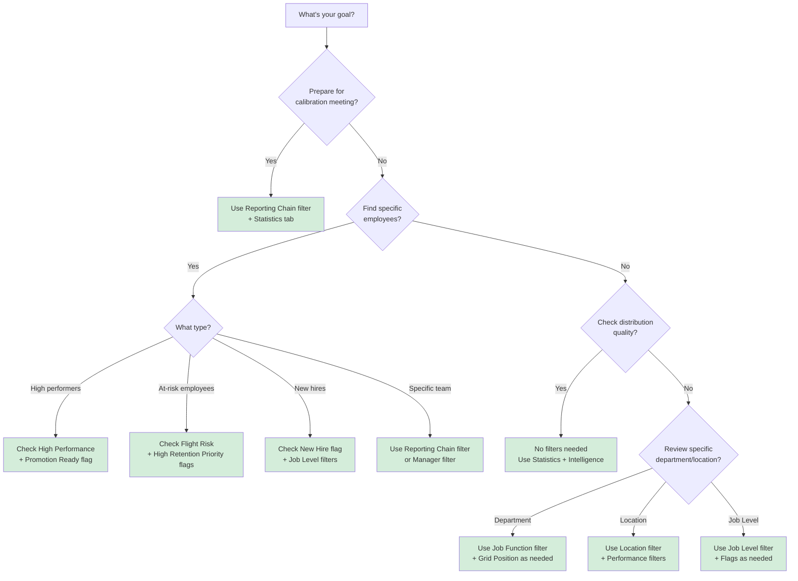

# Filtering and Exclusions

Focus on specific groups of employees using filters and exclusions. These tools help you narrow your view without changing or deleting any data.

---

📋 Quick Reference (Click to expand)

**Applying Filters:**
- Click Filters button → Check desired criteria → Grid updates automatically
- Active filters show orange dot on Filters button
- Employee count shows "X of Y employees" (X = visible, Y = total)
- Click outside drawer to close

**Common Filter Combinations:**
- Focus on department: Click manager name to activate Reporting Chain filter
- View at-risk employees: Check "Flight Risk" flag
- Find promotion candidates: Check "Promotion Ready" flag
- Review manager's team: Select specific Manager name or use Reporting Chain filter
- Critical retention: Combine "Flight Risk" + "High Retention Priority" flags

**Managing Exclusions:**
- Click Filters → Manage Exclusions → Check individuals to hide
- Quick buttons: Exclude VPs, Exclude Directors+, Exclude Managers
- Excluded employees hidden from grid but included in exports

**Clearing Filters:**
- Uncheck all boxes individually OR click "Clear All" button
- Exclusions persist during session but clear on new upload

[See detailed instructions below ↓](#using-filters)

---

## Which Filter Should I Use?

Use this decision tree to find the right filter for your goal:

**Common filter combinations:**

- **Calibration prep**: Reporting Chain (your org) + Flagged for Discussion
- **Find high-potentials**: Grid Position (6, 8, 9) + Job Level (MT1-MT2)
- **Retention focus**: Flight Risk + High Retention Priority + High Performance
- **Promotion planning**: Promotion Ready + Job Function (specific department)
- **New hire review**: New Hire flag + Performance filters (check onboarding success)

---

## Using Filters

Filters let you display only employees who match specific criteria. All other employees are temporarily hidden from the grid.

> 📋 **Real-World Scenario**
>
> Sarah is preparing for her quarterly talent review meeting. She has 47 employees but only needs to discuss the 12 in her direct team. She uses the **Department** filter to focus on just her team, making the meeting prep much faster.

### Opening the Filter Drawer

1. Click the **"Filters"** button in the top application bar
2. The filter drawer opens on the left side of the screen
3. Filter options appear organized by category

The filter drawer gives you every option to narrow your view. Categories are organized logically with checkboxes for easy selection.

!!! note "Why This Matters"
    Filters help you focus during calibration meetings. Instead of scrolling through 200 employees, you can quickly view just your team, a specific department, or high-performers who need development plans.

### Available Filter Categories

You can filter employees by:

| Filter Category | Options | Description |
|----------------|---------|-------------|
| **Job Levels** | MT1-MT6 | Employee job level or grade |
| **Job Functions** | Engineering, Product, etc. | Job function or department |
| **Locations** | USA, Europe, India, etc. | Employee location |
| **Managers** | Manager names | Direct manager |
| **Flags** | 8 flag types | Special status indicators (PIP, Flight Risk, etc.) |
| **Reporting Chain** | Manager hierarchy | Filter by entire management chain |
| **Exclusions** | Individual employees | Hide specific employees from view |

### Filter Types Comparison

Choose the right filter type based on your analysis needs:

| Filter Type | Best For | Scope | Use When | Example |
|------------|----------|-------|----------|---------|
| **Performance** | Rating-based analysis | All employees with specific performance level | Reviewing all high/medium/low performers | Find all High Performance employees for bonus planning |
| **Flags** | Status-based targeting | Employees with special status markers | Finding specific employee groups (at-risk, ready for promotion) | Identify Flight Risk + High Retention Priority for stay conversations |
| **Reporting Chain** | Org hierarchy review | All direct + indirect reports | Reviewing entire department or management chain | See everyone reporting up to VP of Engineering |
| **Manager** | Direct team focus | Only direct reports | Focusing on one manager's team | Review only Sarah's 12 direct reports |
| **Job Level** | Career level analysis | Employees at specific grades | Analyzing ICs vs managers, or specific leadership levels | Compare all MT1 (ICs) vs MT3 (Senior Managers) |
| **Job Function** | Department comparison | Employees in specific function | Reviewing department-specific talent | Engineering calibration session focusing only on engineers |
| **Location** | Geographic analysis | Employees at specific sites | Regional reviews or location-based planning | Review USA employees separately from Europe team |
| **Grid Position** | Performance/potential combo | Employees in specific 9-box positions | Targeted review of specific talent segments | Find all Position 9 (Stars) for succession planning |

!!! tip "Try Filters with Sample Data"
    In the [quickstart tour](quickstart.md), you filtered by USA location. Sample data has 8 locations and 8 functions - perfect for exploring filter combinations! Load sample data to practice filtering by department, location, or flags.

### How Filtering Works

> 📋 **Real-World Scenario**
>
> Marcus manages 25 people across three teams. During his quarterly review, he uses the **Department** filter to review each team separately. This helps him focus the discussion and compare employees within the same context.

**Applying Filters:**

1. Check the boxes for the criteria you want to see
2. The grid updates automatically as you make selections
3. Only employees matching your selected criteria remain visible
4. Click outside the drawer or press the **Filters** button again to close

**Filter Logic:**

- **Within a category** (OR logic): Show employees matching ANY of the selected options
    - Example: Selecting "High" and "Medium" performance shows employees with either rating
- **Across categories** (AND logic): Show employees matching ALL selected categories
    - Example: Selecting "High Performance" AND "Manager" job level shows only high-performing managers

!!! tip "Filter Combinations"
    You can combine multiple filters to drill down to very specific groups. For example, filter by "High Potential" + "IC" + "Engineering" to see all high-potential individual contributors in engineering.

### Active Filter Indicators

When filters are active, you'll see:

- **Orange dot** on the Filters button (shows filters are applied)
- **Employee count** displays "X of Y employees" format
    - **X** = number of employees currently displayed
    - **Y** = total employees in your dataset
- **Filtered-out employees** are hidden from the grid (not deleted)

!!! example "Example Filter Indicator"
    "45 of 150 employees" means 45 employees match your current filters out of 150 total.

### Clearing Filters

To remove filters and show all employees again:

- **Uncheck all filter boxes** individually, or
- **Click "Clear All"** button (if available in the filter drawer)

The grid returns to showing all employees.

### Success! You've Applied Filters

You'll see:
- The grid showing only employees matching your criteria
- An orange dot on the Filters button
- The employee count updated (e.g., "12 of 47 employees")
- A focused view perfect for your current task

### Filtering by Flags

Flags mark employees with special status indicators like Performance Improvement Plans (PIP), flight risk, promotion readiness, or succession candidates. You can filter employees by these flags to focus on specific groups.

Each flag shows the count of employees with that status. Check multiple flags to combine criteria and find specific employee groups.

**Available Flags:**

- **Promotion Ready** - Employees ready for promotion
- **Succession Candidate** - Identified succession candidates
- **High Retention Priority** - Critical retention focus
- **Flight Risk** - At risk of leaving
- **Flagged for Discussion** - Requires manager attention
- **New Hire** - Recently joined employees
- **Ready for Lateral Move** - Ready for horizontal moves
- **PIP** - Performance Improvement Plan

**How to use:**

1. Open the filter drawer
2. Expand the **Flags** section (🏷️ icon)
3. Check the boxes for the flags you want to filter by
4. The count next to each flag shows how many employees have that flag
5. The grid updates to show only employees with the selected flags

!!! tip "Flag Combinations"
    You can select multiple flags at once. For example, select both "Flight Risk" and "High Retention Priority" to see employees who need immediate retention action.

!!! note "Why This Matters"
    Flag filtering lets you instantly identify employees needing specific actions. Combine "Flight Risk" + "High Retention Priority" to see exactly who needs stay conversations before they leave.

### Filtering by Reporting Chain

The reporting chain filter lets you view all employees who report up to a specific manager, including both direct and indirect reports. This is useful for reviewing an entire department or organizational hierarchy.

When a reporting chain filter is active, you see everyone who reports up to that manager. Click the X to clear and return to the full view.

**How to activate:**

1. Click on any manager's name in an employee's **Details Panel**
2. The reporting chain filter activates automatically
3. A green chip appears showing "Reporting to: [Manager Name]"
4. The grid updates to show only employees in that manager's reporting chain

**How to clear:**

- Click the **X** button on the reporting chain filter chip

!!! info "Reporting Chain vs Manager Filter"
    - **Manager filter** shows only direct reports
    - **Reporting chain filter** shows all direct AND indirect reports through the entire hierarchy

### Success! You've Activated Reporting Chain Filter

You'll see:
- A green chip showing "Reporting to: [Manager Name]"
- The grid filtered to show only that manager's org
- Employee count showing the team size
- Quick access to department-level review

### Advanced: Filtering by Grid Position

You can filter employees based on which specific box they currently occupy in the 9-box grid. This is perfect for reviewing specific performance/potential combinations.

**Grid Position Numbers:**

| | Low Potential | Medium Potential | High Potential |
|-|---------------|------------------|----------------|
| **High Performance** | Position 7 | Position 8 | Position 9 (Stars) |
| **Medium Performance** | Position 4 | Position 5 (Core Talent) | Position 6 |
| **Low Performance** | Position 1 | Position 2 | Position 3 |

**How to use Grid Position filters:**

1. Open the filter drawer
2. Select **Grid Position** category
3. Check boxes for the specific positions you want to review
4. Grid shows only employees in those positions

**Common Use Cases:**

- **Review only Stars** (Position 9) - Focus on top talent for succession planning
- **Compare middle boxes** (Positions 4, 5, 6) - Identify differences among "solid performers"
- **Review bottom-left corner** (Positions 1, 2, 3) - Focus on employees needing performance management
- **High potential pipeline** (Positions 7, 8, 9) - See all employees in the top row regardless of current performance

!!! example "Grid Position Filter Scenario"
    **Priya's Use Case:** Before her leadership development program, Priya filters to Positions 7, 8, and 9 to see all high-potential employees. This shows her 32 employees in the top row who should be considered for the program, regardless of current performance level.

### Combining Multiple Filters

You can combine different filter types to create very specific employee views. All active filters work together using AND logic across categories.

Combine multiple filters to drill down to exactly who you need to see. The orange dot and count badge confirm your filters are active.

**Example combinations:**

- **Engineering + High Retention Priority flag** - Critical engineering talent
- **Manager job level + Promotion Ready flag** - Managers ready for advancement
- **Reporting Chain + Flight Risk flag** - At-risk employees in a specific department
- **Location: USA + New Hire flag** - Recent US-based hires

Each filter section shows a count badge indicating how many criteria are selected in that category.

### Advanced Filter Combination Strategies

When you combine 3+ filters together, you can create highly specific employee views for targeted analysis. Here are proven strategies used by experienced 9Boxer users:

#### Strategy 1: Targeted Calibration Review

**Goal:** Review employees who need calibration discussion during your meeting

**Filter Combination:**

- Department: Engineering
- Grid Position: Position 5 (Core Talent)
- Flags: Flagged for Discussion

**Result:** Shows Engineering employees in the center box who have been flagged for specific discussion. Perfect for validating whether they truly belong in Position 5 or should move up/down.

**When to use:** Before calibration meetings to identify borderline cases requiring consensus.

#### Strategy 2: High-Potential Pipeline Analysis

**Goal:** Identify future leaders who are ready for development programs

**Filter Combination:**

- Job Level: MT1 or MT2 (Individual Contributors and First-Line Managers)
- Grid Position: Position 6, 8, or 9 (High Potential)
- Flags: NOT on PIP (exclude performance improvement plan employees)

**Result:** Shows high-potential employees at lower levels who are ready for leadership development.

**When to use:** Building leadership development cohorts or succession planning.

#### Strategy 3: Critical Retention Focus

**Goal:** Identify employees at risk of leaving who are critical to retain

**Filter Combination:**

- Flags: Flight Risk + High Retention Priority
- Grid Position: Position 6, 8, or 9 (High Potential or High Performance)
- Department: (Select critical departments)

**Result:** Shows high-value employees at risk of leaving in critical business functions.

**When to use:** Retention planning, preparing stay interviews, allocating retention bonuses.

#### Strategy 4: Performance Management Cohort

**Goal:** Group employees needing performance improvement plans

**Filter Combination:**

- Grid Position: Position 1, 2, or 3 (Low Performance row)
- NOT Flags: New Hire (exclude employees still ramping up)
- Tenure: >6 months (if available)

**Result:** Shows established employees with performance issues requiring intervention.

**When to use:** Planning performance improvement initiatives, manager coaching.

#### Strategy 5: Promotion Readiness by Department

**Goal:** Find promotion-ready employees in specific functions

**Filter Combination:**

- Flags: Promotion Ready
- Department: Sales (or other function)
- Grid Position: Position 8 or 9 (High Performance + High Potential)

**Result:** Shows promotion candidates in Sales who are both ready and highly rated.

**When to use:** Annual promotion cycles, succession planning, organizational design.

#### Strategy 6: New Hire Onboarding Assessment

**Goal:** Review how recent hires are performing after probation period

**Filter Combination:**

- Flags: New Hire
- Job Level: MT1 (Entry Level)
- Grid Position: Position 1, 2, 3, or 5 (Low performers or average)

**Result:** Shows new hires who may be struggling and need additional onboarding support.

**When to use:** 90-day new hire reviews, onboarding program effectiveness analysis.

### Power User Tips for Complex Filtering

**Tip 1: Filter, Screenshot, Clear, Repeat**

> "When preparing board presentations, I filter to different cohorts (Stars, High Potential, Flight Risk), take screenshots of each, then clear filters and move to the next group. This creates a visual story of our talent landscape." - James, CHRO

**Tip 2: Use Filters with Statistics Tab**

> "After filtering to a specific department, I check the Statistics tab to see that department's distribution in isolation. This reveals department-specific issues the global view hides." - Priya, VP Talent

**Tip 3: Save Filter Combinations as Bookmarks**

> "I bookmark the URL after applying my common filter combinations (my direct team, flight risks, promotion ready). Browser bookmarks let me jump straight to those views." - Sarah, HR Manager

**Tip 4: Combine Reporting Chain + Flags**

> "Click a VP's name to activate reporting chain filter, then add the 'Promotion Ready' flag. Now you see all promotion candidates in that VP's entire organization - perfect for succession planning." - Marcus, Department Head

**Tip 5: Use Exclusions for Clean Reporting**

> "Before exporting data for a leadership review, I exclude all employees below MT3 level. This focuses the export on management and above, making the spreadsheet more digestible." - Rachel, HR Director

---

## Employee Exclusions

Exclusions let you temporarily hide specific individual employees from the grid. This is useful for removing outliers, temporarily excluding certain people from analysis, or focusing on a subset.

> 📋 **Real-World Scenario**
>
> James is reviewing leadership bench strength for his board presentation. He uses the **Exclude Directors+** button to focus only on individual contributors and first-line managers, identifying 8 high-potential employees ready for promotion to leadership roles.

!!! info "Filters vs. Exclusions"
    **Filters** hide employees based on criteria (job level, performance, etc.)
    **Exclusions** hide specific individuals by name

    Both are temporary and non-destructive. Hidden employees can always be restored.

### Managing Exclusions

**To open the exclusion manager:**

1. Click the **"Filters"** button in the top bar
2. Scroll to the bottom of the filter drawer
3. Click the **"Manage Exclusions"** button
4. The exclusion dialog opens

### Two Ways to Exclude Employees

The exclusion dialog offers two approaches:

#### 1. Individual Selection

**Features:**

- Complete list of all employees in your dataset
- **Search box** to quickly find specific people by name
- **Checkbox** next to each employee name
- Check a box to exclude that employee, uncheck to re-include them

**How to use:**

1. Type in the search box to find an employee quickly
2. Check the box next to their name to exclude them
3. Repeat for each individual you want to hide
4. Click **"Apply"** to save your selections

#### 2. Quick Filter Buttons

For common exclusion scenarios, use one-click buttons:

| Button | Effect | Job Levels Hidden |
|--------|--------|-------------------|
| **Exclude VPs** | Hides all VP-level employees | MT6 |
| **Exclude Directors+** | Hides Directors and VPs | MT5, MT6 |
| **Exclude Managers** | Hides all manager levels | MT2, MT4 |

**How to use:**

1. Click the quick filter button for the group you want to hide
2. All employees in that category are automatically excluded
3. The exclusion checkboxes update to reflect the quick filter
4. Click **"Apply"** to save

!!! tip "Combining Exclusions"
    You can combine individual exclusions with quick filter buttons. For example, exclude all managers PLUS two specific individual contributors.

### After Applying Exclusions

Once you click **"Apply"**:

- Excluded employees **disappear from the grid**
- They are **not deleted** - just hidden from view
- Employee count updates to show "X of Y employees"
- All excluded employees remain in your dataset

### Managing Existing Exclusions

**To re-include excluded employees:**

1. Open **"Manage Exclusions"** again
2. Uncheck the boxes for employees you want to restore
3. Click **"Apply"**
4. Those employees reappear on the grid

**Exclusion persistence:**

- Exclusions **persist during your session** (while the app is open)
- Exclusions are **cleared** when you:
    - Upload a new file
    - Restart the application

### Excluded Employees in Exports

!!! warning "Exclusions DO NOT Affect Exports"
    When you export your changes to Excel, **ALL employees are included** in the export file, even excluded ones.

    Excluded employees are marked in the export with an "Excluded" flag so you can identify them.

This ensures you don't accidentally lose employee data when exporting.

### Success! You've Applied Exclusions

You'll see:
- Excluded employees disappear from the grid
- Employee count updates (e.g., "35 of 47 employees")
- A clean view focused on the people you want to analyze
- All data preserved in your dataset for export

---

## Filter Persistence and Session Management

Understanding how filters behave during your 9Boxer session helps you work efficiently and avoid losing work.

### Filter Behavior During Your Session

**Filters persist while:**

- Navigating between employees (clicking tiles)
- Switching tabs (Details, Timeline, Changes, Statistics, Intelligence)
- Making changes (moving employees, adding notes)
- Opening and closing the filter drawer

**Filters clear when:**

- You click "Clear All" in the filter drawer
- You manually uncheck all filter boxes
- You upload a new data file (replaces entire dataset)
- You close and reopen the application

### Exclusions Persistence

**Exclusions persist while:**

- Your session remains active (app stays open)
- You apply other filters
- You make employee changes
- You export to Excel

**Exclusions clear when:**

- You upload a new data file
- You close and reopen the application
- You explicitly re-include employees via Manage Exclusions

### Best Practices for Long Sessions

If you're working in 9Boxer for extended periods (e.g., during a 2-hour calibration meeting):

**Keep track of active filters:**

- Check the orange dot on Filters button periodically
- Verify employee count matches your expectations ("X of Y employees")
- Clear filters between different review focuses (switching from Engineering to Sales review)

**Document your filter combinations:**

- Write down complex filter combinations you'll reuse
- Take screenshots of useful filter states
- Consider bookmarking URLs with filter state preserved

**Manage exclusions deliberately:**

- Before excluding employees, note who and why (especially for reports)
- Remember exclusions persist across filter changes
- Re-include employees when analysis is complete to avoid confusion

### Working with Bookmarks

9Boxer supports URL-based filter state (in some configurations). This means:

**You can:**

- Bookmark a URL with specific filters applied
- Share filtered views with colleagues via URL
- Return to commonly-used filter combinations quickly

**To create a bookmark:**

1. Apply your desired filters
2. Verify the grid shows exactly what you want
3. Bookmark the page in your browser
4. Name it descriptively (e.g., "9Boxer - Engineering High Potentials")

**Bookmark examples:**

- "9Boxer - My Direct Team" (Reporting Chain filter for your org)
- "9Boxer - Flight Risks" (Flight Risk flag filter)
- "9Boxer - Promotion Ready - Sales" (Department + Promotion Ready flag)

!!! info "Browser Refresh Behavior"
    If you refresh your browser while filters are active, filter state may or may not persist depending on your 9Boxer configuration. When in doubt, reapply filters manually after refresh.

---

## Use Cases

### Focus on a Department

**Scenario:** Review only the engineering department.

1. Open Filters
2. Select "Engineering" under Organizational Chain
3. Grid shows only engineering employees

### Review High Performers

**Scenario:** Focus on employees rated "High Performance."

1. Open Filters
2. Check "High" under Performance
3. Grid shows only high performers

### Hide Leadership for IC Analysis

**Scenario:** Analyze individual contributors without manager bias.

1. Open Filters → Manage Exclusions
2. Click **"Exclude Managers"**
3. Click **"Apply"**
4. Grid shows only ICs

### Remove Specific Outliers

**Scenario:** Temporarily hide two employees who are on leave.

1. Open Filters → Manage Exclusions
2. Search for each employee by name
3. Check their exclusion boxes
4. Click **"Apply"**
5. Those employees are hidden from analysis

---

## Tips for Effective Filtering

1. **Start broad, then narrow** - Apply general filters first, then add more specific criteria
2. **Check the employee count** - Verify the "X of Y" count matches your expectations
3. **Clear filters between analyses** - Reset filters when switching focus areas
4. **Use quick filter buttons** - Save time with one-click exclusions for common scenarios
5. **Document exclusions** - Note which employees you excluded and why (especially for reports)
6. **Remember exclusions don't export** - Excluded employees still appear in exported Excel files

---

## Quick Reference

| I want to... | How to do it |
|--------------|-------------|
| Apply a filter | Click Filters → Check criteria → Grid updates automatically |
| Focus on one department | Click manager name in Details panel to activate Reporting Chain filter |
| See flight risk employees | Click Filters → Check "Flight Risk" flag |
| Find promotion candidates | Click Filters → Check "Promotion Ready" flag |
| Combine multiple filters | Check boxes in different categories - they work together with AND logic |
| See how many filters are active | Look for orange dot on Filters button and "X of Y employees" count |
| Clear all filters | Uncheck all boxes or click "Clear All" button |
| Hide specific individuals | Click Filters → Manage Exclusions → Check their names → Apply |
| Exclude all managers | Click Filters → Manage Exclusions → "Exclude Managers" button → Apply |
| Restore excluded employees | Manage Exclusions → Uncheck their names → Apply |
| Check if exclusions affect export | They don't - all employees (even excluded) are in the export file |

---

## Related Topics

- [Viewing Statistics](statistics.md) - See distribution data after applying filters
- [Exporting Your Changes](exporting.md) - Understand how filters affect exports (they don't)
- [Working with Employees](working-with-employees.md) - Select and move filtered employees
