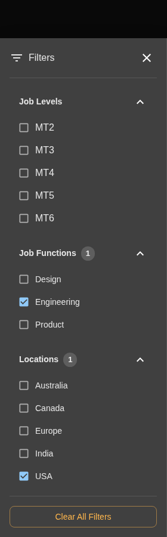
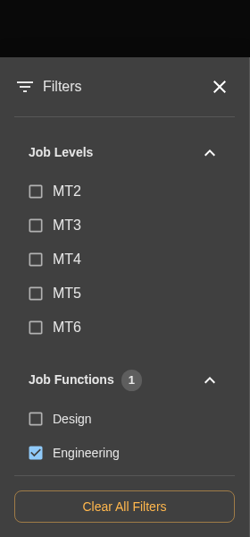
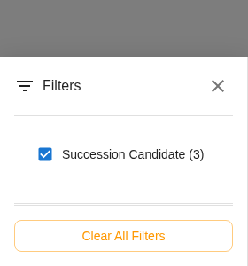
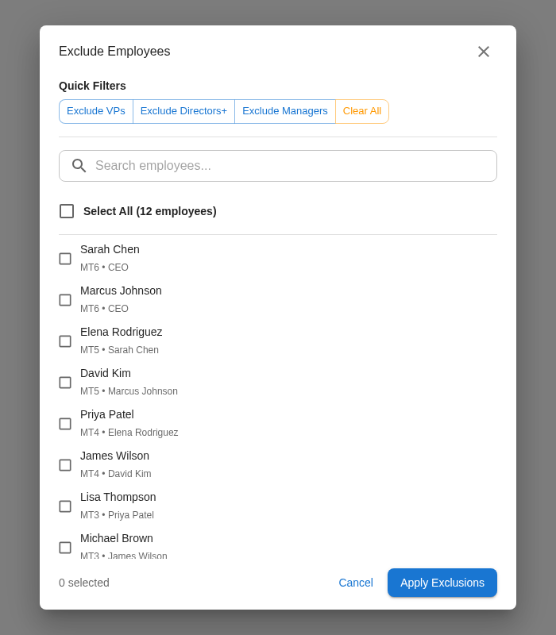

# Filtering Employees

Filters help you focus on specific groups of employees without changing or deleting any data. All filters are temporary and non-destructive.

---

## Basic Filters

Click the **Filters** button in the top bar to open the filter drawer.

### Available Filter Categories

| Category | Options | Description |
|----------|---------|-------------|
| **Job Levels** | MT1-MT6, IC, Manager, etc. | Filter by job grade |
| **Job Functions** | Engineering, Sales, Product, etc. | Filter by department |
| **Locations** | USA, Europe, India, etc. | Filter by office/region |
| **Managers** | Manager names | Filter by direct manager |
| **Flags** | Flight Risk, Promotion Ready, etc. | Filter by special status |

### How Filtering Works

1. **Check the boxes** for criteria you want to see
2. **Grid updates automatically** as you make selections
3. **Click outside** the drawer or press Filters again to close

**Filter Logic:**

- **Within a category** (OR): Checking "Engineering" and "Sales" shows employees in either
- **Across categories** (AND): Checking "Engineering" and "High Performance" shows only high-performing engineers

### Filter Indicators

When filters are active:

- **Orange dot** appears on the Filters button
- **Employee count** shows "X of Y employees" (X visible, Y total)

To clear all filters, uncheck all boxes or click **Clear All**.

---

## Filtering by Flags

Flags mark employees with special statuses. Filter by flags to quickly find specific groups.

**Available Flags:**

- **Promotion Ready** - Ready for advancement
- **Flight Risk** - At risk of leaving
- **High Retention Priority** - Critical to retain
- **Flagged for Discussion** - Needs manager review
- **New Hire** - Recently joined
- **PIP** - On Performance Improvement Plan
- **Succession Candidate** - Identified for succession
- **Ready for Lateral Move** - Ready for role change

Each flag shows a count of employees with that status.

!!! tip "Combine Flags"
    Check multiple flags like "Flight Risk" + "High Retention Priority" to see critical employees at risk who need immediate attention.

---

## Managing Exclusions

Exclusions let you hide specific individuals from the grid. Use this to remove outliers or focus on a subset.

### Opening the Exclusion Dialog

1. Click **Filters** in the top bar
2. Scroll to the bottom
3. Click **Manage Exclusions**

### Two Ways to Exclude

**Individual Selection:**

- Search for employees by name
- Check the box next to each person to exclude
- Click **Apply**

**Quick Buttons:**

| Button | What It Hides |
|--------|---------------|
| **Exclude VPs** | MT6 level employees |
| **Exclude Directors+** | MT5 and MT6 |
| **Exclude Managers** | MT2 and MT4 |

### After Excluding

- Excluded employees disappear from the grid
- Employee count updates ("35 of 47 employees")
- They're **not deleted**—just hidden from view

### Re-Including Employees

1. Open **Manage Exclusions** again
2. Uncheck the employees you want to restore
3. Click **Apply**

### Exclusions in Export

!!! warning "Exclusions Don't Affect Exports"
    All employees (including excluded ones) are included in Excel exports. Excluded employees are marked with an "Excluded" flag.

### Exclusion Persistence

- Exclusions **persist** during your session
- Exclusions **clear** when you:
    - Upload a new file
    - Restart the application

---

## Filter Combinations

Combine filters to drill down to specific groups:

| Goal | Filter Combination |
|------|-------------------|
| **Critical at-risk employees** | Flight Risk + High Retention Priority |
| **Promotion candidates in Sales** | Promotion Ready + Job Function: Sales |
| **Your entire org** | Click manager name → Reporting Chain |
| **ICs only** | Exclude Managers button |

---

## Quick Reference

| I want to... | How to do it |
|--------------|-------------|
| Apply a filter | Filters button → Check criteria → Grid updates |
| See flight risk employees | Filters → Check "Flight Risk" flag |
| Focus on one department | Click manager name in details panel |
| Hide specific people | Filters → Manage Exclusions → Check names → Apply |
| Exclude all managers | Manage Exclusions → "Exclude Managers" button |
| See how many are filtered | Check "X of Y employees" count |
| Clear all filters | Uncheck all boxes or "Clear All" |
| Restore excluded employees | Manage Exclusions → Uncheck names → Apply |

---

## Next Steps

- [Statistics](statistics.md) - View distribution data for filtered groups
- [Intelligence](intelligence.md) - Analyze rating patterns
- [Exporting](exporting.md) - Export includes all employees (filters don't affect exports)
