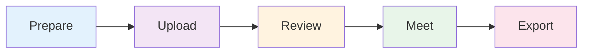
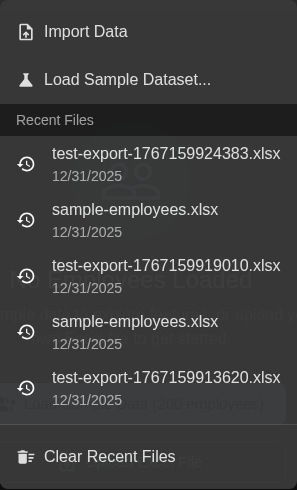

# Your First Calibration

> **Time to complete:** 10-15 minutes
> **What you'll accomplish:** Run your first talent calibration workflow from data upload to final export
> **Brand new to 9Boxer?** Start with the [2-minute quickstart](quickstart.md) to get familiar with the basics
> **New to calibration philosophy?** Read [why calibration matters](new-to-9box.md#why-calibration-matters) first

This guide walks you through the essential calibration workflow. You'll learn how to prepare data, review distribution, identify discussion topics, run the meeting, and export results.

---

## The Calibration Workflow

Here's the simple 5-step workflow for running a talent calibration:



1. **Prepare** - Get your Excel file ready
2. **Upload** - Load data into 9Boxer (2 min)
3. **Review** - Check distribution and identify patterns (5 min)
4. **Meet** - Run calibration discussion with screen sharing
5. **Export** - Save final ratings with full audit trail (2 min)

---

## Before You Begin

Make sure you have:

- [ ] **Excel file with current ratings** - Must include `Employee ID`, `Worker`, `Performance`, and `Potential` columns
- [ ] **Calibration meeting scheduled** - Know who will attend and when
- [ ] **Rating criteria defined** - Your organization's definitions for "High Performance", etc.
- [ ] **15 minutes of prep time** - To review data before the meeting

Don't have real data yet? Use sample data to practice the workflow first.

---

## Step 1: Upload Your Data (2 minutes)

### Get Your Ratings File Ready

Your Excel file needs these 4 required columns:

| Column Name | What It Means | Valid Values |
|-------------|---------------|--------------|
| `Employee ID` | Unique identifier | Any text or number |
| `Worker` | Employee name | Any text |
| `Performance` | Current performance rating | `Low`, `Medium`, or `High` |
| `Potential` | Future growth capacity | `Low`, `Medium`, or `High` |

!!! tip "Using Sample Data?"
    If you want to practice first, click **File → Load Sample Dataset...** to generate 200 realistic employees instantly. This is perfect for learning the calibration workflow before working with real data.

### Upload to 9Boxer

1. Click **File** in the top menu bar
2. Select **Import Data**
3. Choose your Excel file
4. Wait for the success notification

Your employees appear on the grid, automatically positioned based on their Performance and Potential ratings.


### ✅ Success! Data Loaded

You'll see:
- A 3×3 grid filled with employee tiles
- Employee count displayed (example: "47 employees")
- Employees organized into boxes based on their ratings

---

## Step 2: Check Your Distribution (3 minutes)

Now let's review your ratings before the calibration meeting.

### Review the Statistics Tab

Click the **Statistics** tab in the right panel to see how your talent is distributed.


**Patterns that spark good conversations:**

- 💬 **Many "High" ratings** (>25% in top row) - Worth discussing standards across managers
- 💬 **Few Stars** (<5% in top-right corner) - Opportunity to identify hidden talent
- 💬 **Most people in center** (>70% in position 5) - Discussion opportunity about differentiation

**Healthy distribution typically looks like:**

- 10-15% in Stars (top-right corner)
- 50-60% in middle tier (positions 4-6)
- Less than 10% in bottom-left (Too New/Under-Performers)

### Check the Intelligence Tab

Click the **Intelligence** tab to identify statistical patterns.

Intelligence runs analysis behind the scenes to find:

- **Location patterns** - Do certain offices rate higher/lower?
- **Function patterns** - Are some departments' standards different?
- **Manager patterns** - Which managers show different rating approaches?
- **Tenure effects** - Are new hires rated differently?


Red highlights = strong patterns worth discussing.
Yellow highlights = patterns to explore in the meeting.

!!! note "Make a Note"
    Write down which patterns you want to discuss. For example: "Engineering has 30% Stars vs. 10% company-wide - let's compare standards and see if this reflects real talent differences."

> 💡 **Why This Matters**
>
> During your meeting, you'll use level-based filtering as your PRIMARY approach (all ICs, then all Managers, etc.). Intelligence serves as your FINAL sweep to identify patterns that survived the structured review. Think of it as: level-first for bulk calibration, Intelligence for pattern detection.

---

## Step 3: Prepare Discussion Topics (5 minutes)

Don't try to calibrate 200 people at once. Use filters to review manageable groups.

### The Filter Strategy: Level First

Here's what most people get wrong: They review manager-by-manager or try to look at everyone at once.

**The right approach:** Review by level across all managers. This reveals rating patterns and ensures fairness.

Click the **Filters** button to open the left panel.

### Small Organizations (<100 employees)

Review in these sessions:

**Session 1: All Individual Contributors**
```
Filter: Job Level = "Individual Contributor"
What you're looking for:
- Do all managers use similar standards for ICs?
- Where do managers' standards differ - worth discussing?
- Who are the standout performers at this level?

Time: 30-45 minutes
```

**Session 2: All Managers**
```
Filter: Job Level = "Manager"
What you're looking for:
- Who shows leadership capacity?
- Different bar than ICs - looking for people management skills
- Succession pipeline for leadership roles

Time: 20-30 minutes
```

**Session 3: Intelligence Sweep**
```
Tool: Intelligence tab
What you're looking for:
- Patterns that survived your level-based review
- Statistical insights worth discussing
- Final patterns you might have missed

Time: 10 minutes
```

### Large Organizations (>100 employees)

Break it down by function within each level:

**Week 1: Individual Contributors by Function**
- Session 1: IC + Engineering
- Session 2: IC + Sales
- Session 3: IC + Other functions

**Week 2: Managers and Leaders**
- Session 4: All Managers (across functions)
- Session 5: Directors and above
- Session 6: Intelligence pattern review


### Why Level-First Works

When you filter to "All Individual Contributors":

- You see Manager A's ICs next to Manager B's ICs next to Manager C's ICs
- Patterns become obvious: "Manager A rated 80% as High, Manager B rated 20% as High"
- Discussion becomes productive: "Let's compare these high performers and align on standards"

**This reveals manager patterns without creating defensiveness.**

> 💡 **Why This Matters**
>
> Comparing people at the same level ensures fairness. You can't tell if a "High Performer" rating is calibrated by looking at one manager's mixed team. You need to see all Senior Engineers together, or all Managers together, to compare standards and ensure consistent expectations.

### Create Your Discussion List

Based on your level-by-level review, make a prioritized list:

**High priority:**
- Rating patterns across managers at each level (different standards)
- Borderline placements within each level cohort
- Anyone in extremes (top-right or bottom-left corners)

**Medium priority:**
- Distribution imbalances (too many/few in certain boxes per level)
- Cross-functional comparisons at same level
- Employees flagged in Intelligence tab (final sweep)

**Document your questions:**
- "Manager A rated 80% of ICs as High Performance, but Manager B rated 15%. Let's compare what 'high performance' means to each and align on standards."
- "When we look at all Senior Engineers together, who stands out?"
- "Engineering has 85% in center box vs. 50% company-wide at this level. What's driving that pattern?"

For the complete filter strategy and decision tree, see [Filter Strategy Reference](reference/filtering-decision-tree.md).

When difficult situations arise during calibration, refer to [Handling Difficult Scenarios](reference/difficult-scenarios.md) for specific guidance.

---

## Step 4: Run the Meeting (Tips for During)

Here's how to use 9Boxer during your live calibration session.

### Setup for Screen Sharing

1. Open 9Boxer with your data already loaded
2. Share your screen in the video call
3. Keep the right panel visible (Statistics, Intelligence, or Changes tabs)
4. Have your discussion list ready

### Work Through Discussions

Work level-by-level through your planned sessions:

1. **Set the level filter** for this session
   - Example: Job Level = "Individual Contributor"
   - Now you're looking at all ICs across all managers
   - This makes patterns visible

2. **Review the cohort together**
   - Look at distribution for this level
   - Note which managers' ratings differ from peers
   - Identify borderline placements

3. **Discuss specific employees**
   - Click employee tile to show details
   - Review Details tab (job level, manager, tenure)
   - Show Timeline if they have rating history
   - Let manager explain their rating
   - Ask group: "How does this compare to other [level] employees?"
   - Reach consensus on correct rating

4. **Make changes in real-time**
   - Drag employee to new box if group agrees
   - Employee tile gets **orange left border** = modified
   - File menu badge updates to show change count

5. **Document every decision**
   - Click employee → Changes tab
   - Add note explaining the calibration decision
   - Example: "Calibration 2024-Q4: Moved to Star after comparing to other Senior Engineers - consensus on sustained high performance + demonstrated leadership potential"

### Keep the Discussion Moving

- **Set time limits** - 2-3 minutes per employee max
- **Table contentious cases** - Schedule offline follow-up rather than debating endlessly
- **Track progress** - Watch the File menu badge to see how many changes you've made
- **Check distribution** - Periodically review Statistics tab to see distribution shift

!!! tip "Meeting Flow Tip"
    Work through one level at a time (all ICs, then all Managers, then all Directors). This ensures fair comparisons and makes rating patterns visible across managers.

---

## Step 5: Export Results (2 minutes)

When the meeting is done, export your final calibrated ratings.

### Review Before Exporting

Do a final check:

1. **Click Statistics tab** - Does distribution look calibrated now?
2. **Click Intelligence tab** - Are major patterns addressed?
3. **Click Changes tab** - Does every move have a note?

### Export Final Ratings

1. Click the **File menu** (button showing your filename)
2. Select **"Apply X Changes to Excel"** (X shows your change count)
3. File downloads automatically as `modified_[your-filename].xlsx`



### What's in Your Export

Open the Excel file to verify:

- ✅ **Updated Performance/Potential ratings** - Changed values reflect your moves
- ✅ **"Modified in Session" column** - Shows "Yes" for changed employees
- ✅ **"9Boxer Change Notes" column** - Contains your calibration notes
- ✅ **All original columns** - Everything from your original file is preserved

---

## 🎉 You're Done! Next Steps

Congratulations! You've completed your first calibration workflow:

- ✅ Uploaded employee data
- ✅ Reviewed distribution and identified patterns
- ✅ Prepared discussion topics
- ✅ Made changes during the meeting
- ✅ Exported final ratings with full audit trail

### Share Your Results

Send the exported file to:

- **Meeting attendees** - For their records
- **HR team** - To update your HRIS
- **Individual managers** - So they can communicate to employees
- **Leadership** - For succession planning

**Include in your email:**
- Summary of changes (X employees moved)
- Key decisions (promoted to Star, recalibrated center box, etc.)
- Next steps (update HRIS by [date], manager-employee conversations)
- Timeline for next calibration

---

## What to Learn Next

### Ready for Advanced Calibration Techniques?

→ [Best Practices Guide](best-practices.md)

This comprehensive guide includes:
- Detailed checklists for before/during/after meetings
- Common calibration scenarios with solutions
- Advanced filtering strategies and validation techniques
- Handling disagreements and contentious cases
- Statistical anomaly deep-dive
- Post-meeting follow-up workflows

### Want to Go Deeper on Specific Challenges?

Reference appendices for specialized topics:

- [Filter Strategy Reference](reference/filtering-decision-tree.md) - Complete filtering decision tree and session planning
- [Creating Psychological Safety](reference/psychological-safety.md) - Build trust in calibration discussions
- [Difficult Scenarios](reference/difficult-scenarios.md) - Handle protected pets, layoff fears, and contentious moments
- [Post-Calibration Conversations](reference/post-calibration-conversations.md) - Communicate outcomes effectively

### Want to Understand Specific Features?

Choose based on what you need:

| I want to... | Go here |
|--------------|---------|
| Understand what each grid position means | [Understanding the 9-Box Grid](understanding-grid.md) |
| Learn advanced filtering techniques | [Filters and Focus Tools](filters.md) |
| Review my center box placements | [Donut Mode Review Exercise](donut-mode.md) |
| Understand statistical analysis | [Statistics and Intelligence](statistics.md) |
| See all my changes in one place | [Tracking Changes](tracking-changes.md) |
| Export best practices and column details | [Exporting Results](exporting.md) |
| Customize appearance and settings | [Settings and Preferences](settings.md) |

---

## Quick Reference

Bookmark these common actions:

| I want to... | How to do it |
|--------------|--------------|
| Upload my data | File menu → Import Data |
| Load sample data (practice first) | File menu → Load Sample Dataset... |
| Move an employee | Drag tile to new box |
| View employee details | Click the employee tile |
| Add a calibration note | Click employee → Changes tab → Type in Notes field |
| Filter the grid | Click Filters button → Select criteria |
| Export my work | File menu → Apply X Changes to Excel |
| Check distribution | Click Statistics tab in right panel |
| Identify patterns | Click Intelligence tab in right panel |

---

## Common Questions

**Can I use 9Boxer during the live meeting?**

Yes! 9Boxer is designed for real-time calibration. Share your screen and make changes as the group discusses. The orange border highlights and change count badge help everyone see progress.

**What if we can't finish calibration in one meeting?**

Export your progress using File → Apply Changes to Excel. Name it with a date (e.g., `calibration-in-progress-2024-12-31.xlsx`). In the next meeting, re-import that file and continue where you left off.

**How do I handle employees who shouldn't be calibrated yet?**

Use Exclusions:
1. Open Filters panel
2. Exclusions section → Exclude Employees button
3. Select employees to exclude (e.g., new hires, on leave)
4. They're hidden from the grid but remain in your data

**What if someone's rating changes after the meeting?**

Re-import your post-calibration file, make the additional changes, add notes, and export again. The "Modified in Session" column will show the new changes.

---

**Need help?** Check [Troubleshooting](troubleshooting.md) or browse [Best Practices](best-practices.md)
