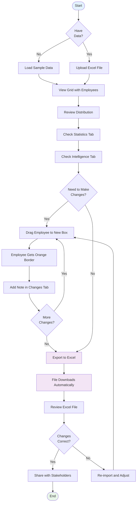
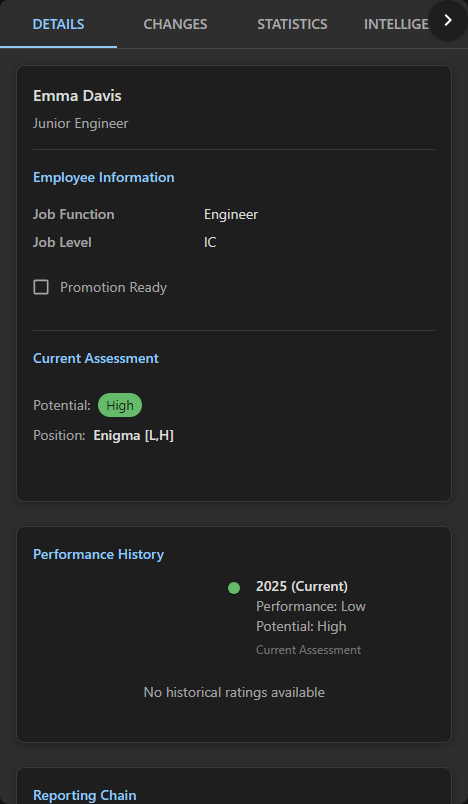

# Getting Started with 9Boxer

> **Time to complete:** 10 minutes
> **What you'll accomplish:** Load data, review your grid, make changes, and export results
> **Already did the [5-minute quickstart tour](quickstart.md)?** Skip to [Step 2: Review Your Distribution](#step-2-review-your-distribution-3-minutes)

Welcome! This guide walks you through the complete 9Boxer workflow, from loading data to exporting your final ratings. We'll start with sample data so you can explore features risk-free, then show you how to work with your own team data. By the end, you'll know exactly how to use 9Boxer for your talent reviews.

---

## Complete Workflow Overview

Here's the full 9Boxer workflow from data upload to export:



**Key steps in the workflow:**

1. **Load Data** - Either load sample data or upload your Excel file
2. **Review** - Check distribution using Statistics and Intelligence tabs
3. **Change** - Drag employees to new positions as needed
4. **Document** - Add notes explaining each change
5. **Export** - Download your updated Excel file with all changes

---

## What You'll Learn

In the next 10 minutes, you'll discover how to:

- ✅ Load sample data to explore features (recommended for learning)
- ✅ Upload your employee data from Excel (for production use)
- ✅ Read and interpret the 9-box grid
- ✅ Make rating changes with drag-and-drop
- ✅ Document your decisions with notes
- ✅ Export your updated ratings

Let's get started!

---

## Step 1: Load Your Data (2 minutes)

You have two ways to get started with 9Boxer. We recommend starting with sample data to explore features risk-free.

### Option 1: Load Sample Data (Recommended for Learning)

If you're new to 9Boxer or want to explore features without creating your own dataset, you can load pre-generated sample data with a single click.

#### What's Included in Sample Data

The sample dataset contains **200 employees** with realistic organizational data:

- **Complete organizational hierarchy** - 6 management levels from CEO to individual contributors
- **3 years of performance history** (2023-2024-2025) - Track trends and progression over time
- **Diverse workforce** - 8 locations, 8 job functions, 6 job levels
- **All 9 grid positions** - See employees distributed across the full talent matrix
- **Detectable patterns** - Built-in patterns for the Intelligence panel to analyze
- **Example flags** - Promotion-ready, flight risk, and other talent indicators

The sample data is designed to showcase 9Boxer's full capabilities, including:

- Filtering by location, function, or level
- Viewing performance trends over time
- Analyzing organizational patterns with Intelligence
- Exporting formatted reports
- Managing talent moves and succession planning

#### How to Load Sample Data

You have two ways to load sample data:

**Method 1: From the Empty State**

When you first open 9Boxer (or after clearing your data), you'll see an empty state screen.

<!-- TODO: Add screenshot showing EmptyState with "Load Sample Data (200 employees)" button
     Path: images/screenshots/getting-started/empty-state-sample-data-button.png -->

1. Click the **"Load Sample Data (200 employees)"** button
2. The app generates 200 employees in a few seconds
3. Your grid appears populated with realistic employee data

**Method 2: From the File Menu**

You can load sample data at any time from the File menu.

<!-- TODO: Add screenshot showing File menu with "Load Sample Dataset..." menu item
     Path: images/screenshots/getting-started/file-menu-load-sample.png -->

1. Click the **File menu** button (top-left, shows your current filename or "No file")
2. Select **"Load Sample Dataset..."**
3. If you have existing data, you'll see a warning that loading sample data will replace it
4. Review the sample data details in the dialog
5. Click **"Load Sample Data"** to confirm

<!-- TODO: Add screenshot showing LoadSampleDialog with warning and sample data details
     Path: images/screenshots/getting-started/load-sample-dialog.png -->

The app generates 200 employees in a few seconds and displays them in the 9-box grid.

#### When to Use Sample Data

Sample data is perfect for:

- **Learning 9Boxer** - Explore features without consequences
- **Testing workflows** - Try filtering, moving employees, and generating reports
- **Demonstrating the app** - Show 9Boxer to stakeholders with realistic data
- **Validating Intelligence insights** - See how the Intelligence panel detects patterns
- **Training sessions** - Consistent data for tutorials and workshops

#### Important Notes

- **Sample data is temporary** - It's generated fresh each time you load it
- **Not saved between sessions** - Load sample data again if you restart the app
- **Replaces existing data** - You'll see a warning if you have work in progress
- **Always the same** - Sample data uses a consistent seed for reproducibility

For production use with your actual team, see [Option 2: Upload Your Excel File](#option-2-upload-your-excel-file-for-production-use) below.

#### Sample Data Characteristics

The sample dataset includes realistic organizational diversity:

- **Locations**: USA, Canada, UK, Germany, France, India, Australia, Singapore
- **Job Functions**: Engineering, Product Management, Sales, Marketing, Operations, Design, Data Analysis, HR
- **Job Levels**: MT1 (Individual Contributor) through MT6 (Executive)
- **Grid distribution**: Employees spread across all 9 positions with realistic patterns
- **Bias patterns**: Some locations and functions have higher concentrations of high performers, simulating real-world dynamics (perfect for testing Intelligence features)

This data is **completely fictional** and generated for demonstration purposes only.

!!! tip "Try the Intelligence Panel"
    After loading sample data, click the **Intelligence** tab in the right panel to see detected patterns and anomalies. The sample data includes deliberate bias patterns for the Intelligence engine to find.

#### ✅ Success! You've Loaded Sample Data

You'll see:
- A 3×3 grid filled with 200 employee tiles
- Employees distributed across all 9 grid positions
- File menu showing "sample-data.xlsx" (virtual file)
- Ready to explore filters, Intelligence, and all 9Boxer features

**Next step:** Continue to [Step 2: Review Your Distribution](#step-2-review-your-distribution-3-minutes) to understand what the grid is showing you, or explore on your own!

---

### Option 2: Upload Your Excel File (For Production Use)

When you're ready to work with your actual team data, you'll upload an Excel file.

#### What You'll Need

An Excel file (`.xlsx` or `.xls`) with these 4 required columns (exact names, case-sensitive):

| Column Name | What It Means | Valid Values |
|-------------|---------------|--------------|
| `Employee ID` | Unique identifier | Any text or number |
| `Worker` | Employee name | Any text |
| `Performance` | Current performance rating | `Low`, `Medium`, or `High` |
| `Potential` | Future growth capacity | `Low`, `Medium`, or `High` |

!!! tip "Don't have a file ready?"
    Use the sample file included with 9Boxer: `Sample_People_List.xlsx`
    Look in the Help menu or in the application's resource folder.

#### Upload Your File

1. **Click "File"** in the top menu bar, then select **"Import Data"**

   (Or, if you're starting fresh, click the **"Import Data"** button in the center of the empty screen)

   <!-- TODO: Update screenshot path to images/screenshots/getting-started/upload-dialog.png -->
   

2. **Choose your Excel file** in the file picker

3. **Click "Upload"** in the dialog

4. **Wait for the success message** - you'll see a notification when your data loads

**What happens next:** Your employees appear on the grid, automatically positioned based on their Performance and Potential ratings.

#### ✅ Success! You've Uploaded Your Data

You'll see:

- A 3×3 grid filled with employee tiles
- Your employee count displayed in the app (example: "15 employees")
- Employees organized into boxes based on their ratings

<!-- TODO: Update screenshot path to images/screenshots/getting-started/grid-populated.png -->


!!! warning "Don't see your employees?"
    Make sure your column names exactly match the required names (case-sensitive).
    [Learn how to troubleshoot upload errors](troubleshooting.md#file-upload-issues)

---

## Step 2: Review Your Distribution (3 minutes)

Now let's understand what this grid is showing you.

### The 3×3 Grid Layout

Your grid organizes employees by two factors:

- **Performance (left to right):** How well they're doing in their current role
- **Potential (bottom to top):** Their capacity for growth and advancement


This creates 9 distinct positions, each with strategic meaning:

### Quick Reference: The 9 Positions

```
              LOW             MEDIUM            HIGH
           PERFORMANCE      PERFORMANCE      PERFORMANCE

HIGH       Enigma           High Potential    ⭐ Stars
POTENTIAL  (investigate)    (develop fast)    (top talent)

MEDIUM     Under-           Core              High
POTENTIAL  Performer        Performer         Performer
           (support)        (backbone)        (strong IC)

LOW        Problem/         Solid             Strong
POTENTIAL  Too New          Performer         Performer
           (action needed)  (reliable)        (excellent IC)
```

**The most important boxes:**

- **⭐ Stars (top-right):** Your highest performers with leadership potential - protect and develop them
- **Core Performer (center):** Your largest group - solid, reliable employees who keep things running
- **Bottom-left corner:** Employees who need attention - either too new to rate or facing performance issues

→ [See detailed descriptions of all 9 positions](understanding-grid.md)

### Check Your Distribution

Click the **Statistics** tab in the right panel to see how your talent is distributed.


**Healthy distribution typically looks like:**

- 10-15% in Stars (top-right)
- 50-60% in the middle tier (Core Performers and surrounding boxes)
- Fewer than 10% in bottom-left (Problems)

**Red flags to watch for:**

- ⚠️ Too many people rated "High" (everyone can't be above average)
- ⚠️ Too few Stars (succession planning risk)
- ⚠️ Everyone clustered in the center (poor differentiation)

!!! info "These are guidelines, not rules"
    Your ideal distribution depends on your industry, growth stage, and organizational needs.
    [Learn more about interpreting distributions](statistics.md)

---

## Step 3: Make Your First Rating Change (2 minutes)

Now that you understand the grid, let's make a change.

### Why You'd Move Someone

Common reasons for changing ratings:

- Recent promotion or role change
- Performance improved (or declined) since last review
- Initial rating was incorrect
- Calibration with other managers revealed misalignment

### How to Move an Employee

Moving employees is drag and drop:

1. **Click and hold** on an employee tile
2. **Drag** to the new box
3. **Release** to drop them in place


The employee tile gets an **orange left border** to show it's been modified in this session.


!!! info "Orange, not yellow?"
    You might hear this called a "yellow highlight" - same thing!
    The border appears orange in light mode (#ff9800) and lighter orange in dark mode (#ffb74d).

**The File menu badge** updates to show how many changes you've made.

### Review What Changed

Click on the employee you just moved to see their details:



The **Timeline** shows:
- Their previous position
- Their new position
- When the change was made

---

## Step 4: Document Your Decision (2 minutes)

Adding notes helps you remember why you made changes - crucial for calibration meetings and performance reviews.

### Why Add Notes?

- **Justify changes** in calibration meetings
- **Create an audit trail** for HR compliance
- **Remember your reasoning** when you review this 6 months from now
- **Share context** with other reviewers

### How to Add a Note

1. **Click the employee** you moved (to open the right panel)

2. **Switch to the Changes tab**

3. **Type your explanation** in the Notes field

   

4. The note saves automatically - you'll see it when you export ✅

### Good Note Examples

Be specific and objective:

- ✅ "Promoted to Senior Engineer Q4 2024, consistently exceeds deliverables"
- ✅ "Performance declined after team restructure - skill gap in new responsibilities"
- ✅ "Calibrated with peers - rating adjusted to reflect actual output vs. potential"

- ❌ "Good performer" (too vague)
- ❌ "Just because" (not helpful)

!!! tip "Notes are included in your export"
    When you export to Excel, your notes appear in the "9Boxer Change Notes" column for easy sharing.

---

## Step 5: Export Your Updated Ratings (1 minute)

When you're ready to save your changes:

!!! tip "Understanding Export"
    Clicking "Apply" exports your changes to a new Excel file. This saves your work - there's no auto-save!

### How to Export

1. **Open the File menu** (the button that shows your filename)

2. **Click "Apply X Changes to Excel"** in the dropdown
   (The number X shows how many changes you've made)

   

3. **Your file downloads automatically**
   File name: `modified_[your-original-filename].xlsx`

4. **Open the file** to verify your changes

### What's in the Export?

Your exported Excel file includes:

- ✅ **Updated Performance/Potential ratings** - Changed values reflect your moves
- ✅ **"Modified in Session" column** - Shows "Yes" for changed employees
- ✅ **"9Boxer Change Notes" column** - Contains your notes
- ✅ **All original columns** - Everything from your original file is preserved

!!! danger "Critical: No Auto-Save!"
    9Boxer does NOT save automatically. Your changes are lost if you close the app without exporting!

    **Always export before:**
    - Closing the application
    - Uploading a new file (replaces current session)
    - Taking a break in a long session

---

## 🎉 Congratulations! You've Completed the Basics

You now know how to:

- ✅ Upload employee data
- ✅ Read the 9-box grid
- ✅ Make rating changes
- ✅ Document your decisions
- ✅ Export your results

You're ready to use 9Boxer for real talent reviews!

---

## What to Learn Next

Choose your path based on what you need to do:

### **I want to learn more about making changes**
→ [Deep dive into making rating changes](workflows/making-changes.md)
Understand when to move employees, common scenarios, and best practices.

### **I'm preparing for a talent calibration meeting**
→ [Follow the calibration workflow guide](workflows/talent-calibration.md)
Learn how to prepare, run the meeting with 9Boxer, and export final results.

### **I want to validate my center box ratings**
→ [Try the Donut Mode exercise](donut-mode.md)
A powerful technique for ensuring "Core Performer" ratings are accurate.

### **I need to focus on specific teams or departments**
→ [Learn about filters and exclusions](filters.md)
Filter by manager, department, job level, or performance tier.

### **I'm curious about distribution analytics**
→ [Explore Statistics and Intelligence](statistics.md)
View charts, detect anomalies, and identify rating bias.

### **I want to understand the methodology**
→ [Dive into Understanding the 9-Box Grid](understanding-grid.md)
Complete explanation of all positions and their strategic implications.

---

## Quick Reference Card

Bookmark this for easy access to common actions:

| I want to... | How to do it |
|--------------|--------------|
| Load sample data (recommended for learning) | File menu → Load Sample Dataset... (or use empty state button) |
| Upload my own data (for production use) | File menu → Import Data |
| Move an employee | Drag tile to new box |
| View employee details | Click the employee tile |
| Add a note | Click employee → Changes tab → Type in Notes field |
| Filter the grid | Click Filters button → Select criteria |
| Export my work | File menu → Apply X Changes to Excel (downloads file) |
| Expand a box | Click ⛶ icon on box header |
| Collapse expanded box | Click ⛶ again or press `Esc` |

---

## Need Help?

### Something Not Working?

- **Upload failed?** → [Troubleshooting upload errors](troubleshooting.md#file-upload-issues)
- **Employees not appearing?** → [Check if filters are active](troubleshooting.md#employees-dont-appear-after-upload)
- **Can't drag employees?** → [Drag and drop troubleshooting](troubleshooting.md#drag-and-drop-issues)
- **Export not working?** → [Export troubleshooting](troubleshooting.md#export-issues)

### Want to Learn More?

- **In-app tooltips:** Hover over any button or UI element for helpful hints
- **Full documentation:** Browse the complete [user guide](index.md)
- **Best practices:** Check out [Best Practices](best-practices.md)

---

**Ready to dive deeper?** Continue to [Understanding the 9-Box Grid](understanding-grid.md) for a complete explanation of all positions and their strategic implications.
