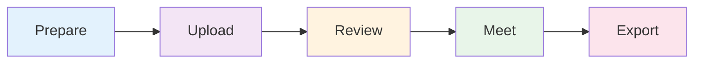

# Your First Calibration

> **Time to complete:** 10-15 minutes
> **What you'll accomplish:** Run your first talent calibration workflow from data upload to final export
> **Brand new to 9Boxer?** Start with the [2-minute quickstart](quickstart.md) to get familiar with the basics

This guide walks you through the essential calibration workflow. You'll learn how to prepare data, review distribution, identify discussion topics, run the meeting, and export results.

---

## The Calibration Workflow

Here's the simple 5-step workflow for running a talent calibration:

1. **Prepare** - Get your Excel file ready
2. **Upload** - Load data into 9Boxer (2 min)
3. **Review** - Check distribution and spot anomalies (5 min)
4. **Meet** - Run calibration discussion with screen sharing
5. **Export** - Save final ratings with full audit trail (2 min)

---

## Before You Begin

Make sure you have:

- [ ] **Excel file with current ratings** - Must include `Employee ID`, `Worker`, `Performance`, and `Potential` columns
- [ ] **Calibration meeting scheduled** - Know who will attend and when
- [ ] **Rating criteria defined** - Your organization's definitions for "High Performance", etc.
- [ ] **15 minutes of prep time** - To review data before the meeting

Don't have real data yet? Use sample data to practice the workflow first.

---

## Step 1: Upload Your Data (2 minutes)

### Get Your Ratings File Ready

Your Excel file needs these 4 required columns:

| Column Name | What It Means | Valid Values |
|-------------|---------------|--------------|
| `Employee ID` | Unique identifier | Any text or number |
| `Worker` | Employee name | Any text |
| `Performance` | Current performance rating | `Low`, `Medium`, or `High` |
| `Potential` | Future growth capacity | `Low`, `Medium`, or `High` |

!!! tip "Using Sample Data?"
    If you want to practice first, click **File → Load Sample Dataset...** to generate 200 realistic employees instantly. This is perfect for learning the calibration workflow before working with real data.

### Upload to 9Boxer

1. Click **File** in the top menu bar
2. Select **Import Data**
3. Choose your Excel file
4. Wait for the success notification

Your employees appear on the grid, automatically positioned based on their Performance and Potential ratings.

### ✅ Success! Data Loaded

You'll see:
- A 3×3 grid filled with employee tiles
- Employee count displayed (example: "47 employees")
- Employees organized into boxes based on their ratings

---

## Step 2: Check Your Distribution (3 minutes)

Now let's validate your ratings before the calibration meeting.

### Review the Statistics Tab

Click the **Statistics** tab in the right panel to see how your talent is distributed.

**Look for these red flags:**

- ⚠️ **Too many "High" ratings** (>25% in top row) - Possible grade inflation
- ⚠️ **Too few Stars** (<5% in top-right corner) - Succession planning risk
- ⚠️ **Everyone clustered in center** (>70% in position 5) - Poor differentiation

**Healthy distribution typically looks like:**

- 10-15% in Stars (top-right corner)
- 50-60% in middle tier (positions 4-6)
- Less than 10% in bottom-left (Problems/Too New)

### Check the Intelligence Tab

Click the **Intelligence** tab to spot statistical anomalies.

Intelligence runs analysis behind the scenes to find:

- **Location bias** - Do certain offices rate higher/lower?
- **Function bias** - Are some departments inflating ratings?
- **Manager patterns** - Which managers show unusual rating patterns?
- **Tenure effects** - Are new hires rated differently?

Red anomalies = critical issues requiring discussion.
Yellow anomalies = worth reviewing in the meeting.

!!! note "Make a Note"
    Write down which anomalies you want to discuss. For example: "Engineering has 30% Stars vs. 10% company-wide - is this justified?"

> 💡 **Why This Matters**
>
> Distribution review gives you specific talking points backed by data. Instead of vague concerns, you'll walk into the meeting saying "Alex, you rated 18 of 20 as High Performance. Let's discuss your top 5."

---

## Step 3: Prepare Discussion Topics (5 minutes)

Use filters to identify specific employees who need calibration.

### Find Borderline Cases

Click the **Filters** button to open the left panel.

**Try these filter combinations:**

=== "High Performers"
    **Goal:** Validate all high performers truly deserve it

    - Performance: Check "High" only
    - Review each employee - do they have evidence of high performance?

    **Questions to prepare:**
    - Who might actually be a Star (High Potential too)?
    - Who is just meeting expectations, not exceeding?

=== "Borderline Stars"
    **Goal:** Find High Performers who might be future leaders

    - Performance: "High"
    - Potential: "Medium" or "High"

    **Questions to prepare:**
    - Who is ready for promotion?
    - Who shows leadership capacity?

=== "Manager Comparison"
    **Goal:** Compare one manager's ratings to others

    - Managers: Select one manager
    - Review their distribution vs. company averages

    **Questions to prepare:**
    - Does this manager rate higher/lower than peers?
    - Are there patterns in their ratings?

### Create Your Discussion List

Based on your review, make a prioritized list:

**High priority:**
- Employees flagged in Intelligence tab (anomalies)
- Borderline Stars (High Performers who might be promoted)
- Anyone in extremes (top-right or bottom-left corners)

**Medium priority:**
- Manager-specific patterns (one manager's ratings vs. others)
- Distribution imbalances (too many/few in certain boxes)
- Cross-functional comparisons

**Document your questions:**
- "Why is Sarah a Star this year but was Medium/Medium last year?"
- "Engineering has 85% in center box vs. 50% company-wide. What's driving that?"
- "Alex, you have 8 Stars but company average is 3. Let's walk through your top performers."

---

## Step 4: Run the Meeting (Tips for During)

Here's how to use 9Boxer during your live calibration session.

### Setup for Screen Sharing

1. Open 9Boxer with your data already loaded
2. Share your screen in the video call
3. Keep the right panel visible (Statistics, Intelligence, or Changes tabs)
4. Have your discussion list ready

### Work Through Discussions

For each discussion topic:

1. **Use filters** to focus on the relevant group
   - Filter by manager to review one person's team
   - Filter by performance level to validate a cohort
   - Filter by department to compare patterns

2. **Show employee details**
   - Click the employee tile
   - Review Details tab (job level, manager, tenure)
   - Show Timeline if they have rating history

3. **Facilitate discussion**
   - Present your calibration question
   - Let manager explain their rating
   - Ask group for feedback
   - Reach consensus on correct rating

4. **Make changes in real-time**
   - Drag employee to new box if group agrees
   - Employee tile gets **orange left border** = modified
   - File menu badge updates to show change count

5. **Document every decision**
   - Click employee → Changes tab
   - Add note explaining the calibration decision
   - Example: "Calibration 2024-Q4: Moved to Star - consensus on sustained high performance + demonstrated leadership potential"

### Keep the Discussion Moving

- **Set time limits** - 2-3 minutes per employee max
- **Table contentious cases** - Schedule offline follow-up rather than debating endlessly
- **Track progress** - Watch the File menu badge to see how many changes you've made
- **Check distribution** - Periodically review Statistics tab to see distribution shift

!!! tip "Meeting Flow Tip"
    Filter one manager at a time to review their full team together. This helps everyone see rating patterns and makes comparisons easier.

---

## Step 5: Export Results (2 minutes)

When the meeting is done, export your final calibrated ratings.

### Review Before Exporting

Do a final check:

1. **Click Statistics tab** - Does distribution look calibrated now?
2. **Click Intelligence tab** - Are major anomalies addressed?
3. **Click Changes tab** - Does every move have a note?

### Export Final Ratings

1. Click the **File menu** (button showing your filename)
2. Select **"Apply X Changes to Excel"** (X shows your change count)
3. File downloads automatically as `modified_[your-filename].xlsx`

### What's in Your Export

Open the Excel file to verify:

- ✅ **Updated Performance/Potential ratings** - Changed values reflect your moves
- ✅ **"Modified in Session" column** - Shows "Yes" for changed employees
- ✅ **"9Boxer Change Notes" column** - Contains your calibration notes
- ✅ **All original columns** - Everything from your original file is preserved

---

## 🎉 You're Done! Next Steps

Congratulations! You've completed your first calibration workflow:

- ✅ Uploaded employee data
- ✅ Reviewed distribution and spotted anomalies
- ✅ Prepared discussion topics
- ✅ Made changes during the meeting
- ✅ Exported final ratings with full audit trail

### Share Your Results

Send the exported file to:

- **Meeting attendees** - For their records
- **HR team** - To update your HRIS
- **Individual managers** - So they can communicate to employees
- **Leadership** - For succession planning

**Include in your email:**
- Summary of changes (X employees moved)
- Key decisions (promoted to Star, recalibrated center box, etc.)
- Next steps (update HRIS by [date], manager-employee conversations)
- Timeline for next calibration

---

## What to Learn Next

### Ready for Advanced Calibration Techniques?

→ [Complete Calibration Reference](workflows/talent-calibration.md)

This comprehensive 874-line guide includes:
- Detailed checklists for before/during/after meetings
- Advanced filtering techniques for large datasets
- Donut Mode exercise for validating center box placements
- Handling disagreements and contentious cases
- Statistical anomaly deep-dive
- Post-meeting follow-up workflows

### Want to Understand Specific Features?

Choose based on what you need:

| I want to... | Go here |
|--------------|---------|
| Understand what each grid position means | [Understanding the 9-Box Grid](understanding-grid.md) |
| Learn advanced filtering techniques | [Filters and Focus Tools](filters.md) |
| Validate my center box placements | [Donut Mode Validation Exercise](donut-mode.md) |
| Understand statistical analysis | [Statistics and Intelligence](statistics.md) |
| See all my changes in one place | [Tracking Changes](tracking-changes.md) |
| Export best practices and column details | [Exporting Results](exporting.md) |
| Customize appearance and settings | [Settings and Preferences](settings.md) |

---

## Quick Reference

Bookmark these common actions:

| I want to... | How to do it |
|--------------|--------------|
| Upload my data | File menu → Import Data |
| Load sample data (practice first) | File menu → Load Sample Dataset... |
| Move an employee | Drag tile to new box |
| View employee details | Click the employee tile |
| Add a calibration note | Click employee → Changes tab → Type in Notes field |
| Filter the grid | Click Filters button → Select criteria |
| Export my work | File menu → Apply X Changes to Excel |
| Check distribution | Click Statistics tab in right panel |
| Spot anomalies | Click Intelligence tab in right panel |

---

## Common Questions

**Can I use 9Boxer during the live meeting?**

Yes! 9Boxer is designed for real-time calibration. Share your screen and make changes as the group discusses. The orange border highlights and change count badge help everyone see progress.

**What if we can't finish calibration in one meeting?**

Export your progress using File → Apply Changes to Excel. Name it with a date (e.g., `calibration-in-progress-2024-12-31.xlsx`). In the next meeting, re-import that file and continue where you left off.

**How do I handle employees who shouldn't be calibrated yet?**

Use Exclusions:
1. Open Filters panel
2. Exclusions section → Exclude Employees button
3. Select employees to exclude (e.g., new hires, on leave)
4. They're hidden from the grid but remain in your data

**What if someone's rating changes after the meeting?**

Re-import your post-calibration file, make the additional changes, add notes, and export again. The "Modified in Session" column will show the new changes.

---

**Need help?** Check [Troubleshooting](troubleshooting.md) or browse [Best Practices](best-practices.md)
