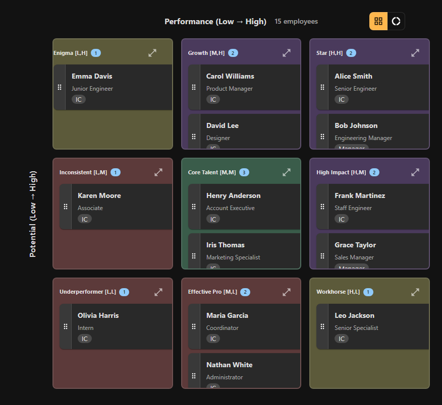

# Welcome to 9Boxer

**Visualize your team's talent in minutes, make informed decisions with confidence**

9Boxer is a simple, powerful desktop application that helps you manage talent using the proven 9-box methodology. Plot employees by performance and potential, track your decisions, and make succession planning a breeze - all while keeping your sensitive data secure on your computer.

---

## Get Started in 2 Minutes

New to 9Boxer? Let's get you to your first success fast.

**[Start the 2-Minute Quickstart →](quickstart.md)**

Upload your data, see your team on the grid, and understand what it means - all in less time than it takes to make coffee.

---

## Choose Your Path

### 🆕 New to 9Boxer?

**[2-Minute Quickstart](quickstart.md)** - Upload data and see your first grid (fastest path to success)

**[10-Minute Getting Started Guide](getting-started.md)** - Complete workflow from upload to export

**[Understanding the 9-Box Grid](understanding-grid.md)** - Learn what each position means strategically

### 🎯 Ready to Make Changes?

**[Making Your First Changes](workflows/making-changes.md)** - Learn how to move employees and track your decisions

**[Talent Calibration Workflow](workflows/talent-calibration.md)** - Run effective calibration sessions

**[Donut Mode Exercise](donut-mode.md)** - Validate your center box placements before the meeting

**[Statistics & Intelligence](statistics.md)** - Review distributions and spot anomalies

### 🔍 Need Specific Help?

**Not sure which feature or workflow to use?**

- **[Choose Your Workflow →](workflows/workflow-decision-tree.md)** - Decision tree to find the right guide
- **[Feature Comparison →](feature-comparison.md)** - Compare features side-by-side
- **[Common Decisions →](common-decisions.md)** - Quick answers to frequent questions

**Jump directly to the feature you need:**

- **[Uploading Data](uploading-data.md)** - Excel file requirements and troubleshooting
- **[Working with Employees](working-with-employees.md)** - View details, move employees, and track changes
- **[Filters](filters.md)** - Focus on specific teams, departments, or performance levels
- **[Exporting Results](exporting.md)** - Save your changes and export audit trails
- **[Troubleshooting](troubleshooting.md)** - Solve common issues quickly

---

## What is the 9-Box Grid?

The 9-box talent grid helps you evaluate employees based on two key dimensions:

- **Performance** - How well they're doing in their current role
- **Potential** - Their capacity for growth and future leadership

By plotting everyone on a 3x3 grid, you can quickly identify your top talent, spot development needs, and make informed decisions about promotions and succession planning.

**Want the full story?** Read [Understanding the 9-Box Grid](understanding-grid.md) for complete position descriptions and strategic guidance.

---

## Key Features at a Glance

**Visual Talent Management**
- Drag-and-drop interface makes rating changes intuitive
- See your entire team's distribution at a glance
- Track all changes with automatic timeline history

**Smart Analytics**
- Distribution statistics show if your ratings are balanced
- Anomaly detection spots rating bias across managers and departments
- Filter by team, level, or performance to focus your reviews

**Secure and Local**
- All data stays on your computer - no cloud uploads
- Import from Excel, export back to Excel
- Standalone desktop app for Windows, macOS, and Linux

**[Explore all features in detail →](getting-started.md)**

---

## Critical: No Auto-Save

!!! danger "Remember to Export Your Changes!"
    9Boxer does NOT automatically save your work. Click **Export** to download your changes before closing the application!

    Your exported Excel file includes updated ratings, change notes, and a complete audit trail.

---

## What You Can Do with 9Boxer

**Upload & Visualize**
- Import employee data from Excel in seconds
- See everyone positioned on the 9-box grid
- Understand your talent distribution instantly

**Review & Adjust**
- Drag employees to adjust their ratings
- Add notes explaining your rationale
- Use Donut Mode to validate center box placements

**Analyze & Export**
- View distribution statistics and charts
- Identify rating anomalies and bias patterns
- Export results with full change tracking

**[See the complete workflow →](getting-started.md)**

---

## Your First 5 Minutes

Here's what a typical first session looks like:

1. **Upload your team data** (1 minute)
   - Prepare an Excel file with 4 required columns
   - Click Import and select your file

2. **See your grid** (30 seconds)
   - Employees appear automatically, positioned by their ratings
   - Check the distribution in the Statistics tab

3. **Make your first change** (2 minutes)
   - Drag an employee to a new position
   - Add a note explaining why

4. **Export your results** (1 minute)
   - Click Export to download your updated ratings
   - Open the file to see your changes and notes

**Ready to try it?** [Start the quickstart now →](quickstart.md)

---

## Need Help?

**In the app:**
- Hover over any button for helpful tooltips
- Check error messages - they usually explain the issue

**In the docs:**
- [Troubleshooting Guide](troubleshooting.md) - Common issues and solutions
- [Tips & Best Practices](tips.md) - Expert recommendations
- Feature guides - Detailed help for each feature (see navigation menu)

**Can't find what you need?** Check the [FAQ](faq.md) or the [troubleshooting section](troubleshooting.md).

---

## Version Information

**Current Version:** 2.2
**Last Updated:** December 2024

---

**Let's get started!** Head to the [2-Minute Quickstart](quickstart.md) and you'll see your team on the grid before you know it.
