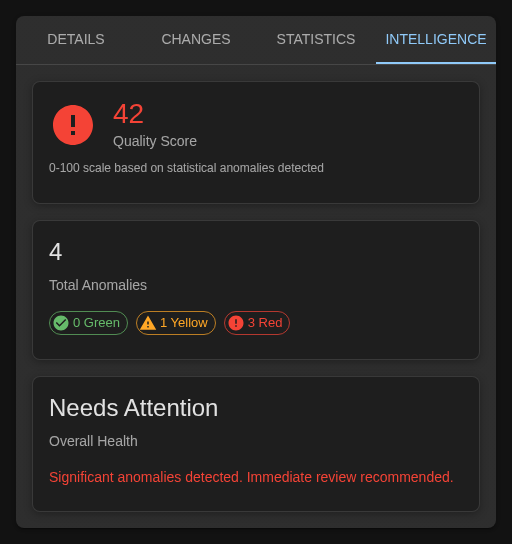
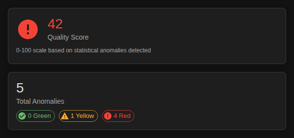
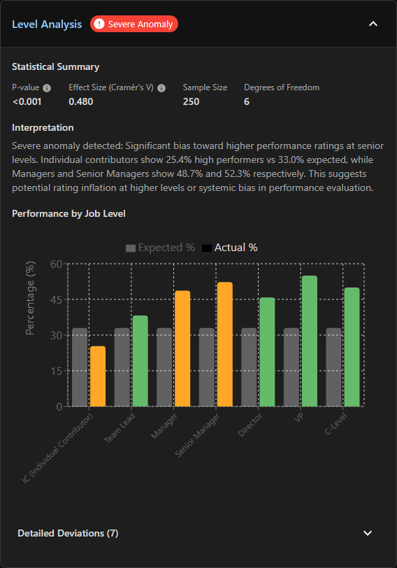

# Intelligence

The Intelligence tab automatically detects rating anomalies and potential bias in your talent data. It analyzes patterns across locations, job functions, job levels, and tenure to flag inconsistencies.

---

## Accessing Intelligence

1. Click any employee (or click in empty space)
2. Click the **Intelligence** tab (fourth tab) in the right panel

---

## Quality Score

At the top, you'll see an overall quality score (0-100) summarizing your data health.

| Score | Rating | What It Means |
|-------|--------|---------------|
| 90-100 | Excellent | Well-calibrated, no significant issues |
| 75-89 | Good | Minor anomalies only |
| 60-74 | Fair | Some issues worth reviewing |
| 40-59 | Poor | Multiple anomalies need attention |
| 0-39 | Critical | Significant bias detected |

A low score means you should review anomalies before finalizing ratings.

---

## The 4 Anomaly Detectors

Intelligence analyzes your data across four dimensions:

### 1. Location Bias

Detects offices or regions with skewed performance distributions compared to the organization overall.

**What to look for:**

- One office rates 30% High Performance, others average 12%
- Remote workers rated lower than office-based peers
- Regional differences that don't match performance data

**Common causes:**

- Local leadership sets different standards
- Proximity bias (out of sight, out of mind)
- Cultural differences in feedback directness

### 2. Job Function Bias

Detects departments with unusual distributions compared to organizational patterns.

**What to look for:**

- Sales has 40% High Potential, Engineering has 8%
- One department has no Stars while others have 10-15%
- Support functions rated consistently lower than revenue teams

**Common causes:**

- Different rating standards across functions
- Visibility bias (customer-facing rated higher)
- Conflating recent results with long-term potential

### 3. Job Level Bias

Detects rating patterns that correlate too strongly with job level rather than actual performance.

**What to look for:**

- Directors/VPs disproportionately rated High Performance
- Individual contributors rated lower than managers doing equivalent work
- Executives rarely rated Low (statistically unlikely)

**Common causes:**

- Conflating job level with performance quality
- Assumption that promoted employees are automatically high performers
- Political reluctance to rate senior leaders honestly

### 4. Tenure Bias

Detects rating patterns correlated with time at company rather than performance.

**What to look for:**

- New hires (<6 months) rated High Potential at 3x normal rate
- Long-tenure employees stuck in middle boxes
- Recent hires clustered in top-right despite limited data

**Common causes:**

- Optimism about new hires before proven performance
- Assumption that long tenure = plateaued growth
- "Halo effect" of successful recruiting

---

## Understanding Severity

Anomalies are color-coded by severity:

| Color | Severity | What It Means |
|-------|----------|---------------|
| **Red** | Critical | Statistically significant, affects many employees—investigate now |
| **Yellow** | Moderate | Notable pattern, worth reviewing |
| **Green** | Minor | Small deviation, likely normal variance |

Each anomaly card shows:
- **Dimension** (Location, Function, Level, Tenure)
- **Expected count** vs **Actual count**
- **Deviation** amount
- **Affected categories**

---

## What to Do With Anomalies

### Red (Critical) Anomalies

1. **Review affected employees** - Use filters to see them
2. **Hold calibration discussion** - Share data with the relevant group
3. **Recalibrate if needed** - Adjust ratings to align with standards

### Yellow (Moderate) Anomalies

1. **Investigate** - Is there a legitimate reason?
2. **Document** - Note if the pattern is justified
3. **Monitor** - Track if it persists over time

### Green (Minor) Anomalies

Generally no action needed—these are within normal variance.

---

## Common Patterns and What They Mean

| Pattern | Likely Cause | Action |
|---------|--------------|--------|
| One location all High ratings | Location-specific leniency | Cross-location calibration |
| New hires all High Potential | Premature rating | Wait 6 months to rate Potential |
| Department has no Stars | Under-rating or talent gap | Cross-functional calibration |
| VPs rated higher than ICs | Level bias | Review against objective metrics |

---

## Quick Reference

| I want to... | How to do it |
|--------------|-------------|
| Check overall data quality | Look at quality score at top |
| Find critical issues | Scan for red anomaly cards |
| Compare locations | Check location bias section |
| Compare departments | Check function bias section |
| Check level calibration | Check level bias section |
| Check tenure patterns | Check tenure bias section |
| Investigate an anomaly | Filter to that group, review individuals |

---

## How Detection Works

Each detector uses statistical analysis to compare your actual distribution against expected patterns. When the deviation is too large to be random chance, it's flagged as an anomaly.

For technical details on the statistical methods used, see [Detection Methodology](detection-methodology.md).

---

## Next Steps

- [Statistics](statistics.md) - View distribution data
- [Filtering](filters.md) - Focus on specific groups to investigate
- [Tracking Changes](tracking-changes.md) - Document recalibration decisions
