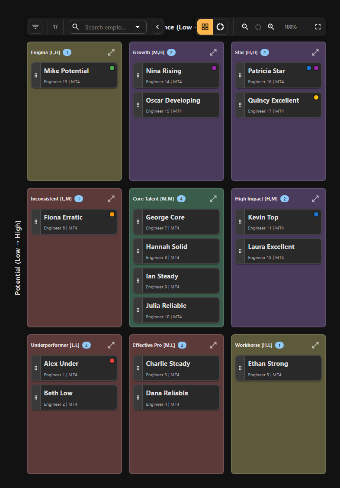

# New to 9-Box? Start Here

Welcome! This guide introduces you to the 9-box methodology and helps you get started with 9Boxer. Whether you're a department head evaluating your team for the first time or a manager learning this talent framework, you'll find everything you need to understand what the 9-box grid shows and how to use it effectively.

---

## Who This Guide Is For

This guide is designed for:

- **Department heads new to 9-box methodology** - You've been asked to rate your team using a 9-box grid but haven't used this framework before
- **Managers transitioning to talent management roles** - You need to understand how performance and potential ratings work together
- **First-time 9Boxer users** - You want to learn both the methodology and the tool at the same time
- **Team leaders preparing for calibration** - You need to quickly understand the framework before your first calibration meeting

> **Real-World Example**
>
> Marcus is an Engineering Department Head managing 25 people across 3 teams. He's been asked to prepare 9-box ratings for the quarterly talent review but has never used this framework. This guide helps him understand what the grid means, how to interpret positions, and how to get started with confidence.

---

## What Is the 9-Box Grid?

Think of the 9-box grid as a simple 3×3 tic-tac-toe board that helps you visualize your team's talent.

### The Two Dimensions

The grid plots each employee based on two key factors:

**Performance (X-axis, left to right):**
- How well they're doing **right now** in their current role
- Ratings: Low, Medium, High

**Potential (Y-axis, bottom to top):**
- Their capacity for **future growth** and advancement
- Ratings: Low, Medium, High



### Why Two Dimensions Matter

Here's the key insight: **performance and potential are different things.**

- A high performer might be excellent in their current role but have limited capacity for advancement (best as a senior individual contributor)
- A high-potential employee might be new or still developing but shows clear leadership capacity (future manager material)
- Your best employees combine both: high performance today AND high potential for tomorrow

This is why we need a grid instead of a single rating - it captures both dimensions at once.

---

## Why Organizations Use the 9-Box

The 9-box methodology helps you answer critical talent questions:

### Strategic Questions

**Succession Planning:**
- Who can step into leadership roles if someone leaves?
- Do we have enough future leaders in our pipeline?

**Development Planning:**
- Who needs intensive development to reach their potential?
- Where should we invest our limited development resources?

**Retention Strategy:**
- Who are our highest-value employees we must retain?
- Which employees are critical to protect from competitors?

**Performance Management:**
- Who needs performance improvement plans?
- Who's struggling and needs support or transition?

### Calibration Across Teams

The 9-box grid creates a common language for talent discussions:

- Ensures managers use consistent rating standards
- Makes talent visible across organizational boundaries
- Prevents grade inflation ("everyone is High Performance")
- Identifies rating bias (one manager rates everyone high, another rates everyone low)

!!! note "Why This Matters"
    Without the 9-box framework, talent discussions become subjective debates. The grid provides structure, making it easier to compare employees fairly and make data-driven decisions about promotions, development, and resource allocation.

---

## Understanding the 9 Positions

Each box in the grid has strategic meaning. Here's what you need to know about each position:

### Visual Grid Layout

```
                 LOW               MEDIUM            HIGH
              PERFORMANCE        PERFORMANCE      PERFORMANCE

HIGH          Enigma/              High            ⭐ Stars
POTENTIAL     Question Mark       Potential       (Top Talent)
              Position 7          Position 8       Position 9

MEDIUM        Under-              Core             High
POTENTIAL     Performer           Performer        Performer
              Position 4          Position 5       Position 6

LOW           Too New/            Solid            Strong
POTENTIAL     Problem             Performer        Performer
              Position 1          Position 2       Position 3
```

### The Most Important Positions to Understand

Let's start with the positions you'll focus on most:

#### Position 9: Stars (High Performance, High Potential)

**Top-right corner - Your future leaders**

**Who belongs here:**
- Consistently exceed expectations in their current role
- Show clear capacity for advancement and leadership
- Ready for bigger challenges and responsibilities

**What to do with them:**
- **Retention priority:** Keep them engaged and challenged
- **Succession planning:** Identify for key leadership roles
- **Development:** Provide stretch assignments and growth opportunities
- **Compensation:** Ensure competitive pay and recognition

**Target population:** 10-15% of your workforce

**Red flag:** If you have 50% Stars, you're over-rating. Be more selective.

---

#### Position 5: Core Performers (Medium Performance, Medium Potential)

**Center box - The backbone of your organization**

**Who belongs here:**
- Meet expectations consistently and reliably
- Solid contributors who keep things running smoothly
- Steady, dependable employees

**What to do with them:**
- **Recognition:** Acknowledge their steady contributions
- **Development:** Offer growth opportunities to move toward Position 6 or 8
- **Validation:** Use Donut Mode to ensure they truly belong here (not hidden high performers)

**Target population:** 50-60% of your workforce

**Warning:** The center box often becomes a default placement for "I'm not sure where they belong." Use [Donut Mode](donut-mode.md) to validate these ratings.

---

#### Position 1: Too New / Problem (Low Performance, Low Potential)

**Bottom-left corner - Requires attention**

**Who belongs here:**
- **New hires:** Too early to rate accurately (give them time)
- **Performance issues:** Not meeting expectations with limited growth capacity

**What to do with them:**
- **For new employees:** Provide onboarding support, reassess in 6-12 months
- **For existing employees:** Performance improvement plan, coaching, or exit discussion

**Target population:** 5-10% of your workforce

**Critical:** Don't confuse "too new to rate" with "performance problem." They're different situations requiring different actions.

---

### The Other Six Positions (Quick Reference)

**Position 8: High Potential (Medium Performance, High Potential)**
- Future leaders still developing - invest in their growth
- May be new to role or need more experience
- Fast-track development opportunities

**Position 7: Enigma (Low Performance, High Potential)**
- High potential but currently underperforming - investigate why
- Could be wrong role fit, lack of support, or too new
- Decide if they can improve or need a change

**Position 6: High Performer (High Performance, Medium Potential)**
- Excellent in current role but limited advancement interest
- Critical individual contributors and subject matter experts
- Retain and reward - don't assume they need promotion

**Position 4: Under-Performer (Low Performance, Medium Potential)**
- Has potential but not currently delivering
- Performance improvement plan with clear goals
- Monitor progress, provide support

**Position 3: Strong Performer (High Performance, Low Potential)**
- Excel in current role with limited advancement desire
- Valuable individual contributors - respect their choice
- Leverage as mentors and technical specialists

**Position 2: Solid Performer (Medium Performance, Low Potential)**
- Reliable workers meeting minimum standards
- Provide stability and clear expectations
- Ensure they don't decline toward Position 1

For detailed descriptions of all positions, see [Understanding the Grid](understanding-grid.md).

---

## Common Calibration Scenarios

As you prepare for calibration meetings, here are typical situations you'll encounter:

### Scenario 1: The "Everyone Is High Performance" Trap

**Situation:** You rated 80% of your team as High Performance because you genuinely believe they're all doing great work.

**The problem:** Statistical reality says not everyone can be above average. This indicates grade inflation.

**What to do:**
1. Compare your team to organizational benchmarks (typically 15-20% High Performance)
2. Ask: "If I could only promote 3 people tomorrow, who would they be?" - Those are your true high performers
3. Recalibrate using relative rankings within your team
4. Use the Statistics tab to see your distribution and identify skew

**Outcome:** A more realistic distribution where High Performance truly means exceptional.

---

### Scenario 2: The "I Don't Know Their Potential" Dilemma

**Situation:** You can rate current performance easily but struggle to assess future potential.

**The problem:** Potential is harder to evaluate than performance, especially for new managers.

**What to do:**
1. **Ask these questions:**
   - Can they handle more complex responsibilities?
   - Do they show leadership behaviors (mentoring others, taking initiative)?
   - How far could they advance if given the right opportunities?
2. **Look for evidence:**
   - Do they seek feedback and learn from it?
   - Can they adapt to new situations?
   - Do they influence others positively?
3. **When uncertain, default to Medium Potential** and revisit next quarter

**Outcome:** More confident potential ratings based on observable behaviors.

---

### Scenario 3: The "Everyone Clustered in the Center" Pattern

**Situation:** You placed 70% of your team in the center box (Core Performers) because you're not comfortable differentiating.

**The problem:** This avoids difficult decisions and hides both stars and under-performers.

**What to do:**
1. **Run Donut Mode exercise** to force differentiation ([see complete guide](donut-mode.md))
2. **Ask for each center box employee:** "If they couldn't be Medium/Medium, where would they actually belong?"
3. **Look for hidden patterns:**
   - Are some truly high performers you're under-rating?
   - Are some actually struggling but you avoided placing them low?
4. **Use peer comparison:** Compare similar employees to identify real differences

**Outcome:** Better differentiation revealing your actual stars and employees needing support.

---

### Scenario 4: The "New Hire Rating" Question

**Situation:** You have 5 employees hired in the past 3 months. Where do they belong?

**The problem:** Rating new hires too early leads to inflated ratings based on potential rather than proven performance.

**What to do:**
1. **Place new hires in Position 1 (Too New)** or default to Medium/Medium with a note
2. **Add note:** "New hire - provisional rating pending 6-month performance data"
3. **Set review milestone:** Flag for reassessment after onboarding period
4. **Focus on trajectory:** Are they ramping quickly? Showing early promise?
5. **Wait for performance data** before assigning High Potential

**Outcome:** More accurate ratings that avoid new hire inflation.

---

### Scenario 5: The "Performance vs. Potential Confusion"

**Situation:** Your best performer is also rated High Potential, but they've told you they don't want to be a manager.

**The problem:** Confusing "high performance" with "high potential for leadership."

**What to do:**
1. **Clarify what Potential means:**
   - Potential = capacity for growth and advancement (not just management)
   - High performers can have low potential if they're best in their current role
2. **Have the conversation:** Do they want to advance, or do they prefer to deepen expertise?
3. **Consider Position 6 or 3:** High Performance + Medium or Low Potential
4. **Respect their choice:** Not everyone needs or wants to be promoted

**Outcome:** More accurate placement that respects individual career preferences.

---

## Getting Started Guide for New Users

Follow these steps to complete your first 9-box assessment with confidence:

### Step 1: Understand Your Team's Context (30 minutes)

Before rating anyone, gather context:

**Review your team roster:**
- Who reports to you (direct and indirect)?
- What roles do they perform?
- How long have they been in their current positions?

**Clarify organizational expectations:**
- What percentage should be rated High Performance? (typically 15-20%)
- Are there specific calibration criteria to use?
- When is the calibration meeting scheduled?

**Prepare performance data:**
- Recent project outcomes
- Goal achievement metrics
- Peer and customer feedback
- Development progress

---

### Step 2: Rate Performance First (1 hour)

Start with Performance because it's easier to assess than Potential.

**For each employee, ask:**
- How well do they execute in their current role?
- Do they meet, exceed, or fall short of expectations?
- What results have they delivered in the past 6-12 months?

**Rating guidance:**
- **Low:** Below expectations, needs improvement
- **Medium:** Meets expectations consistently
- **High:** Exceeds expectations, outstanding results

**Tips:**
- Use relative ranking: Compare team members to each other
- Be specific: Base ratings on evidence, not gut feel
- Avoid clustering: Differentiate between similar performers

---

### Step 3: Rate Potential Second (1 hour)

Now assess future capacity (this is harder but important).

**For each employee, ask:**
- How far could they advance in the organization?
- Do they have capacity for bigger roles or leadership?
- Can they learn new skills and adapt to change?

**Rating guidance:**
- **Low:** Best suited to current role, limited advancement capacity
- **Medium:** Could advance 1-2 levels with development
- **High:** Leadership potential, could advance 3+ levels

**Look for evidence:**
- Do they seek feedback and act on it?
- Do they influence and mentor others?
- Can they handle ambiguity and complexity?
- Do they demonstrate strategic thinking?

**When uncertain:** Default to Medium and revisit next quarter with more data.

---

### Step 4: Plot on the Grid in 9Boxer (30 minutes)

Now transfer your ratings to 9Boxer:

1. **Prepare your Excel file** with required columns: Employee ID, Worker, Performance, Potential
2. **Upload to 9Boxer** via File > Import Data
3. **Review the grid** to see how your team is distributed
4. **Check Statistics tab** to see distribution percentages

**What to look for:**
- Does the distribution look realistic?
- Are there too many in one box?
- Does it match your intuition about your team?

---

### Step 5: Validate with Donut Mode (30 minutes, optional but recommended)

If your center box is crowded (>60% of employees), run the Donut Mode exercise:

1. **Activate Donut Mode** (see [complete guide](donut-mode.md))
2. **For each center box employee, ask:** "If they can't be Medium/Medium, where do they belong?"
3. **Place on the donut** at their true level
4. **Compare results** to your original grid
5. **Recalibrate** employees who were mis-placed

This exercise reveals hidden high performers and employees who need more support.

---

### Step 6: Add Notes and Document Decisions (30 minutes)

For every employee you rated (especially those you moved):

1. **Click the employee tile** to open details
2. **Go to Changes tab**
3. **Add a note** explaining your rating

**Good note examples:**
- "High Performer: Led 3 major projects this quarter, all delivered ahead of schedule"
- "High Potential: Shows strong leadership in team meetings, mentors junior engineers"
- "New hire - too early to rate accurately, reassess in 6 months"
- "Solid performer but best in current role, not interested in management"

Notes help you remember your reasoning and defend ratings in calibration.

---

### Step 7: Review Distribution and Export (15 minutes)

Before calibration, validate your work:

1. **Check Statistics tab:**
   - Is distribution realistic? (10-15% Stars, 50-60% middle tier)
   - Any red flags? (too many high, too few stars)
2. **Check Intelligence tab:**
   - Any anomalies or bias patterns detected?
3. **Review Changes tab:**
   - Do all changes have notes?
4. **Export to Excel:**
   - File > Apply Changes to Excel
   - Save as: `talent_[yourname]_YYYY-MM-DD.xlsx`

**Total time:** 3-4 hours for a first-time 9-box assessment of 25 employees.

---

## Key Principles for New Users

As you get started, keep these core principles in mind:

### 1. Performance and Potential Are Different

Don't rate them the same. High performers aren't automatically high potential, and vice versa.

**Ask distinct questions:**
- Performance: "How well do they do their current job?"
- Potential: "How far could they advance?"

---

### 2. Differentiation Is Essential

Not everyone can be High Performance or in the center box.

**Healthy distribution:**
- 10-15% Stars (Position 9)
- 50-60% in middle tier (Positions 2, 4, 5, 6)
- Some in top row (High Potential pipeline)
- Some in lower boxes (performance concerns or new hires)

---

### 3. Use Evidence, Not Gut Feel

Base ratings on observable performance and behaviors, not personal feelings.

**Good evidence:**
- Project outcomes and deliverables
- Goal achievement metrics
- 360-degree feedback
- Demonstrated leadership behaviors
- Client or peer testimonials

**Poor evidence:**
- "They seem promising"
- "I just have a feeling"
- "Everyone likes them"

---

### 4. Calibration Is Where the Magic Happens

Your initial ratings are a starting point, not the final answer.

**Calibration helps:**
- Ensure consistent standards across managers
- Validate ratings through peer discussion
- Identify and correct bias
- Build consensus on borderline cases

Come to calibration prepared to discuss and adjust.

---

### 5. The Grid Is a Planning Tool

The 9-box isn't just a rating exercise - it drives action.

**Different boxes require different strategies:**
- **Stars:** Retention and succession planning
- **High Potential:** Development acceleration
- **Under-Performers:** Performance improvement or transition
- **Core Performers:** Engagement and skill development

Use the grid to guide resource allocation and development decisions.

---

## Common Mistakes New Users Make

Avoid these pitfalls as you get started:

### Mistake 1: Rating Everyone Medium/Medium

**Why it happens:** Fear of difficult conversations, uncertainty about criteria.

**The problem:** Avoids differentiation, hides both stars and under-performers.

**Solution:** Use Donut Mode to force ranking. Ask "If they can't all be Medium, who's actually higher or lower?"

---

### Mistake 2: Conflating Performance with Potential

**Why it happens:** Intuitive assumption that top performers are also high potential.

**The problem:** Misses excellent individual contributors (High Performance, Low Potential) and future leaders still developing (Low Performance, High Potential).

**Solution:** Rate each dimension separately using distinct questions. See [Understanding the Grid](understanding-grid.md#axis-definitions).

---

### Mistake 3: Rating New Hires Too Quickly

**Why it happens:** Optimism from successful hiring, pressure to complete all ratings.

**The problem:** Inflates potential ratings based on interviews, not actual performance.

**Solution:** Mark new hires as "Too New to Rate" in Position 1 or default to Medium/Medium with a note. Reassess after 6-12 months.

---

### Mistake 4: Not Adding Notes

**Why it happens:** Time pressure, assuming you'll remember later.

**The problem:** Can't defend ratings in calibration, lose reasoning over time.

**Solution:** Add brief notes as you rate. 1-2 sentences per employee is enough.

---

### Mistake 5: Not Exporting for Stakeholders

**Why it happens:** Forgetting that others need the updated data.

**The problem:** Calibration decisions not shared with HR, managers, or leadership.

**Solution:** Export at milestones - after calibration meetings, before quarterly reviews, when sharing with stakeholders.

---

## Next Steps After Your First Rating

Once you've completed your initial 9-box assessment:

### Prepare for Calibration

1. **Review your distribution** using Statistics tab
2. **Identify employees you're uncertain about** and prepare discussion points
3. **Check Intelligence tab** for anomalies that might come up
4. **Print or screenshot your grid** for reference during the meeting
5. **Bring your notes** to defend rating decisions

### Learn Advanced Features

- **[Donut Mode](donut-mode.md)** - Validate center box placements
- **[Filters](filters.md)** - Focus on specific teams or rating tiers
- **[Statistics and Intelligence](statistics.md)** - Analyze patterns and bias
- **[Tracking Changes](tracking-changes.md)** - Document calibration adjustments

### Plan Development Actions

For each box in your grid, create action plans:

- **Stars:** Retention strategy, succession roles, stretch assignments
- **High Potential:** Development programs, mentorship, leadership training
- **Under-Performers:** Performance improvement plans, coaching, role reassessment

### Schedule Follow-Up

- **Set next review date** (quarterly recommended)
- **Track progress** on development plans
- **Reassess ratings** as employees develop or performance changes

---

## Quick Reference for New Users

| I want to... | What to do |
|--------------|-----------|
| Understand what High Potential means | Review [Position definitions](understanding-grid.md#the-9-grid-positions) |
| Know how many Stars I should have | Target 10-15% of workforce in Position 9 |
| Rate a new hire | Place in Position 1 (Too New) or Medium/Medium with note, reassess in 6 months |
| Differentiate Performance vs Potential | Performance = current role execution, Potential = future advancement capacity |
| Validate my center box | Run [Donut Mode exercise](donut-mode.md) |
| Check if my distribution is realistic | View Statistics tab - compare to ideal guidelines |
| Add notes to my ratings | Click employee > Changes tab > Type in Notes field |
| Prepare for calibration | Review Statistics, identify uncertain employees, export current ratings |
| Save my work | File > Apply Changes to Excel |

---

## Related Topics

- **[Getting Started](getting-started.md)** - Complete walkthrough of uploading data and using 9Boxer
- **[Understanding the Grid](understanding-grid.md)** - Detailed descriptions of all 9 positions
- **[Donut Mode](donut-mode.md)** - Advanced technique for validating center box ratings
- **[Statistics and Intelligence](statistics.md)** - Analyze distribution and detect rating bias
- **[Best Practices](best-practices.md)** - Proven strategies for effective talent reviews
- **[FAQ](faq.md)** - Answers to common questions from new users

---

**Ready to start?** Continue to [Getting Started](getting-started.md) to upload your data and create your first 9-box grid.
