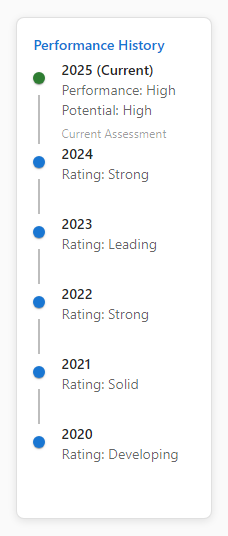

# 5-Minute Guided Tour: Discover 9Boxer's Full Power

> ⏱️ **Time:** 5-7 minutes
> 🎯 **Goal:** Experience 9Boxer's complete talent management workflow using realistic sample data
> 📋 **You'll need:** Nothing! We'll use built-in sample data

Welcome! This guided tour shows you everything 9Boxer can do. Instead of just uploading a file and looking at a grid, you'll explore performance history, discover hidden patterns, track changes, and see why 9Boxer is powerful for talent management.

Ready? Let's dive in!

---

## Step 1: Load Sample Data (1 minute)

Let's start with realistic sample data - 200 employees across 8 locations, 8 functions, and 3 years of performance history.

### Load the Sample Dataset

When you first open 9Boxer, you'll see an empty state screen with a prominent button.

1. Click the **"Load Sample Data (200 employees)"** button
2. Wait a few seconds while the app generates realistic employees
3. Watch your grid populate with 200 employee tiles

**Already have data loaded?** Open the **File menu** (top-left) and select **"Load Sample Dataset..."** instead.

### What You'll See

Your grid now displays 200 employees organized into 9 boxes based on Performance (horizontal) and Potential (vertical).

> 💡 **Why This Matters**
>
> Sample data lets you explore features risk-free. You can't break anything, and you'll see patterns that make the Intelligence panel come alive!

> 💾 **New! Save Sample Data Immediately**
>
> Want to save the sample data as an Excel file? You can now do that immediately! Click the **File menu** and select **"Save Sample Data"** - no need to make changes first. Perfect for creating a template or sharing the sample dataset with your team!

---

## Step 2: Explore Employee Details (1 minute)

Let's look at what 9Boxer knows about your people.

### Click on Any Employee

1. Click any employee tile on the grid
2. The right panel opens showing the **Details** tab

You'll see rich information:

- **Current Assessment** - Performance and Potential ratings
- **Job Information** - Function, level, location, tenure
- **Flags** - Talent indicators like "Promotion Ready" or "Flight Risk"
- **Reporting Chain** - Who they report to, up to the CEO

**Try this:** Click on different employees to see the variety of roles, locations, and flags. Notice how the reporting chain updates for each person.

> 💡 **Why This Matters**
>
> Seeing organizational context helps you make better talent decisions. Is this person a senior leader or a new hire? Do they have special considerations?

---

## Step 3: View Performance History (1 minute)

Now let's see how people have progressed over time.

### Open the Timeline Tab

1. With an employee selected, click the **Timeline** tab
2. You'll see their 3-year performance history (2023-2024-2025)

The timeline shows:

- **Historical ratings** - How their Performance and Potential changed
- **Grid position movements** - Visual representation of their journey
- **Year-over-year trends** - Are they improving or declining?

**Try this:** Find someone who moved boxes over time. Click on different employees to compare career trajectories.

> 💡 **Why This Matters**
>
> Performance isn't a snapshot - it's a trend. Someone declining needs intervention. Someone rising consistently might be your next leader!

---

## Step 4: Check Distribution Statistics (1 minute)

Let's see the big picture: how your talent is distributed.

### Open the Statistics Tab

1. Click the **Statistics** tab in the right panel (you don't need an employee selected)
2. Review the distribution table and chart

You'll see:

- **Breakdown by box** - Count and percentage in each grid position
- **Visual bar chart** - Quick pattern recognition
- **Summary cards** - Total employees, average ratings, distribution health

**Look for patterns:**

- Are too many people rated "High"? (Grade inflation)
- Are there enough Stars (top-right) for succession planning?
- Is everyone clustered in the center? (Poor differentiation)

> 💡 **Why This Matters**
>
> Healthy distributions typically have 10-15% in the top corner (Stars), not 40%. Statistics reveal calibration issues at a glance!

---

## Step 5: Discover Intelligence Insights (1-2 minutes)

Here's where it gets exciting - AI-powered pattern detection!

### Open the Intelligence Tab

1. Click the **Intelligence** tab in the right panel
2. Review the Summary section at the top
3. Scroll down to see **Anomaly Detection**

The Intelligence panel will show you things like:

- **Location bias detected** - "USA location has 15% more high performers than expected"
- **Function bias detected** - "Sales function has 20% more high performers than average"
- **Statistical outliers** - Groups that stand out from the norm

**Why these patterns exist:** The sample data deliberately includes these biases so you can see how the Intelligence panel works. In real data, patterns like this might reveal:

- Manager leniency (one manager rates everyone high)
- Actual performance differences (Sales genuinely excelling)
- Unconscious bias (favoring certain groups)

**Click on anomaly cards** to see detailed breakdowns and charts showing the deviation from expected distribution.

> 💡 **Why This Matters**
>
> Intelligence helps you ask the right questions: "Is Sales really outperforming, or is their manager too lenient?" It reveals patterns you'd miss in spreadsheets!

---

## Step 6: Try Making a Change (1 minute)

Let's see how easy it is to update ratings.

### Move an Employee

1. Find an employee you want to move (try someone in the center box)
2. **Click and hold** their tile
3. **Drag** to a different box
4. **Release** to drop

Watch what happens:

- The tile gets an **orange left border** - shows it's been modified
- The **File menu badge** updates with change count
- The **Changes** tab tracks this move

### Add a Note

1. Click the employee you just moved
2. Switch to the **Changes** tab
3. In the "Notes" field, type something like: "Moving to High Potential - demonstrated leadership in recent project"
4. The note saves automatically

> 💡 **Why This Matters**
>
> Notes create an audit trail. Six months from now, you'll remember WHY you made this change. During calibration meetings, you can justify every decision!

---

## Step 7: Try Filters (30 seconds)

Want to focus on a specific group? Filters are your friend.

### Filter by Location

1. Click the **Filters** button in the top toolbar
2. The filter drawer opens on the left
3. Under **Location**, select **"USA"**
4. The grid updates to show only USA employees

You'll see:

- Grid showing only matching employees
- **Orange dot** on the Filters button (filters are active)
- Employee count updated (e.g., "45 of 200 employees")

**Try this:**

- Clear the filter (click the **"Clear All"** button)
- Filter by **Function** instead - try "Engineering" or "Sales"
- Combine filters - select multiple locations or functions

> 💡 **Why This Matters**
>
> During calibration meetings, filters help you review one team at a time. Instead of scrolling through 200 people, you see exactly the group you need!

---

## Congratulations - You've Experienced 9Boxer's Power!

In just 5-7 minutes, you've seen:

- ✅ **Rich employee data** - Job info, flags, reporting chains
- ✅ **Performance history** - 3-year trends and career progression
- ✅ **Distribution analytics** - Statistical patterns and health checks
- ✅ **AI-powered insights** - Automatic detection of bias patterns
- ✅ **Easy editing** - Drag-and-drop changes with audit trail
- ✅ **Powerful filtering** - Focus on specific groups instantly

This is everything you need for effective talent management - all in one place!

---

## What's Next?

Choose your path based on what you need:

### I'm Ready to Use My Own Data

[Learn how to upload your Excel file](uploading-data.md)

You'll need 4 columns: Employee ID, Worker, Performance, Potential. We'll show you the exact format.

### I Want the Full 10-Minute Walkthrough

[Take the complete Getting Started tour](getting-started.md)

Deeper dive into the complete workflow: upload, review, change, document, export.

### I Need to Understand What Each Grid Position Means

[Learn about the 9-box framework](understanding-grid.md)

What does "Star" vs "Core Talent" vs "Enigma" actually mean? Strategic context for each position.

### I Want to Try Specific Features

[Jump to feature documentation](index.md#need-specific-help)

Filters, Donut Mode, Statistics, Intelligence, Change Tracking, Exporting - pick what you need.

---

## Quick Tips for Your First Real Session

!!! tip "Use Sample Data to Practice First"
    Before calibrating your real team, load sample data and practice the workflow. Try moving people, adding notes, and exporting. Build muscle memory in a safe environment!

!!! warning "Remember to Export Your Changes!"
    9Boxer doesn't auto-save. When you're done making changes, click the **File menu** and select **"Apply X Changes to Excel"** to download your updated file. Note: With sample data, you can also use **"Save Sample Data"** to export immediately without making any changes!

!!! info "Filters + Intelligence = Powerful Combo"
    During calibration: Filter by manager to see their team, then check Intelligence for patterns. Does this manager rate everyone high? Intelligence will tell you!

!!! success "Notes Are Your Future Self's Friend"
    Always add notes when moving employees. During next year's review, you'll thank yourself: "Why did we promote this person? Oh right, they led that critical project!"

---

## Exploring Safely

Remember: **You can't break anything!**

- Sample data resets every time you load it
- No changes are saved until you export
- Feel free to click buttons, drag employees, try filters
- The worst thing that can happen? You reload sample data and start over!

So explore freely. Click everything. Try features. See what happens!

---

## Common Questions After the Tour

**Q: Where did the bias patterns come from?**
A: Sample data deliberately includes USA (+15%) and Sales (+20%) bias so you can see how Intelligence works. Real data might reveal manager leniency, unconscious bias, or genuine performance differences.

**Q: Can I customize the sample data?**
A: Not currently - sample data uses a fixed seed for consistency. But you can upload your own Excel file with whatever data you want!

**Q: What happens to my changes if I don't export?**
A: They're lost when you close the app. 9Boxer is a session-based tool - think of it like Excel without auto-save. Always export before closing!

**Q: How do I get my real data into this format?**
A: Check out [Uploading Data](uploading-data.md) for the exact Excel format. You'll need 4 columns: Employee ID, Worker, Performance, Potential (case-sensitive!).

**Q: Can I use this for a live calibration meeting?**
A: Absolutely! Load your data, share your screen, and use filters to review one team at a time. See [Getting Started](getting-started.md) for the complete calibration workflow.

---

## Need Help?

- **Stuck on something?** Check [Troubleshooting](troubleshooting.md) for common issues
- **Want to learn a specific feature?** Browse the [Feature Reference](index.md#need-specific-help)
- **Tooltips everywhere!** Hover over any button for helpful hints

---

**You're off to a great start!** When you're ready, continue to [Getting Started](getting-started.md) to learn the complete production workflow with your own data.
