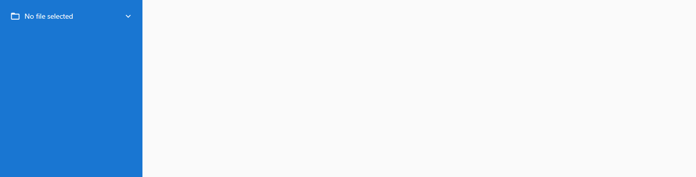
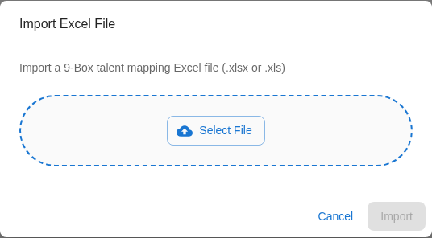
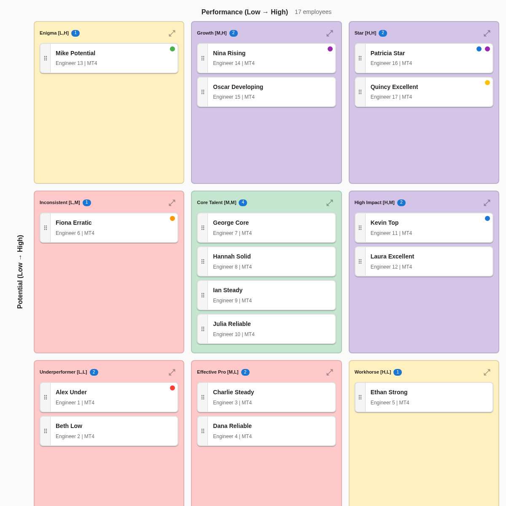

# 2-Minute Quickstart: See Your Team on the Grid

> ⏱️ **Time:** 2 minutes
> 🎯 **Goal:** Upload your data and see your first 9-box grid
> 📋 **You'll need:** An Excel file with employee data (or use our sample)

Let's get you to your first success quickly. In just 2 minutes, you'll see your entire team visualized on the 9-box talent grid.

---

## Step 1: Prepare Your File (30 seconds)

Your Excel file needs **4 columns** with these exact names:

| Employee ID | Worker | Performance | Potential |
|-------------|--------|-------------|-----------|
| 1001 | Sarah Chen | High | High |
| 1002 | Marcus Johnson | Medium | High |
| 1003 | Emma Rodriguez | High | Medium |

**Column requirements:**

- Names are **case-sensitive** - capitalize first letters exactly as shown
- Performance and Potential must be: `Low`, `Medium`, or `High`

### Don't have a file ready?

No problem! Use the built-in sample file:

1. Look in your 9Boxer installation folder for `Sample_People_List.xlsx`
2. Or download it from the Help menu inside the app

This sample file has everything you need to explore 9Boxer right now.

---

## Step 2: Upload Your File (1 minute)

### Open the File Menu

Find the **File menu button** in the top-left area of the app (it shows "No file selected" when you first open the app).

### Import Your Data

1. Click the **File menu button**
2. Select **Import Data** from the dropdown
3. Choose your Excel file in the file picker
4. Click **Import** in the dialog
5. Wait for the green success message

### Watch the Magic Happen

Your employees automatically appear on the grid, positioned based on their performance and potential ratings.

---

## Success! You Did It

You should now see:

1. **A 3×3 grid** - Nine boxes organized by Performance (horizontal) and Potential (vertical)
2. **Employee tiles** - Blue cards with names, positioned in the appropriate box
3. **Employee count** - Shows your total in the right panel

**If your grid is empty:** Check for an orange dot on the Filters button - you might have filters active. [Learn how to clear filters](filters.md#clearing-filters)

---

## Congratulations

**You've created your first talent grid!**

Here's what you can do now:

### Quick Actions to Try

**See who's in each box:**

- Click on any box to expand it and see all employees in that position

**View someone's details:**

- Click any employee tile to open their profile in the right panel

**Understand the positions:**

- Top-right corner = Your top talent (Stars)
- Center = Solid performers (Core Talent)
- Bottom-left = Need attention (Too new or performance concerns)

---

## What's Next?

Choose your path:

### I'm brand new to this

[Take the 10-minute Getting Started tour](getting-started.md)

Learn how to make changes, add notes, and export your results.

### I know what I'm doing

[Jump to specific tasks](index.md#need-specific-help)

Go directly to calibration workflows, filtering, or advanced features.

### I want to understand the 9-box method

[Learn about the 9-box framework](understanding-grid.md)

Understand what each position means and how to interpret distributions.

---

## Quick Tips

!!! tip "Make Your First Change"
    Try dragging an employee to a different box. Click and hold the tile, drag to a new box, and release. The tile gets an orange left border to show it's been modified!

!!! warning "Remember to Export!"
    9Boxer doesn't auto-save. When you're ready to save your changes, open the File menu and click "Apply Changes to Excel" to export.

!!! info "Explore Safely"
    You can't break anything! Drag employees around, click buttons, and explore. Nothing is saved until you export to Excel.

---

## Need Help?

### Common First-Time Questions

**Q: Why is my grid empty after uploading?**
A: Check if filters are active (orange dot on Filters button). [Clear all filters](filters.md#clearing-filters)

**Q: My file won't upload. Why?**
A: Make sure column names match exactly: `Employee ID`, `Worker`, `Performance`, `Potential` (case-sensitive). [See full upload requirements](uploading-data.md)

**Q: Can I use a CSV file?**
A: No, only Excel files (`.xlsx` or `.xls`). Convert your CSV to Excel first.

**Q: How do I save my changes?**
A: Open the File menu and click "Apply X Changes to Excel". This exports an updated Excel file. [Learn about exporting](exporting.md)

### Still stuck?

- **Tooltips:** Hover over any button for a helpful hint
- **Troubleshooting:** [Check common issues and solutions](troubleshooting.md)
- **Full guide:** [Browse complete documentation](index.md)

---

**You're off to a great start!** When you're ready, continue to [Getting Started](getting-started.md) to learn the complete workflow.
