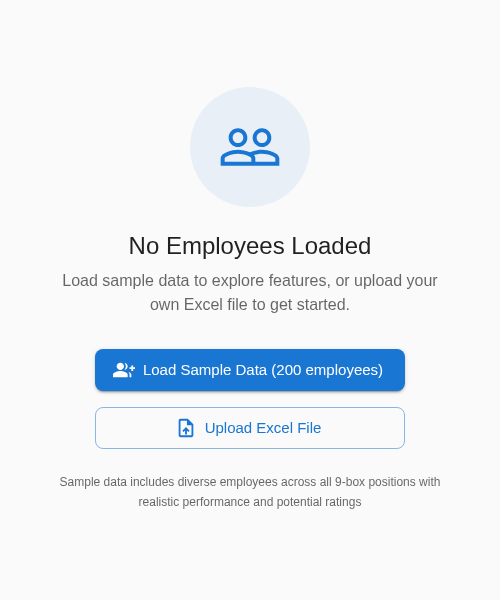
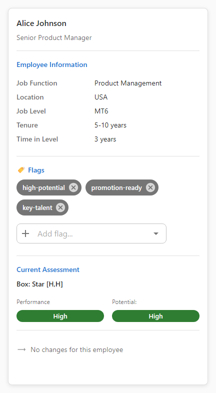
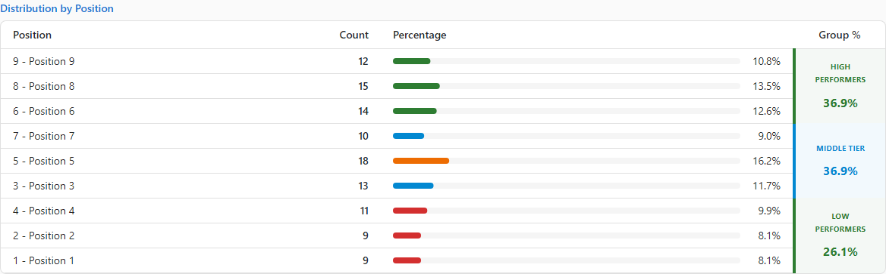

# Quickstart: See 9Boxer in 2 Minutes

> **Time:** 2 minutes
> **Goal:** Experience the complete workflow with sample data
> **You'll need:** Nothing! We'll use built-in sample data

This quickstart walks you through the core 9Boxer workflow. Let's go!

---

## Step 1: Download & Open 9Boxer

Download 9Boxer for your platform and launch the app.

| Platform | Download |
|----------|----------|
| Windows | [Download for Windows](#coming-soon) |
| macOS | [Download for macOS](#coming-soon) |
| Linux | [Download for Linux](#coming-soon) |

> 9Boxer runs locally on your computer. Your employee data never leaves your machine.

---

## Step 2: Load Sample Data

Click the **"Load Sample Data (200 employees)"** button in the center of the screen.

The grid populates with 200 realistic employees spread across all 9 boxes - organized by Performance (left to right) and Potential (bottom to top).

---

## Step 3: Explore Employee Details

Click any employee tile on the grid.

The right panel opens showing:

- **Current ratings** - Performance and Potential scores
- **Job details** - Function, level, location, tenure
- **Reporting chain** - Manager up to the CEO
- **Flags** - Indicators like "Promotion Ready" or "Flight Risk"

Click the **Timeline** tab to see this person's 3-year performance history - useful for understanding trends.

[Learn more about employee details →](working-with-employees.md)

---

## Step 4: Move an Employee

This is the core activity in calibration meetings.

1. **Click and drag** any employee tile to a different box
2. **Release** to drop them in the new position
3. Notice the **orange left border** - this marks them as modified

During calibration, you'll drag employees as your team reaches consensus on ratings.

---

## Step 5: Filter by Level

A common calibration task: review employees at the same job level to ensure balanced ratings.

1. Click the **Filters** button (top toolbar)
2. Under **Level**, select a specific level (e.g., "Manager")
3. The grid now shows only employees at that level

This helps you compare apples to apples during discussions. Clear the filter when done.

---

## Step 6: Check Statistics

Click the **Statistics** tab in the right panel.

You'll see:
- **Distribution table** - Count and percentage in each box
- **Visual chart** - Quick pattern recognition

Look for red flags:
- Too many in top row? (grade inflation)
- Everyone in the center? (poor differentiation)
- Empty corners? (missing data or extreme ratings)

---

## Step 7: Check Intelligence

Click the **Intelligence** tab in the right panel.

Intelligence automatically detects bias patterns:
- "USA location has 15% more high performers than expected"
- "Sales function shows rating inflation"
- "Manager X rates significantly higher than peers"

These insights help you ask the right questions in calibration meetings.

---

## Step 8: Apply Changes

Click **File menu → Apply Changes to Excel** to export your work.

This creates an Excel file with:
- Updated Performance/Potential ratings
- "Modified in Session" column showing what changed
- Notes you added during the session

**For sample data:** This gives you a baseline template. Fill it in with your own employee data to run your first real calibration meeting.

---

## You're Done!

In 2 minutes, you've experienced the complete workflow:

1. Load data into 9Boxer
2. View employee details and history
3. Move employees between boxes (core calibration activity)
4. Filter to focus on specific groups
5. Check distribution statistics
6. Spot bias with Intelligence
7. Export results

---

## What's Next?

**Ready to run a calibration?** → [Your First Calibration](getting-started.md) - Complete workflow guide

**Ready to use your data?** → [Employee Data](employee-data.md) - Excel file requirements

**New to 9-box methodology?** → [Understanding the Grid](understanding-grid.md) - What each position means

**Want the complete reference?** → [Best Practices Guide](best-practices.md) - All checklists and scenarios
