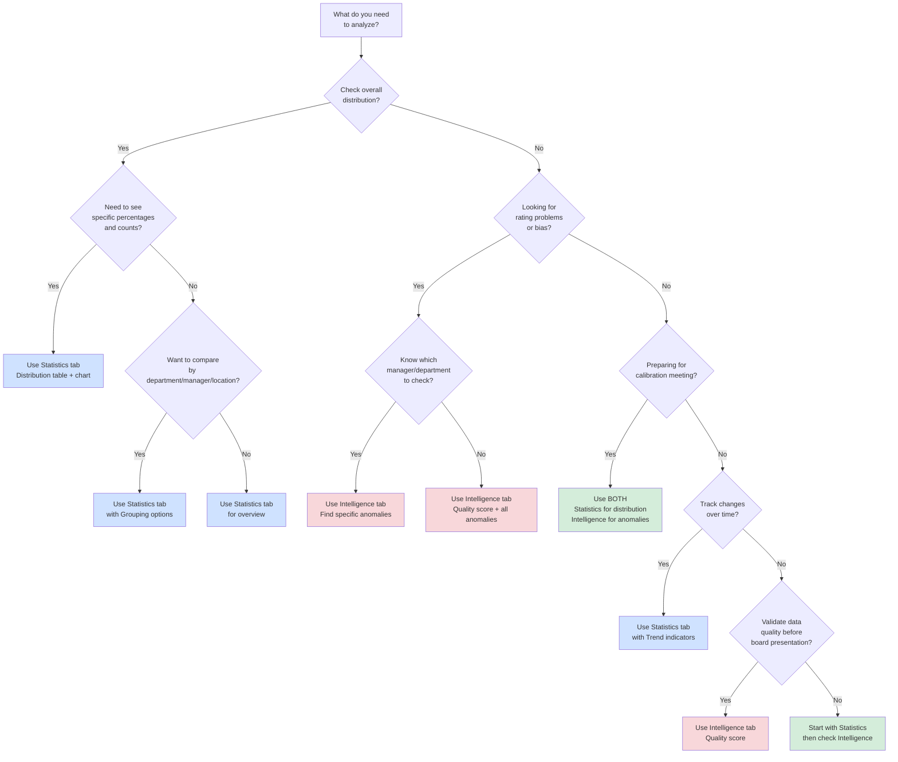

# Statistics and Intelligence

Here's everything you need to know about analyzing your talent distribution using the Statistics and Intelligence tabs in the right panel.

---

📋 Quick Reference (Click to expand)

**Accessing Statistics:**
- Click any employee (or click outside) → Statistics tab (third tab)
- Shows distribution table + visual chart
- Displays count and percentage for each grid box

**Reading Distribution:**
- Ideal: 10-15% Stars (top-right), 50-60% in middle boxes
- Red flags: Too many in bottom-left, too few in top row, heavy clustering
- Use chart to spot imbalances at a glance

**Using Intelligence:**
- Intelligence tab (fourth tab) shows anomalies and quality score
- Red/yellow highlights indicate rating inconsistencies
- Compare expected vs. actual employee counts by manager, department, job level

**Common Patterns to Watch:**
- Manager rates everyone high = leniency bias
- Department has no stars = under-rating or talent gap
- Uneven distribution = calibration needed

[See detailed analysis below ↓](#statistics-tab)

---

## Which Analysis Feature Do I Need?

Use this decision tree to choose between Statistics and Intelligence:

**Quick decision guide:**

- **Use Statistics when**: Checking distribution, comparing percentages, grouping by dimension, tracking trends
- **Use Intelligence when**: Finding bias, spotting anomalies, validating quality, preparing for difficult conversations
- **Use BOTH when**: Preparing for calibration, validating overall data health, comprehensive talent review

---

## When to Use This

### Common Scenarios

You'll want to use Statistics and Intelligence when:

- **Checking distribution health** - See if you have too many "High" ratings or too few Stars before calibration ([see Preparing for Talent Calibration](workflows/talent-calibration.md))
- **Identifying rating bias** - Spot managers who rate everyone high or departments with skewed distributions
- **Preparing reports** - Generate data for quarterly talent reviews or board presentations
- **Validating calibration results** - After making changes, verify your distribution improved and anomalies resolved
- **Succession planning analysis** - Check if you have enough high-potential employees in your pipeline

### Related Workflows

- [Preparing for Talent Calibration](workflows/talent-calibration.md) - Use Statistics to validate distribution and Intelligence to spot anomalies requiring discussion
- [Understanding the Grid](understanding-grid.md) - Learn what healthy distributions look like for your organization

### Real-World Example

> 📋 **Scenario**
>
> Before the calibration meeting, Rachel checks Statistics and sees 35% of employees are rated "High Performance" (target is 20%). Intelligence highlights that Manager Tom rates 80% of his team as High while other managers average 15%. This becomes her top discussion topic for the meeting.

---

## Accessing Statistics and Intelligence

To view statistics and intelligence data:

1. Click any employee tile on the grid (or click outside to view global data)
2. The right panel opens with four tabs
3. Click the **"Statistics"** tab (third tab) or **"Intelligence"** tab (fourth tab)

You'll see distribution data in Statistics and advanced analytics in Intelligence.

---

## Statistics Tab

The Statistics tab shows you exactly how your people are spread across the 9-box grid.

> 📋 **Real-World Scenario**
>
> Before her calibration meeting, Sarah checks Statistics and sees 35% of employees are rated "High Performance" (her target is 20%). This becomes her top discussion topic for the meeting - identifying which employees are truly high performers versus those rated too generously.

### Distribution Table

Here's the breakdown of employees by performance and potential:

**Table Structure:**

| | **High Potential** | **Medium Potential** | **Low Potential** |
|---|---|---|---|
| **High Performance** | Count (%) | Count (%) | Count (%) |
| **Medium Performance** | Count (%) | Count (%) | Count (%) |
| **Low Performance** | Count (%) | Count (%) | Count (%) |

**What each cell shows:**

- **Count** - Number of employees in that box
- **Percentage** - Proportion of total workforce in that box

!!! example "Example Distribution Cell"
    **15 (10%)** means 15 employees are in this box, representing 10% of the total workforce.

The Statistics panel gives you both a detailed table breakdown and an at-a-glance visual chart. The bar chart makes patterns immediately obvious.

!!! note "Why This Matters"
    Statistics turn subjective talent discussions into objective data. Instead of guessing if your ratings are balanced, you'll see exactly where adjustments are needed before calibration meetings.

### Distribution Chart

A visual bar chart representation of your data:

- Each bar represents one of the nine boxes in the grid
- Bar height indicates the number of employees in that box
- Makes it easy to spot imbalances and patterns at a glance

!!! tip "See It in Action"
    Remember the distribution chart from the [quickstart tour](quickstart.md)? Load sample data to see realistic distribution patterns with 200 employees spread across all 9 boxes.

This is what a healthy, well-balanced distribution looks like. Notice the concentration in the middle boxes with fewer employees at the extremes.

### Interpreting Your Distribution

Use these statistics to assess your talent pipeline health and spot potential issues.

**Ideal Distribution (Rough Guideline):**

| Category | Target % | What It Means |
|----------|---------|---------------|
| **Stars** (High/High) | 10-15% | Top performers ready for advancement |
| **High Potential boxes** (top row) | 15-20% | Future leaders in development |
| **Core/Solid Performer boxes** (middle) | 50-60% | Backbone of the organization |
| **Lower boxes** (bottom row) | 10-20% | New hires or improvement needed |

!!! info "Distribution Guidelines"
    These are general guidelines, not strict rules. Your ideal distribution depends on your organization's structure, growth stage, and talent strategy.

**Red Flags to Watch For:**

!!! warning "Distribution Warning Signs"
    - **Too many in bottom-left** (Under-performers) - Performance management issues
    - **Too few in top rows** - Succession planning risk, retention problems
    - **Heavily skewed to one side** - Calibration needed, potential rating bias
    - **Very uneven distribution** - Rating inconsistency across managers or departments

**Balanced vs. Unbalanced Distributions:**

- **Balanced**: Employees spread across multiple boxes with concentration in middle
- **Unbalanced**: Most employees clustered in one or two boxes (indicates calibration issues)

Summary cards at the top of the Statistics panel give you quick insights into your overall distribution health without scrolling through the detailed table.

### Success! You've Reviewed Distribution Statistics

You'll see:
- Exact counts and percentages for each grid box
- Visual bar chart showing patterns at a glance
- Red flags if distribution looks unbalanced
- Data to drive calibration conversations

### Grouping and Trend Analysis

You can group your distribution data by different dimensions (Department, Manager, Location, Job Level) to spot patterns and compare rating consistency across teams.

Trend indicators show you how your distribution has changed over time. Green arrows indicate improvements (like increasing Stars or reducing Under-performers), while red arrows highlight areas needing attention.

### Use Cases for Statistics

**Performance Review Calibration:**

- Compare your distribution to organizational targets
- Identify if too many employees are rated "High" or "Low"
- Ensure consistent rating standards across teams

**Succession Planning:**

- Check if you have enough high-potential employees (top row)
- Identify gaps in your talent pipeline
- Plan development programs based on distribution

**Talent Strategy Assessment:**

- Evaluate overall workforce quality
- Spot hiring or retention issues
- Track distribution changes over time

> Why This Matters
>
> Statistics help you focus during calibration meetings. Instead of guessing if your ratings are balanced, you'll see exactly where adjustments are needed. This data turns subjective discussions into objective calibration.

---

## Intelligence Tab

Intelligence runs advanced statistical analysis behind the scenes to spot patterns, anomalies, and potential biases in your ratings.

!!! info "Sample Data Includes Intentional Bias Patterns"
    Sample data deliberately includes USA location bias (+15% high performers) and Sales function bias (+20% high performers) so you can see Intelligence in action. [Take the quickstart tour](quickstart.md) to explore how anomaly detection works!

!!! note "Why This Matters"
    Intelligence catches rating bias that goes unnoticed until it impacts succession planning or causes employee relations issues. It gives you statistical evidence to have difficult calibration conversations.

> 📋 **Real-World Scenario**
>
> Priya opens Intelligence and discovers that the Engineering department has 80% of employees in the "Core Talent" box while Sales has only 40%. She uses filters to review Engineering employees individually, finding 12 who are actually high-potential but were rated conservatively. She adds notes and recalibrates their ratings.

### What Intelligence Does

Intelligence is 9Boxer's AI-powered analysis engine that automatically detects rating patterns and potential biases in your talent data. Think of it as a quality assurance system that works behind the scenes to ensure your performance and potential ratings are fair, consistent, and statistically sound.

**Core Capabilities:**

- Analyzes thousands of data points across your organization
- Identifies statistically significant deviations from expected patterns
- Flags potential bias in manager ratings, department distributions, and location-based inconsistencies
- Provides a data quality score to assess overall rating reliability
- Recommends specific areas requiring calibration review

> Why This Matters
>
> Without Intelligence, rating biases often go unnoticed until they impact succession planning or cause employee relations issues. Intelligence catches these problems early, giving you the opportunity to recalibrate before finalizing performance reviews.

### When to Use Intelligence

You'll get the most value from Intelligence in these scenarios:

- **Before calibration meetings** - Identify discussion topics and outliers requiring consensus review
- **After initial rating submissions** - Spot manager leniency or harshness before finalizing ratings
- **During talent reviews** - Validate that your distribution is statistically sound and bias-free
- **For quarterly audits** - Track rating consistency trends over time
- **Before board presentations** - Ensure your talent data quality is defensible

### How Intelligence Works: Detection Methodology

Intelligence uses **chi-square statistical testing** (p-value analysis) to compare your actual employee distribution against expected patterns. Here's how it works:

**Step 1: Calculate Expected Distribution**

Based on your overall talent distribution, Intelligence calculates how many employees would be expected in each performance/potential category for every manager, department, location, and job level if ratings were perfectly consistent.

**Step 2: Compare Actual vs. Expected**

Intelligence counts the actual number of employees in each category and compares it to the expected number.

**Step 3: Test Statistical Significance**

The chi-square test determines whether differences between actual and expected are:

- **Random chance** (normal variance) - No action needed
- **Statistically significant** (p < 0.05) - Moderate anomaly detected
- **Highly significant** (p < 0.01) - Critical anomaly requiring attention

**Step 4: Flag Anomalies with Severity**

Based on the p-value and deviation magnitude, Intelligence assigns a severity level:

- Red (Critical) - Immediate calibration needed
- Yellow (Moderate) - Review recommended
- Green (Minor) - Informational only

!!! example "Real-World Example: Manager Leniency Detection"
    Manager Alex has 20 direct reports. Your organization's overall distribution shows 15% of employees are rated "High Performance."

    **Expected:** 3 of Alex's 20 employees should be High Performance (15% of 20)
    **Actual:** 16 of Alex's 20 employees are rated High Performance (80%)
    **Deviation:** +13 employees (+65 percentage points)
    **Statistical Test:** p < 0.001 (highly significant)
    **Intelligence Verdict:** Critical manager leniency bias detected - red alert

    This pattern would be nearly impossible due to random chance, indicating systematic over-rating.

### Types of Anomalies Detected

Intelligence analyzes your data across five key dimensions and detects different types of rating anomalies:

#### 1. Performance Bias (Manager Rating Patterns)

**What It Detects:**

Individual managers who rate their teams significantly higher or lower than their peers.

**Common Patterns:**

- **Leniency bias** - Manager rates everyone high ("My team is exceptional!")
- **Harshness bias** - Manager rates everyone low (sets unrealistic standards)
- **Central tendency bias** - Manager puts everyone in the middle (avoids differentiation)
- **Recency bias** - Recent events disproportionately influence annual ratings

**Red Flags:**

- Manager A: 80% of team rated High Performance (org average: 15%)
- Manager B: 0% of team in top-right "Stars" box (org average: 12%)
- Manager C: 95% of team in center box (org average: 55%)

**Why It Happens:**

- First-time managers lack calibration experience
- Managers fear difficult conversations about low performance
- Genuinely exceptional team (rare, but possible)
- Different interpretation of rating criteria

This is what critical manager leniency looks like. When a manager rates 18 employees high when only 4 are expected statistically, you're looking at systematic bias requiring immediate calibration discussion.

#### 2. Location Bias (Geographic Rating Patterns)

**What It Detects:**

Certain office locations, regions, or countries with skewed performance distributions compared to the organization overall.

**Common Patterns:**

- **Regional leniency** - One office rates significantly higher than others
- **Remote worker penalty** - Remote employees rated lower than office-based peers
- **Country/culture effects** - Different cultural norms around performance feedback
- **Office-specific leadership** - Local leadership sets different rating standards

**Red Flags:**

- San Francisco office: 30% Stars (global average: 12%)
- Remote workers: 5% High Potential (office workers: 20%)
- London office: 0% Low Performance ratings (global average: 15%)

**Why It Happens:**

- Different regional managers with inconsistent calibration
- Cultural differences in feedback directness
- Local labor markets (highly competitive areas may attract better talent)
- Geographic isolation reducing cross-office calibration

!!! example "Location Bias Example"
    A multinational company discovers their India office has 35% of employees rated "High Potential" while other regions average 12%.

    **Possible Causes:**
    - Truly exceptional hiring in that region (talent hub)
    - Regional manager is lenient compared to peers
    - Cultural tendency toward positive ratings

    **Action:** Hold cross-regional calibration session to align rating standards.

#### 3. Function Bias (Department Rating Patterns)

**What It Detects:**

Certain departments or job functions with distributions that don't match organizational patterns.

**Common Patterns:**

- **Favored functions** - Sales or Engineering rated higher than support functions
- **Under-valued functions** - Operations or Admin rated lower despite solid performance
- **Revenue-biased ratings** - Revenue-generating teams rated higher regardless of metrics
- **Visibility bias** - Customer-facing roles rated higher than backend roles

**Red Flags:**

- Engineering: 25% Stars (org average: 12%)
- Customer Support: 2% Stars (org average: 12%)
- Sales: 60% High Performance (org average: 18%)
- Finance: 90% in center box (org average: 55%)

**Why It Happens:**

- Unconscious bias favoring "strategic" functions
- Revenue-generating teams perceived as more valuable
- Different managers with varying rating philosophies
- Genuine performance differences (less common than assumed)

**Real-World Scenario:**

> 📋 **Function Bias Discovery**
>
> An HR director reviews Intelligence before the annual talent review and discovers Sales has 40% of employees in the top row (High Potential) while Engineering has only 8%, despite similar business criticality.
>
> **Investigation:** Filters to Sales department and reviews individual employees. Finds many rated "High Potential" based on recent deal wins rather than demonstrated leadership capability.
>
> **Action:** Recalibrates 12 Sales employees from High Potential to High Performance (great current results, but not necessarily future leaders).

#### 4. Tenure Bias (Experience-Based Patterns)

**What It Detects:**

Rating patterns correlated with employee tenure rather than actual performance or potential.

**Common Patterns:**

- **New hire inflation** - New employees rated high prematurely ("they seem promising!")
- **Veteran penalty** - Long-tenured employees rated lower (plateaued perception)
- **Recency bias** - New hires benefit from "fresh start" assumptions
- **Legacy ratings** - Long-term employees stuck in historical ratings

**Red Flags:**

- Employees <6 months: 40% High Potential (overall: 15%)
- Employees >5 years: 8% High Potential (overall: 15%)
- New hires disproportionately in top-right corner
- Veterans concentrated in center box despite strong performance

**Why It Happens:**

- Insufficient data to rate new hires accurately
- "Halo effect" of successful recruiting (we hired great people!)
- Assumption that long tenure = plateaued growth
- Failure to update ratings as employees develop

!!! warning "New Hire Rating Pitfall"
    Many organizations rate new hires as "High Potential" based on interview performance and early impressions. Intelligence flags this when new employees are rated High Potential at 3x the organizational average.

    **Best Practice:** Wait 6-12 months before assigning Potential ratings. Mark new hires as "Too New to Rate" or default to Medium until performance data emerges.

#### 5. Level Bias (Job Level Rating Patterns)

**What It Detects:**

Performance and potential ratings that correlate too strongly with job level (individual contributors vs. managers vs. executives).

**Common Patterns:**

- **Leadership inflation** - Directors/VPs disproportionately rated High Performance
- **IC penalty** - Individual contributors rated lower than managers doing equivalent work
- **Management halo effect** - Promotion to management assumes high potential
- **Executive kid-glove treatment** - Senior leaders rarely rated Low

**Red Flags:**

- Individual Contributors: 8% Stars (org average: 12%)
- Managers: 25% Stars (org average: 12%)
- VPs: 50% High Performance (org average: 15%)
- Executives: 0% in lower boxes (statistically unlikely)

**Why It Happens:**

- Conflating job level with performance quality
- Assumption that promoted employees are automatically high performers
- Politics around rating senior leaders honestly
- Survivorship bias (weak performers at senior levels already left)

**Example Pattern:**

Your organization has 120 individual contributors and 30 managers. Intelligence shows:

- ICs: 6% in top-right Stars box (7 employees)
- Managers: 30% in top-right Stars box (9 employees)

**Statistical Issue:** If job level didn't matter, you'd expect roughly similar percentages. This suggests managers are rated more favorably simply for being managers.

Level distribution analysis reveals how ratings vary across your organizational hierarchy. Use this to identify if managers are systematically rated higher than individual contributors or if executive succession gaps exist.

The Intelligence tab highlights anomalies with color-coded severity indicators. Red cards need immediate attention, yellow cards warrant review, and green cards are informational.

### Severity Levels: Understanding the Color Coding

Intelligence uses a traffic-light color system to help you prioritize which anomalies require immediate attention and which are informational only.

#### Red (Critical) - Immediate Attention Needed

**When You See Red:**

- Statistical significance p < 0.01 (less than 1% chance this is random)
- Large deviation from expected (typically +/- 50% or more)
- Pattern affects significant number of employees (10+ people)

**What It Means:**

This anomaly is almost certainly not due to random chance. There's a systematic pattern that requires investigation and likely calibration.

**Examples:**

- Manager rates 18 employees High when only 4 expected (350% deviation)
- Department has 0 Stars when 12 expected (100% deficit)
- Location shows 30% High Performance when org average is 12% (150% surplus)

**Recommended Action:**

Schedule immediate calibration discussion. This level of deviation typically indicates:

- Manager needs rating calibration training
- Different rating standards being applied
- Genuine talent concentration requiring validation

**Timeline:** Address before finalizing performance reviews or making promotion decisions based on this data.

When you see red anomalies like this manager leniency example, don't ignore them. The statistical test shows this pattern is highly unlikely to be random chance.

#### Yellow (Moderate) - Review Recommended

**When You See Yellow:**

- Statistical significance p < 0.05 (less than 5% chance this is random)
- Moderate deviation from expected (typically +/- 20-50%)
- Pattern affects moderate number of employees (5-10 people)

**What It Means:**

This anomaly is probably not random, but might have legitimate explanations. Worth investigating, but not necessarily a crisis.

**Examples:**

- Manager rates 8 employees High when 5 expected (60% deviation)
- Department has 15% Stars when org average is 10% (50% surplus)
- New hires rated High Potential at 25% when org average is 15% (67% surplus)

**Recommended Action:**

Review the affected employees to determine if the pattern is:

- **Justified** - Team genuinely performs better, new hiring strategy working
- **Questionable** - Manager interpretation differs from peers, requires discussion

**Timeline:** Address during next scheduled calibration session or quarterly review.

#### Green (Minor) - Informational Only

**When You See Green:**

- Statistical significance p < 0.10 (less than 10% chance random, but not conclusive)
- Small deviation from expected (typically +/- 10-20%)
- Pattern affects few employees (1-5 people)

**What It Means:**

This deviation could easily be random chance or natural variance. Intelligence is flagging it for awareness, but no action is typically needed.

**Examples:**

- Manager rates 6 employees High when 5 expected (20% deviation)
- Department has 2 Stars when 1.5 expected (33% surplus with small numbers)
- Remote workers show slight positive bias within normal range

**Recommended Action:**

Note the pattern but don't take action unless it persists over multiple review cycles. Small sample sizes create natural statistical noise.

**Timeline:** Monitor in future quarters. If green becomes yellow/red, investigate then.

Green anomalies like this are typically within normal statistical variance. Intelligence shows them for completeness, but they rarely require action.

### Quality Score: Overall Rating Reliability

At the top of the Intelligence tab, you'll see an overall **quality score** that summarizes the statistical health of your talent data.

**How the Score Is Calculated:**

Intelligence analyzes all detected anomalies and calculates a composite score from 0-100 based on:

- **Number of anomalies** - More anomalies = lower score
- **Severity of anomalies** - Red anomalies impact score more than yellow or green
- **Percentage of employees affected** - Anomalies affecting 50% of workforce score lower than those affecting 5%
- **Statistical significance** - Higher p-values (weaker evidence) impact score less

**Score Interpretation:**

| Score Range | Rating | What It Means | Action Needed |
|-------------|--------|---------------|---------------|
| **90-100** | Excellent | No significant anomalies, well-calibrated ratings | No action needed |
| **75-89** | Good | Minor anomalies only, mostly consistent | Monitor trends over time |
| **60-74** | Fair | Some moderate anomalies, review recommended | Schedule calibration review |
| **40-59** | Poor | Multiple moderate/critical anomalies detected | Immediate calibration needed |
| **0-39** | Critical | Severe systematic bias across organization | Hold calibration before finalizing ratings |

**What a High Score Tells You:**

- Ratings are statistically consistent across managers, departments, and locations
- No systematic bias patterns detected
- Data is reliable for succession planning and talent decisions
- Calibration efforts are working effectively

**What a Low Score Tells You:**

- Significant rating inconsistencies exist
- Some managers/departments using different standards
- Data quality issues require resolution before making talent decisions
- Calibration sessions needed to align rating criteria

!!! tip "Quality Score Trends Over Time"
    Track your quality score across multiple review cycles. Improving scores indicate your calibration efforts are working. Declining scores suggest rating standards are drifting apart.

**Real-World Context:**

> 📋 **Quality Score Example**
>
> A company of 500 employees runs their annual performance review. Intelligence shows a quality score of 42 (Poor).
>
> **Anomalies Detected:**
> - 3 managers with severe leniency bias (red)
> - 2 departments with function bias (yellow)
> - New hires over-rated as High Potential (yellow)
>
> **Action:** HR pauses the review process, holds cross-manager calibration sessions, and recalibrates 67 employees. Quality score improves to 81 (Good) before finalizing ratings.

When Intelligence shows a clean bill of health like this, your ratings are well-calibrated and statistically consistent across your organization. No anomalies means no bias patterns detected.

### Success! You've Reviewed Intelligence Analysis

You'll see:
- Overall quality score showing rating reliability
- Red/yellow anomaly cards flagging issues needing attention
- Statistical evidence of manager leniency or department bias
- Specific employees to review during calibration

This is what you see when Intelligence detects problems. Multiple red anomalies mean you should review ratings before finalizing them. Use this as a discussion prompt for calibration meetings.

### Recommended Actions for Each Anomaly Type

When Intelligence detects an anomaly, knowing what action to take is crucial. Here's your playbook for responding to each type of bias pattern:

#### Manager Leniency Bias (Rates Too High)

**Situation:** One manager rates their team significantly higher than peers rate similar employees.

**Immediate Actions:**

1. **Review the affected employees individually** - Use filters to show only this manager's team
2. **Compare to peer employees** - Look at similar job levels/functions rated by other managers
3. **Hold 1:1 calibration discussion** with the manager:
   - Share the statistical evidence (expected vs. actual)
   - Review rating criteria definitions together
   - Discuss specific employees who may be over-rated
   - Recalibrate ratings to align with organizational standards

**Long-Term Solutions:**

- Provide rating calibration training for new managers
- Include this manager in cross-functional calibration sessions
- Have them shadow experienced managers during rating process
- Implement forced distribution guidelines if leniency is widespread

**Example Conversation:**

> "Tom, I noticed that 80% of your team is rated High Performance, while other managers average 15%. Let's review your top performers together and ensure we're applying consistent standards across the organization."

#### Manager Harshness Bias (Rates Too Low)

**Situation:** One manager rates their team significantly lower than peers, even for strong performers.

**Immediate Actions:**

1. **Investigate the reason** - Is this a genuinely struggling team or harsh rating standards?
2. **Compare team metrics** - If this team hits targets like others, ratings may be too harsh
3. **Review individual employees** - Are there hidden stars rated as "Medium" who deserve "High"?
4. **Calibrate with peer managers** - Show examples of similar employees rated higher elsewhere

**Long-Term Solutions:**

- Coach manager on providing balanced feedback
- Ensure manager understands organizational rating distribution targets
- Pair with mentor manager who calibrates well
- Address if manager fears rating employees highly

**Warning Signs of Genuine Performance Issues:**

If the harsh ratings are justified (team truly underperforming):

- Review hiring practices for that team
- Assess manager's leadership effectiveness
- Consider performance improvement plans
- Evaluate if team has resource/support gaps

#### Department/Function Bias

**Situation:** One department (e.g., Sales) has dramatically different distribution than others (e.g., Engineering).

**Immediate Actions:**

1. **Validate if bias is justified**:
   - Does Sales genuinely have better talent due to competitive hiring?
   - Or are Sales managers using different rating standards?
2. **Hold cross-departmental calibration** - Sales and Engineering managers review employees together
3. **Recalibrate outliers** - Adjust ratings for employees whose ratings don't match performance data
4. **Document why differences exist** if they're legitimate (e.g., "Sales hires from top MBA programs, Engineering promotes from within")

**Long-Term Solutions:**

- Create organization-wide rating calibration sessions (not just within departments)
- Establish clear criteria for each rating level that apply across functions
- Rotate calibration facilitators across departments
- Track function bias trends quarterly to ensure it doesn't worsen

**Example Action:**

> A company discovers Engineering has 0% Stars while Sales has 25% Stars. Cross-functional review reveals Sales conflates "High Performance" (great quarterly results) with "High Potential" (future leadership). They recalibrate 8 Sales employees from Stars to High Performers.

#### Location Bias

**Situation:** One office/region rates significantly higher or lower than others.

**Immediate Actions:**

1. **Hold cross-location calibration call** - Include managers from multiple offices
2. **Review sample employees from each location** side-by-side
3. **Identify if bias is cultural** (some cultures avoid low ratings) or managerial (local leadership sets tone)
4. **Recalibrate using consistent standards** across all locations

**Long-Term Solutions:**

- Establish global rating standards with cultural sensitivity
- Train local HR teams on consistent calibration
- Create regional calibration committees that include multiple offices
- Use data-driven performance metrics, not just subjective ratings

**Cultural Considerations:**

Some cultures avoid direct negative feedback. Address this by:

- Focusing on relative rankings ("top 10% of performers") rather than absolute ratings
- Emphasizing growth opportunities rather than "low performance" labels
- Providing calibration training that acknowledges cultural norms while maintaining standards

#### Tenure Bias (New Hire Inflation)

**Situation:** Employees with <6 months tenure rated as "High Potential" disproportionately.

**Immediate Actions:**

1. **Review each new hire rated High Potential** - Is there evidence, or is this optimism?
2. **Implement "Too New to Rate"** policy - Default new hires to "Medium/Medium" until 6-12 months
3. **Recalibrate premature ratings** - Move new hires to Medium Potential until proven otherwise

**Long-Term Solutions:**

- Establish minimum tenure requirement (6-12 months) before rating Potential
- Separate "Performance" (can rate immediately) from "Potential" (requires observation time)
- Create "New Hire" flag to track separately from 9-box grid
- Focus new hire assessments on onboarding success, not long-term potential

**Why This Matters:**

Rating new hires as High Potential prematurely:

- Inflates your succession pipeline artificially
- Creates disappointment when expectations don't match reality
- Reduces credibility of ratings overall
- May cause retention issues if new hire doesn't advance as expected

#### Level Bias (Leadership Inflation)

**Situation:** Managers/directors rated disproportionately high compared to individual contributors.

**Immediate Actions:**

1. **Compare performance criteria** - Are you rating job level instead of performance quality?
2. **Review IC stars** - Are high-performing ICs under-valued compared to mediocre managers?
3. **Separate "current performance" from "leadership level"** - A senior IC can be a Star without being a manager

**Long-Term Solutions:**

- Create dual career tracks (IC track and Management track) with equivalent prestige
- Ensure "High Potential" means "potential for growth" not "potential for management"
- Rate managers on leadership quality, not on the fact they're managers
- Recognize technical experts as "Stars" even if they don't manage people

**Example Recalibration:**

> A VP is rated "High Performance" despite missing strategic goals, while an IC engineer shipping critical projects is rated "Medium Performance." Intelligence flags this as level bias. After review, VP is recalibrated to Medium Performance, IC engineer moves to Star.

### Anomaly Detection

Intelligence highlights unusual distributions by comparing:

- **Expected employee count** - What you'd expect based on overall distribution
- **Actual employee count** - What you actually have in each category
- **Deviation** - How far actual deviates from expected

**We highlight outliers with color coding:**

- **Red/Yellow highlights** - Significant deviations from expected distribution
- **Tables or lists** - Show which groups have the most anomalies

!!! example "Anomaly Example"
    **Expected**: 8 employees in "High Performance, High Potential" for Engineering
    **Actual**: 2 employees
    **Deviation**: -6 (significantly lower than expected)
    **Interpretation**: Engineering may be under-rating high performers or lacking stars

Critical (red) anomalies like this manager leniency example show severe rating bias. This manager rates 18 employees high when only 4 would be expected statistically. This needs immediate calibration discussion.

Minor (green) anomalies are informational only. This slight deviation is within normal statistical variance and doesn't require action. Intelligence helps you distinguish real problems from noise.

### Anomaly Severity Levels

Intelligence uses color coding to indicate how urgent each anomaly is:

- **Red (Critical)** - Needs immediate attention, significant deviation (p < 0.01)
- **Yellow (Moderate)** - Review recommended, notable pattern (p < 0.05)
- **Green (Minor)** - Informational only, within acceptable variance

The statistical significance (p-value) tells you whether the pattern is real or could be random chance.

### Deviation Charts

Deviation charts visualize where your actual distribution differs from expected patterns. Red bars show over-representation, blue shows under-representation. This makes patterns obvious at a glance.

Level distribution analysis shows rating patterns across your organizational hierarchy. Use this to spot if managers are rated differently than individual contributors or if leadership has succession gaps.

### Real-World Intelligence Success Stories

Here are detailed examples showing how organizations have used Intelligence to improve their talent management:

#### Scenario 1: Sarah Discovers Manager Leniency Before Annual Reviews

**Organization:** 150-person SaaS company, annual performance review cycle

**Problem Discovered:**

Sarah, the HR Director, opens Intelligence two weeks before the annual review committee meeting. Quality score shows 58 (Poor). Intelligence flags:

- **Manager Tom Chen (red anomaly):** 18 of 20 direct reports rated High Performance (90%), org average is 18%
- **Manager Lisa Park (yellow anomaly):** 12 of 15 direct reports in top-right "Stars" box (80%), org average is 12%

**Investigation:**

Sarah filters to Tom's team and reviews each employee individually. She finds:

- 5 employees rated "High Performance" who joined less than 3 months ago (insufficient data)
- 8 employees rated "High" with performance metrics below team average
- 5 employees legitimately high performers

**Action Taken:**

1. Sarah schedules 1:1 calibration meeting with Tom
2. Shows statistical evidence (expected 3.6 High Performance employees, actual 18)
3. Reviews each employee with Tom, asking for specific performance evidence
4. Tom recalibrates 13 employees downward after discussion
5. Sarah provides Tom with calibration training resources

**Outcome:**

After recalibration, Tom's team distribution aligns with organizational norms. Quality score improves to 79 (Good). Sarah adds Tom to monthly calibration training cohort for new managers.

**What Sarah Learned:**

Tom wasn't intentionally inflating ratings - he genuinely believed his team was exceptional. He needed concrete examples of what "High Performance" looks like compared to "Medium Performance" at the organization.

#### Scenario 2: Priya Identifies Function Bias Affecting Promotions

**Organization:** 800-person financial services firm, quarterly talent review

**Problem Discovered:**

Priya, VP of Talent, opens Intelligence before the quarterly talent review and sees quality score of 44 (Poor). Intelligence flags:

- **Sales Department (red anomaly):** 40% of employees in top row (High Potential), org average is 15%
- **Engineering Department (yellow anomaly):** 8% of employees in top row (High Potential), org average is 15%

**Investigation:**

Priya suspects Sales is conflating strong quarterly performance (closed big deals) with long-term leadership potential. She filters to Sales and reviews the 35 employees marked "High Potential."

She finds:

- 22 employees rated "High Potential" based on recent quota attainment, not leadership evidence
- 8 employees with actual leadership potential (mentoring others, strategic thinking, cross-functional collaboration)
- 5 employees who are great individual contributors but show no interest in management

**Action Taken:**

1. Priya holds cross-functional calibration session with Sales and Engineering VPs
2. Clarifies difference between "High Performance" (great at current role) vs. "High Potential" (ready for growth/leadership)
3. Recalibrates 18 Sales employees from "High Potential" to "High Performance"
4. Identifies 7 Engineering employees under-rated as "Medium Potential" who demonstrate leadership
5. Updates promotion readiness list based on recalibrated ratings

**Outcome:**

After recalibration:

- Sales: 18% High Potential (down from 40%)
- Engineering: 16% High Potential (up from 8%)
- Quality score improves to 82 (Good)
- Promotion pipeline now includes more diverse functions

**What Priya Learned:**

Function bias was skewing succession planning. Sales was dominating the "future leaders" pipeline simply due to visibility bias and conflation of performance with potential. Engineering had hidden leadership talent being overlooked.

#### Scenario 3: Marcus Catches New Hire Rating Inflation

**Organization:** 250-person tech startup, rapid hiring phase

**Problem Discovered:**

Marcus, Head of People Ops, reviews Intelligence after hiring 50 new employees in Q3. Quality score is 51 (Poor). Intelligence flags:

- **New Hires <6 months tenure (red anomaly):** 45% rated "High Potential" vs. org average of 12%
- **New Hires <3 months tenure (red anomaly):** 60% rated "High Potential"

**Investigation:**

Marcus filters to employees hired in the last 6 months and finds:

- 23 new hires rated "High Potential" based on interview performance and first impressions
- Managers explaining: "We hired great people from top companies, so they must be high potential"
- Insufficient performance data to justify ratings (most new hires still in onboarding)

**Action Taken:**

1. Marcus implements new policy: No "Potential" ratings for employees <6 months tenure
2. Defaults all new hires to "Medium Performance, Medium Potential" until probation period ends
3. Creates separate "New Hire Cohort" tracking outside of 9-box grid
4. Recalibrates 23 new hires to "Medium/Medium" with note "Too new to rate - reassess at 6 months"
5. Educates hiring managers on difference between "interviewed well" and "high potential"

**Outcome:**

- Quality score improves to 88 (Good) after removing premature ratings
- Succession planning discussions now focus on proven employees with track records
- New hire assessment at 6 months (after probation) becomes standard process
- 12 of the original 23 "High Potential" new hires later confirmed as genuinely high potential; 11 were not

**What Marcus Learned:**

New hire inflation is common in high-growth companies. "We hired great people" optimism needs to be tempered with "let's see performance data first." Intelligence caught this before promotion decisions were made based on inflated ratings.

#### Scenario 4: James Uses Intelligence for Board Succession Report

**Organization:** 1,200-person public company, board succession planning

**Problem Discovered:**

James, Chief HR Officer, needs to present succession readiness report to the board. Before finalizing the report, he checks Intelligence. Quality score shows 39 (Critical). Intelligence flags:

- **VP/Director level (red anomaly):** 55% rated "High Performance" vs. org average of 15%
- **Individual Contributors (yellow anomaly):** 7% rated "High Performance" vs. org average of 15%

**Investigation:**

James realizes the company has severe level bias - leaders are rated more favorably simply for being leaders. He investigates whether this is:

- **Justified:** Leadership level genuinely has better talent (survivorship bias)
- **Bias:** Political reluctance to rate executives honestly

James compares performance data:

- Several VPs rated "High Performance" despite missing strategic objectives
- High-performing ICs (shipping critical projects) rated "Medium Performance"
- IC-to-management promotions show many "Medium Performance" ICs becoming "High Performance" managers immediately upon promotion

**Action Taken:**

1. James convenes executive calibration committee (CEO + all EVPs)
2. Reviews each executive's rating with evidence-based discussion
3. Recalibrates 8 VPs downward based on missed objectives
4. Recalibrates 15 ICs upward based on project impact
5. Separates "job level" from "performance quality" in rating criteria
6. Creates dual career track (IC track and Management track) with equal prestige

**Outcome:**

- Level bias reduced significantly (VPs now 22% High Performance, ICs now 12% High Performance)
- Quality score improves to 76 (Good)
- Board succession report now defensible with data-driven ratings
- IC retention improves as high performers don't need management promotion to be recognized

**What James Learned:**

Level bias creates cynicism among individual contributors and inflates executive self-perception. Intelligence provided the statistical evidence to have difficult conversations about rating senior leaders honestly.

#### Scenario 5: Remote Work Location Bias Discovered

**Organization:** 400-person distributed company, hybrid work model

**Problem Discovered:**

After returning to hybrid work, Intelligence shows quality score of 62 (Fair). Flags:

- **Remote employees (yellow anomaly):** 5% rated "High Potential" vs. office workers at 18%
- **San Francisco office (yellow anomaly):** 25% rated "High Performance" vs. Austin office at 10%

**Investigation:**

HR team investigates and finds:

- Proximity bias - Managers rate office-based employees more favorably
- Remote workers perceived as "less committed" despite equal/better performance metrics
- San Francisco office has CEO and executive team (halo effect)

**Action Taken:**

1. Hold all-hands calibration call across locations
2. Share performance data showing remote employees hit metrics at same rate
3. Implement blind calibration (review metrics before seeing employee location)
4. Recalibrate 12 remote employees upward based on performance evidence
5. Train managers on proximity bias awareness

**Outcome:**

- Remote employee ratings align with office workers after recalibration
- Location bias reduced to green (minor) level
- Company avoids potential discrimination concerns
- Remote retention improves

**What Was Learned:**

Hybrid work created unconscious bias favoring visible employees. Intelligence caught this early before it impacted promotion and retention decisions.

### How to Use Intelligence Insights

Here's how to act on Intelligence findings:

**Step 1: Check the Quality Score**

- Look at the overall score at the top
- Low score? Investigate anomalies before finalizing ratings

**Step 2: Scan for Red or Yellow Anomalies**

- Find the highlighted categories
- Note which dimensions have the biggest deviations

**Step 3: Investigate Outliers**

Ask these questions:

- **Manager bias?** Does one manager rate everyone as "High" or "Low"?
- **Department gaps?** Does one department have no stars or too many under-performers?
- **Rating consistency?** Are new hires properly rated as "Too New/Question Mark"?
- **Location differences?** Are certain offices rated more harshly or leniently?

**Step 4: Validate or Adjust Placements**

- **If the anomaly is justified** (e.g., one team truly is exceptional) - Keep ratings as-is
- **If the anomaly indicates bias** (e.g., leniency or harshness) - Re-calibrate ratings across teams

**Step 5: Re-Calibrate if Needed**

- Hold calibration meetings with managers
- Ensure consistent rating standards across the organization
- Adjust placements based on intelligence insights

### Benefits of Intelligence Analysis

Using the Intelligence tab helps ensure:

- **Fair and consistent ratings** across the organization
- **Identification of potential bias** (leniency, harshness, or other rating errors)
- **Data quality and accuracy** for decision-making
- **Informed succession planning** based on reliable talent data
- **Calibration guidance** for performance review cycles

!!! tip "Use Intelligence During Calibration"
    The Intelligence tab is most valuable during talent calibration sessions. Review anomalies with managers and use the insights to drive discussions about rating consistency.

---

## Statistics vs Intelligence: Feature Comparison

Understanding when to use each feature helps you work more efficiently:

| Feature | Statistics Tab | Intelligence Tab |
|---------|---------------|------------------|
| **Primary Purpose** | Show distribution overview | Detect bias and anomalies |
| **Best For** | Understanding current state | Identifying problems to fix |
| **Data Shown** | Counts and percentages by box | Expected vs actual comparisons |
| **Visual Format** | Distribution table + bar chart | Anomaly cards with severity colors |
| **Grouping Options** | Department, Manager, Location, Job Level | Same dimensions, but with statistical testing |
| **When to Use** | "How many employees in each box?" | "Are ratings consistent and fair?" |
| **Output Type** | Descriptive data (what exists) | Diagnostic data (what's wrong) |
| **Action Required** | Review and understand distribution | Investigate and recalibrate outliers |
| **Quality Indicator** | Distribution percentages | Quality score (0-100) |
| **Trend Tracking** | Green/red arrows showing changes | Severity levels (red/yellow/green) |
| **Use Before** | Board presentations, reporting | Calibration meetings, rating reviews |
| **Answers Question** | "What's our talent distribution?" | "Are our ratings biased or inconsistent?" |
| **Typical Workflow** | Check first for overview | Check second for problems |

**Complementary use cases:**

| Scenario | Use Statistics To | Use Intelligence To |
|----------|-------------------|---------------------|
| **Pre-calibration** | See overall distribution percentages | Identify which managers need discussion |
| **Post-calibration** | Verify distribution improved | Confirm anomalies resolved |
| **Quarterly review** | Report talent metrics to leadership | Validate data quality before presenting |
| **Succession planning** | Count high-potential pipeline | Ensure high-potentials aren't clustered in one department |
| **Department comparison** | See each department's distribution | Find departments with statistical outliers |
| **Manager coaching** | Show manager's distribution vs org average | Provide statistical evidence of bias |

---

## Combining Statistics and Intelligence

For the most effective analysis, use both tabs together:

**Workflow:**

1. **Start with Statistics** - Get the big picture of your distribution
2. **Check Intelligence** - Identify specific anomalies and patterns
3. **Investigate outliers** - Drill into specific managers, departments, or job levels
4. **Use Filters** - Apply filters to focus on problem areas
5. **Re-calibrate** - Adjust ratings based on insights
6. **Re-check Statistics** - Verify distribution improvements after changes

**Example Workflow:**

1. Statistics shows 60% of employees are in "Core Performer" box
2. Intelligence highlights that Engineering has 80% in Core, while Sales has 40%
3. Apply filter to show only Engineering employees
4. Review placements and identify stars/under-performers miscategorized as "Core"
5. Move employees to more accurate boxes
6. Re-check Statistics to see improved distribution

---

## Quick Reference

| I want to... | How to do it |
|--------------|-------------|
| View distribution statistics | Click any employee (or click outside) → Statistics tab (third tab) |
| See counts and percentages | Check the distribution table - each cell shows count (%) |
| Spot imbalances visually | Look at the distribution chart - bar heights show concentrations |
| Check if distribution is healthy | Compare to ideal: 10-15% Stars, 50-60% in middle boxes |
| View anomaly analysis | Click Intelligence tab (fourth tab) |
| Check overall quality score | Look at top of Intelligence tab for quality score |
| Find specific bias patterns | Scan Intelligence for red/yellow anomaly cards |
| See which managers rate high | Intelligence shows manager-level rating patterns |
| Compare expected vs actual | Anomaly cards show expected count vs actual count |
| Investigate an anomaly | Click "View Affected Employees" on anomaly card, use filters to drill in |
| Group distribution by dimension | Use Statistics grouping dropdown (Department, Manager, Location, Job Level) |
| Track distribution changes | Look for trend indicators (green/red arrows) in Statistics panel |

---

## Related Topics

- [Understanding the Grid](understanding-grid.md) - Learn what each box means and ideal distributions
- [Filtering and Exclusions](filters.md) - Focus on specific groups when investigating anomalies
- [Tracking Changes](tracking-changes.md) - Document rating adjustments based on intelligence insights
- [Tips & Best Practices](tips.md) - Best practices for using statistics during reviews
