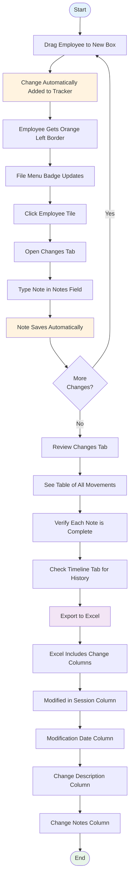

# Tracking Changes and Adding Notes

The **Changes** tab provides a comprehensive tracking system for all employee movements with the ability to add notes explaining your decisions.

---

## Change Tracking Workflow

Here's how the change tracking process works from start to finish:

**Key points:**

- **Automatic tracking** - Changes are tracked automatically when you drag employees
- **Visual indicators** - Orange border and badge show modified employees
- **Notes save automatically** - No manual save button needed
- **Export includes everything** - All changes and notes appear in Excel

---

📋 Quick Reference (Click to expand)

**Accessing Change Tracker:**
- Click Changes tab (second tab) in right panel
- Shows table of all employee movements
- Separate tabs for Regular Changes and Donut Changes (when applicable)

**What's Tracked:**
- Employee name and movement (from → to positions)
- Net change only (multiple moves show overall change)
- Automatically added when you drag employees
- Automatically removed if moved back to original position

**Adding Notes:**
- Click in Notes field for employee → Type explanation → Click outside to save
- Notes save automatically (no button needed)
- Include notes in Excel export for audit trail

**Understanding Changes:**
- Regular Changes = actual rating adjustments (affect Performance/Potential)
- Donut Changes = exercise placements only (separate columns in export)
- Badge shows count of changes in each tab

**Export Includes:**
- Modified in Session, Modification Date, Change Description, Change Notes
- All changes and notes included in Excel export

[See detailed tracking below ↓](#accessing-the-change-tracker)

---

## When to Use This

### Common Scenarios

You'll want to use the Changes tab when:

- **During calibration meetings** - Track all rating adjustments made during group discussions in real-time ([see Preparing for Talent Calibration](workflows/talent-calibration.md))
- **Creating audit trails** - Document why each employee was moved for HR compliance and future reference
- **Reviewing your work** - Check all movements before exporting to ensure they're correct
- **Adding context** - Explain the rationale behind each rating change so you remember 6 months from now ([see Adding Notes](workflows/adding-notes.md))
- **Preparing for export** - Verify all changes have notes before sharing results with stakeholders

### Related Workflows

- [Adding Notes & Documentation](workflows/adding-notes.md) - Learn best practices for documenting rating decisions with clear, specific notes
- [Preparing for Talent Calibration](workflows/talent-calibration.md) - Track calibration decisions in real-time during meetings
- [Exporting Your Changes](exporting.md) - Understand how change notes appear in your Excel export

### Real-World Example

> 📋 **Scenario**
>
> During a 2-hour calibration meeting, Kim moves 23 employees. She adds notes to each one in the Changes tab like "Calibration 2024-Q4: Moved to Star - consensus on leadership demonstrated in Q3 project." Six months later, when reviewing decisions, these notes help her remember exactly why each change was made.

!!! tip "Practiced This in the Tour?"
    In [Step 6 of the quickstart tour](quickstart.md#step-6-try-making-a-change-1-minute), you moved an employee and added a note. The Changes tab tracked it automatically - no manual entry needed!

---

## Accessing the Change Tracker

> 📋 **Real-World Scenario**
>
> During a 2-hour calibration meeting, Sarah moves 23 employees. She adds notes to each one in the Changes tab like "Calibration 2024-Q4: Moved to Star - consensus on leadership demonstrated in Q3 project." Six months later, when reviewing decisions, these notes help her remember exactly why each change was made.

1. **Click the "Changes" tab** in the right panel (second tab after Details)
2. The change tracker displays a table of all employee movements
3. Each row shows one employee who has been moved from their original position

### Change Tracker Views

The change tracker has two modes depending on whether you're using Donut Mode:

**When donut mode is active or donut changes exist:**

- The change tracker shows two tabs: **Regular Changes** and **Donut Changes**
- **Regular Changes** tab displays normal employee movements
- **Donut Changes** tab displays donut exercise placements (see [Donut Mode Exercise](donut-mode.md))
- Tab badges show the count of changes in each category
- Click between tabs to view regular or donut changes

**When donut mode is inactive and no donut changes exist:**

- The change tracker shows a single list of regular changes (original behavior)
- No tabs are displayed for a cleaner interface

<!-- Screenshot placeholder -->
!!! example "Screenshot Placeholder"
    **Change tracker with separate Regular and Donut tabs**

    _(Screenshot to be added: Changes panel showing both tabs when donut changes exist)_

## Understanding the Change Tracker Table

The table has three columns:

**Employee**
: Shows the employee's full name
: Helps you quickly identify who has been moved

**Movement**
: Visual display showing: "From Position → To Position"
: Uses color-coded chips to show the transition
: Position labels (e.g., "Core Performer [M,M]" → "Star [H,H]")
: Arrow icon between positions for clarity

**Notes**
: Editable text field for each employee
: Document the rationale for the change
: Preserved across sessions and included in Excel export

## How the Change Tracker Works

### Automatic Tracking

When you drag an employee to a new box, an entry is automatically added to the change tracker:

- Each employee appears **only once** in the tracker showing their net change from original position
- If you move an employee multiple times, the tracker updates to show the overall change (from original to current)
- No need to manually create entries - the system tracks everything automatically

### Automatic Removal

The tracker keeps itself clean:

- If you move an employee **back to their original position**, the entry is automatically removed from the tracker
- This keeps the tracker clean, showing only employees who are actually in modified positions
- Makes it easy to see which employees have net changes that will be exported

### Persistence

Changes are saved automatically:

- The change tracker persists when you close and reopen the app (as long as you don't clear the session)
- All changes and notes are preserved until you upload a new file
- Notes are saved automatically as you type them
- No manual save button needed - everything saves in the background

## Adding Notes to Track Your Rationale

> 📋 **Real-World Scenario**
>
> Marcus is reviewing his engineering team and moves an employee from Core Talent to High Potential. He immediately clicks in the Notes field and types "Promoted to tech lead Q4 2024, successfully delivered critical migration project, demonstrated strong mentoring skills with junior developers." This specific note helps justify the rating change to HR.

Notes help you document why each change was made, which is valuable for:

- Calibration meetings and performance discussions
- Justifying rating changes to management
- Future reference when reviewing decisions
- Compliance and audit trails

### To add a note:

1. **Click in the Notes field** for the employee
2. **Type your explanation** (e.g., "Promoted to manager role in Q4, strong leadership")
3. **Click outside the field or press ++tab++** to save
    - Notes save automatically in the background
    - You can immediately move to the next field without waiting
4. The note is now saved and will be included in your Excel export

### Note Tips

!!! tip "Writing Effective Notes"
    - **Be specific** about the reason (promotion, performance improvement, role change, etc.)
    - **Keep notes concise** but informative
    - **Use consistent terminology** across your team
    - **Support multiple lines** for longer explanations if needed

!!! note "Why This Matters"
    Notes create an audit trail for talent decisions. Six months from now, you'll remember exactly why you moved someone. During performance reviews or promotions, these notes justify your rating changes to leadership.

## Regular Changes vs. Donut Changes

> 📋 **Real-World Scenario**
>
> James is using Donut Mode to validate his center box. He places 12 employees in exploratory positions to see where they "really" belong. These show up in the "Donut Changes" tab with purple badges. Later, he switches to the "Regular Changes" tab to review the 8 actual rating adjustments he made during calibration. The separate tabs keep his exploratory work distinct from real decisions.

The change tracker separates regular employee movements from donut exercise placements to maintain data integrity.

| Aspect | Regular Changes | Donut Changes |
|--------|----------------|---------------|
| **Purpose** | Track actual rating changes | Track donut exercise placements |
| **When visible** | Always (when changes exist) | Only when donut mode active or donut data exists |
| **Impact on ratings** | Updates actual Performance/Potential | No impact on actual ratings |
| **Export behavior** | Updates main rating columns | Separate "Donut Exercise" columns |
| **Notes field** | "9Boxer Change Notes" in export | "Donut Exercise Notes" in export |

See [Donut Mode Exercise](donut-mode.md) for detailed information about donut tracking.

## Empty State

If you haven't moved any employees yet, you'll see:

- An icon and message: "No changes yet"
- Instruction: "Move employees to track changes here"

This reminds you that the change tracker is ready but waiting for you to make employee movements.

### Success! You've Added Notes to Changes

You'll see:
- Notes appear in the Notes field for each employee
- Notes save automatically as you type
- All notes included in Excel export
- Complete audit trail of your decision-making

## Use Cases

### Talent Calibration Sessions

1. Move employees during the meeting
2. Add notes capturing the discussion and consensus
3. Review the Changes tab to confirm all decisions
4. Export with notes for the record

### Performance Review Cycles

1. Adjust ratings throughout the review period
2. Document the reason for each rating change
3. Reference notes when discussing changes with managers
4. Include notes in the exported file for HR records

### Succession Planning

1. Identify and move high-potential employees
2. Note development plans or promotion timelines
3. Track progress across multiple sessions
4. Export notes for succession planning documentation

### Audit and Compliance

1. Every movement is tracked with who, what, and when
2. Add notes explaining the business justification
3. Export provides complete audit trail
4. Maintain transparency in talent decisions

## Tips for Effective Change Tracking

!!! tip "Best Practices"
    1. **Add notes immediately** - Capture your reasoning while it's fresh
    2. **Be specific** - "Completed leadership training, ready for next level" is better than "Good performance"
    3. **Use consistent language** - Adopt standard phrases for common scenarios
    4. **Review before export** - Check the Changes tab to ensure all notes are complete
    5. **Keep it professional** - Notes may be reviewed by others; maintain professionalism

## What Gets Tracked

The change tracker captures:

- **Employee movements** - From original position to current position
- **Net changes** - Overall change, even if employee was moved multiple times
- **Timestamps** - When each change was made (visible in export)
- **Notes** - Your documented reasoning for each change
- **Regular vs. Donut** - Separate tracking for actual changes vs. exercise placements

## What Doesn't Get Tracked

The tracker intentionally excludes:

- Employees who haven't been moved
- Intermediate positions (if employee moved multiple times)
- Filter changes or view preferences
- Employees moved back to their original position (auto-removed)

## Change History in Export

When you export your changes, the Excel file includes:

### Regular Changes Columns

- **"Modified in Session"** - Shows "Yes" for employees who were moved
- **"Modification Date"** - Timestamp of when each employee was last moved
- **"9Boxer Change Description"** - Formatted description (e.g., "Moved from Core Talent [M,M] to Star [H,H]")
- **"9Boxer Change Notes"** - Your notes explaining the change

### Donut Exercise Columns (if applicable)

- **"Donut Exercise Position"** - Position number from donut exercise
- **"Donut Exercise Label"** - Box label from donut exercise
- **"Donut Exercise Change Description"** - Formatted donut movement description
- **"Donut Exercise Notes"** - Your notes from the donut exercise

See [Exporting Your Changes](exporting.md) for complete export documentation.

## Related Topics

- [Working with Employees](working-with-employees.md) - How to move and select employees
- [Donut Mode Exercise](donut-mode.md) - Special validation exercise with separate tracking
- [Exporting Your Changes](exporting.md) - How change data appears in exports
- [Tips and Best Practices](tips.md) - General workflow recommendations
