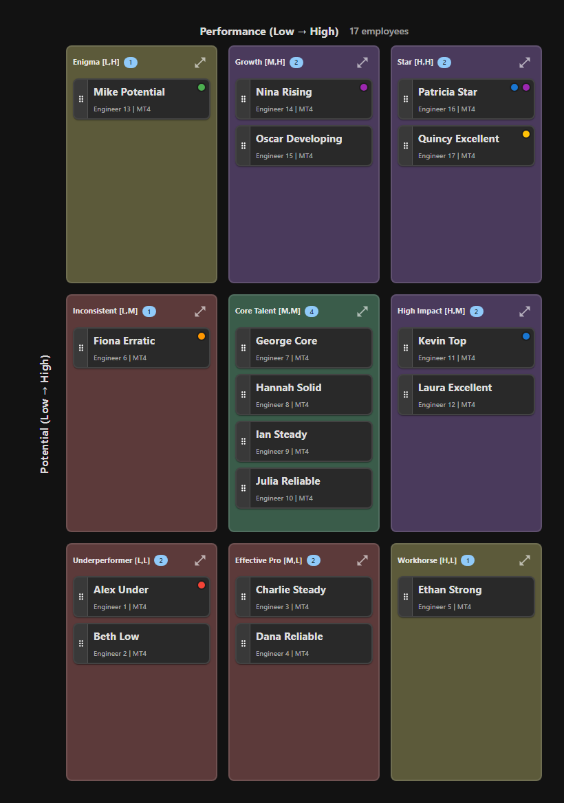
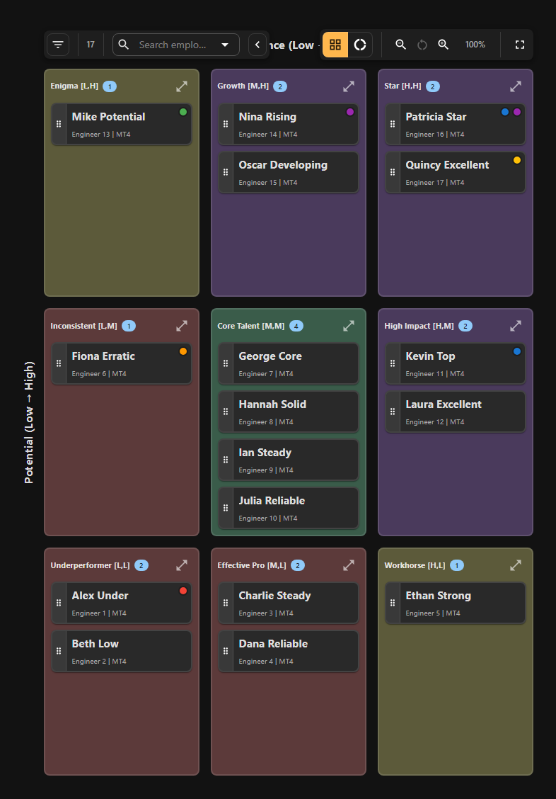
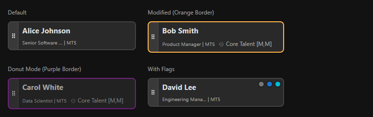
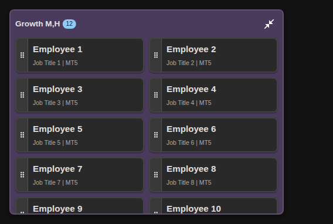

# Understanding the 9-Box Grid

The 9-box grid is the core visualization in 9Boxer. This guide explains how the grid is organized and what each position means.

---

## Grid Layout

The grid is a 3×3 matrix that plots employees on two dimensions:

- **X-axis (horizontal)**: **Performance** - How they're doing in their current role
- **Y-axis (vertical)**: **Potential** - Their capacity for future growth

Each axis has three levels: **Low**, **Medium**, and **High**, creating 9 distinct positions.



### Visual Grid Structure

```
                 LOW               MEDIUM            HIGH
              PERFORMANCE        PERFORMANCE      PERFORMANCE

HIGH          Enigma              High            Stars
POTENTIAL     Position 7          Potential       Position 9
                                  Position 8

MEDIUM        Under-              Core            High
POTENTIAL     Performer           Performer       Performer
              Position 4          Position 5      Position 6

LOW           Underperformer      Solid           Strong
POTENTIAL     Position 1          Performer       Performer
                                  Position 2      Position 3
```

### Axis Definitions

**Performance (X-axis):**

- **Low** - Below expectations, needs improvement
- **Medium** - Meets expectations, solid contribution
- **High** - Exceeds expectations, outstanding performance

**Potential (Y-axis):**

- **Low** - Best suited to current role, limited growth capacity
- **Medium** - Can advance with the right development
- **High** - Future leader potential, high growth capacity

---

## The 9 Grid Positions

Each position tells you something different about an employee's current state.

### Position 9: Stars [High Performance, High Potential]

Top-right corner. Top performers with high future leadership potential. They exceed expectations consistently and are ready for bigger roles.

### Position 8: High Potential [Medium Performance, High Potential]

Top-middle. High potential but not yet performing at the highest level. Often still developing in their role. With the right investment, they become your Stars.

### Position 7: Enigma [Low Performance, High Potential]

Top-left. High potential but currently underperforming. May be struggling with role fit or lacking support. Requires investigation to understand why they're not delivering.

### Position 6: High Performer [High Performance, Medium Potential]

Middle-right. Excellent in current role. This is also the default placement for **new hires** (first 6 months) and **recently promoted employees** (first 6 months after promotion) while they establish themselves. Critical individual contributors and subject matter experts often stay here long-term.

### Position 5: Core Performer [Medium Performance, Medium Potential]

Center. Meet expectations consistently. Solid, reliable employees who are the backbone of the organization. This is typically your largest group. Use [Donut Mode](donut-mode.md) to validate these placements aren't just "default" ratings.

### Position 4: Under-Performer [Low Performance, Medium Potential]

Middle-left. Not meeting expectations but has potential. May need training, clearer expectations, or a different role.

### Position 3: Strong Performer [High Performance, Low Potential]

Bottom-right. Excel in current role with limited advancement interest or capacity. Valuable individual contributors who prefer to stay in their current role.

### Position 2: Solid Performer [Medium Performance, Low Potential]

Bottom-middle. Reliable workers who meet standards with limited growth trajectory. They provide stability and consistency.

### Position 1: Underperformer [Low Performance, Low Potential]

Bottom-left. Employees with performance and potential concerns. Requires attention and action—either performance improvement or transition planning.

---

## Color Coding

9Boxer uses visual color coding:

**Grid Boxes:**

- **Green** (top row) - High potential employees
- **Yellow/Amber** (middle row) - Medium potential employees
- **Orange** (bottom row) - Lower potential employees



**Employee Tiles:**

- **Blue tiles** - Default appearance (unchanged)
- **Orange left border** - Employee moved during current session
- **Purple border** - Employee placed in Donut Mode (also shows original position)
- **Flag chips** - Colored indicators for special statuses (see [Flags](working-with-employees.md#employee-flags))



---

## Expanding and Collapsing Boxes

When a box contains many employees, expand it for better viewing:

1. **Click the expand icon** (⛶) on any box
2. Employees arrange in multiple columns (2-4 depending on screen size)
3. Drag-and-drop continues to work normally
4. **Click collapse icon** or press ++esc++ to collapse



---

## Understanding Distribution

A healthy distribution is roughly:

- **~20%** in high performers (Positions 6, 8, 9)
- **~70%** in core performers (Position 5)
- **~10%** in lower boxes (Positions 1, 2, 4)

Positions 3 and 7 are typically smaller edge cases.

!!! note "Guidelines, Not Rules"
    These are rough guidelines. Your distribution will vary based on organization size, industry, and business context.

**Warning Signs:**

- **Too many in top-right**: Possible grade inflation
- **Too few in top row**: Succession planning risk
- **Heavy center clustering**: May indicate lack of differentiation

See [Statistics](statistics.md) for distribution analytics and [Intelligence](intelligence.md) for anomaly detection.

---

## Next Steps

- [Working with Employees](working-with-employees.md) - View details and move employees
- [Donut Mode](donut-mode.md) - Validate center box placements
- [Tracking Changes](tracking-changes.md) - Document your rationale for movements
