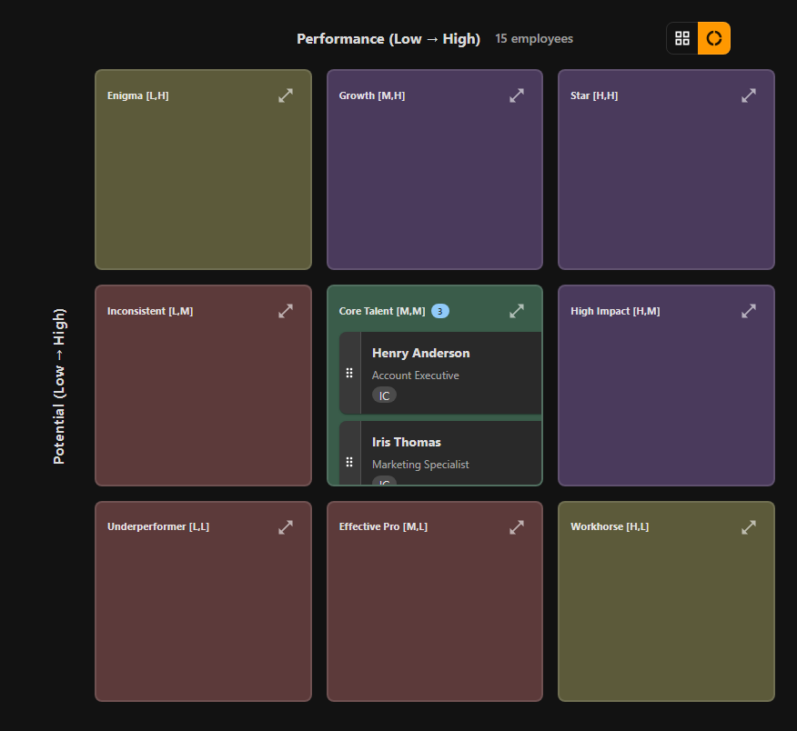
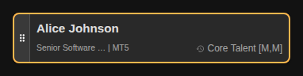
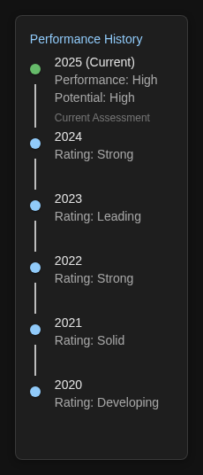
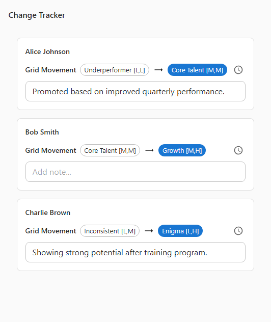

# Making Your First Changes

⏱️ **Time:** 5-10 minutes

**What you'll accomplish:**
- Move an employee to a different box
- Understand visual feedback (orange border indicator)
- Track your changes in real-time
- Verify your change was recorded

**Before you start:**
- Have your employee data uploaded
- Know which employee(s) you want to move
- Understand which box they should be in

---

## Change Review Checklist

Use this checklist before and after making rating changes to ensure quality and proper documentation.

### Before Making a Change

- [ ] Have clear evidence for the rating change (performance data, metrics, feedback)
- [ ] Understand why the current rating is incorrect or outdated
- [ ] Know which box the employee should move to and why
- [ ] Have manager approval or calibration consensus (if required)
- [ ] Confirm timing is appropriate (not too early to assess, not waiting too long)

### After Making Each Change

- [ ] Verify orange border appears on employee tile (confirms change recorded)
- [ ] Check employee details show updated Performance/Potential values
- [ ] Add clear note explaining what changed and why
- [ ] Include date context and who was involved in decision
- [ ] Verify note is specific and professional (avoid vague or subjective language)

### Before Exporting Changes

- [ ] Open Changes tab and review all movements
- [ ] Verify every change has a note documenting the reasoning
- [ ] Check that notes are clear enough for someone else to understand
- [ ] Confirm all changes are intentional (no accidental moves)
- [ ] Verify distribution makes sense (check Statistics tab if making many changes)

### After Exporting

- [ ] Open exported Excel file to verify changes applied correctly
- [ ] Check "Modified in Session" column shows "Yes" for changed employees
- [ ] Check "9Boxer Change Notes" column contains your documentation
- [ ] Verify Performance/Potential columns are updated in Excel
- [ ] Save exported file with clear naming convention (include date)
- [ ] Share with appropriate stakeholders if required

---

## Why You'd Make Changes

Before we dive into the mechanics, let's talk about when and why you'd move someone.

### Common Scenarios

You'll typically change ratings in these situations:

**Recent promotion or role change**
: Someone moved into a leadership role and is demonstrating higher potential than before.

**Performance improvement**
: An employee who was struggling has shown significant improvement over the past quarter.

**Performance decline**
: Someone's output has dropped, possibly due to skill gaps or personal circumstances.

**Calibration adjustment**
: After discussing with other managers, you realize a rating is too high or too low compared to peers.

**Initial error correction**
: You uploaded data and notice someone is in the wrong box - maybe a typo in the original file.

**New information received**
: You just completed performance reviews and have updated assessments to reflect.

---

## When to Make Changes vs. When to Wait

Not every insight requires an immediate change. Here's how to decide:

### Make Changes Now When:

✅ **You have clear evidence**
- Performance metrics show sustained improvement or decline
- Manager and employee agree on the rating change
- Calibration session reached consensus
- Recent promotion or role change justifies new rating

✅ **The change affects immediate decisions**
- Promotion cycles are happening now
- Bonus allocations are being finalized
- Succession planning discussions are this week
- Retention risk requires urgent action

✅ **The error is obvious**
- Data entry mistake (wrong box entirely)
- Rating doesn't match documented performance
- Employee in wrong position due to Excel import issue

### Wait and Gather More Information When:

⏸️ **Evidence is incomplete**
- Only one data point (e.g., single project success/failure)
- Less than 90 days in new role - too early to assess
- Manager hasn't had performance conversation with employee yet
- Conflicting feedback from different sources

⏸️ **Change might be temporary**
- Performance dip due to personal circumstances (medical, family)
- Temporary project assignment (not permanent role change)
- Short-term performance spike (wait to see if sustained)
- New manager hasn't observed employee long enough

⏸️ **Political or timing concerns**
- Major reorganization in progress - ratings may change again
- Employee is in sensitive situation (PIP, transfer, leave)
- Manager relationships are strained - need neutral mediator
- Waiting for calibration session to validate with peers

**Best Practice:** If unsure, wait until the next formal review cycle rather than making hasty changes. Document your observations in notes and revisit in 30-60 days.

!!! note "Why This Matters"
    Rushing rating changes without evidence creates fairness concerns and credibility issues. Waiting for calibration or gathering more data ensures your changes are defensible and consistent across teams.

---

## Best Practices for Change Documentation

Good documentation protects you and provides clarity for future reviews.

### Document Every Change

Never make a change without a note explaining why:

**Minimum information to include:**

- **What changed** - Old position → New position
- **Why it changed** - Specific reason or trigger
- **When** - Date or timeframe context
- **Who was involved** - Manager, calibration team, HR

**Example:**
"Moved from Position 5 to Position 9 (Core to Star) based on Q4 calibration session. Consensus from 5 managers - sustained high performance in leadership role for 8 months. Ready for Director promotion in Q1 2025."

### Use Consistent Language

Create standard phrases for common changes:

**Promotion/Role Change:**
- "Promoted to [role] on [date], demonstrating [new capability]"
- "Role expanded to include [responsibility], increased potential rating"

**Calibration:**
- "Calibration [date]: Adjusted to [new position] to align with peer standards"
- "Cross-functional calibration consensus - moved to [position]"

**Performance Trend:**
- "Performance improved from [old] to [new] over [timeframe]"
- "Performance declined from [old] to [new] - [reason if known]"

### Avoid These Documentation Mistakes

❌ **Too vague:** "Changed rating" - Why? Based on what?

❌ **Too subjective:** "Just not good enough" - Not helpful or professional

❌ **No context:** "8" - What does this number mean?

❌ **Blame language:** "Manager was wrong" - Focus on evidence, not blame

✅ **Good example:** "Calibration 2024-Q4: Moved from High Performance to Medium Performance to align with peer standards. Initial rating was relative to team, not company-wide benchmarks. Discussed with manager - agreed on recalibration."

---

## How to Handle Disputed Changes in Calibration

Disagreements during calibration are normal. Here's how to navigate them professionally:

### Step 1: Acknowledge the Disagreement

Don't dismiss concerns. Say:

- "I hear you think Sarah should stay at Star. Let's look at the evidence."
- "There's a difference of opinion here. Let's work through it together."

### Step 2: Review the Data

Use 9Boxer to show objective information:

1. **Filter to the employee's peers** - How do similar employees rate?
2. **Check Intelligence tab** - Is this person an outlier statistically?
3. **Review the timeline** - What's the trend over time?
4. **Show Statistics** - How does this fit overall distribution?

### Step 3: Ask for Specific Evidence

Request concrete examples:

- "Can you give me 2-3 specific examples of Star-level performance?"
- "What projects or metrics support this rating?"
- "How does this compare to other Stars in the company?"

### Step 4: Seek Compromise

If consensus can't be reached:

**Option 1: Split the Difference**
- Manager says Star (Position 9), others say Core (Position 5)
- Compromise: High Performer (Position 6 or Position 8)

**Option 2: Conditional Rating**
- "We'll keep them at Star for now, but revisit in 90 days"
- "If they deliver X project successfully, they stay Star; otherwise we recalibrate"

**Option 3: Table the Discussion**
- Mark as "Under Review" in notes
- Schedule offline follow-up with relevant stakeholders
- Don't hold up entire calibration for one disputed case

**Option 4: Escalate**
- If significant impact (promotion, retention risk), escalate to senior leader
- Present both viewpoints with evidence
- Accept final decision and document reasoning

### Step 5: Document the Resolution

Whatever the outcome, capture it in notes:

**If consensus reached:**
"Calibration discussion - initial disagreement resolved. Moved to Position 6 after reviewing peer comparisons. All managers agreed based on evidence."

**If compromise:**
"Calibration 2024-Q4: Moved to Position 8 as compromise between Star and Core ratings. Will revisit in Q1 2025 after project delivery."

**If tabled:**
"Calibration 2024-Q4: Rating disputed between manager and peers. Tabled for offline discussion. Current rating unchanged pending follow-up by [date]."

**If escalated:**
"Calibration 2024-Q4: Escalated to VP after manager disagreement. VP decision: Maintain Star rating based on business impact. Dissenting view documented."

### What NOT to Do

❌ **Don't make it personal** - Focus on performance, not personalities

❌ **Don't dismiss without discussion** - "My decision is final" shuts down collaboration

❌ **Don't let it drag on** - Set a time limit for debate (5-10 minutes max)

❌ **Don't force fake consensus** - It's OK to disagree and document both views

---

## Undo and Redo Guidance

Made a mistake? Here's how to fix it:

### To Undo a Single Change

**Option 1: Drag back immediately**

1. Realize you moved the wrong person
2. Drag them back to their original position
3. The orange border remains (they're still "modified")
4. The final position is what matters for export

**Option 2: Check Changes tab and manually fix**

1. Open Changes tab to see all moves
2. Find the incorrect change
3. Drag employee to the correct position
4. Update the note to reflect the correction

**Example note after correction:**
"Initially moved to Position 6 in error. Corrected to Position 5 (original rating unchanged)."

### To Undo Multiple Changes

If you made several mistakes:

1. Open Changes tab
2. Review the full list of movements
3. For each incorrect change, drag employee back to correct position
4. Consider: Is it easier to re-import your original file and start over?

**When to re-import:**
- If you have >10 incorrect changes
- If you're not sure which changes are correct
- If you want a clean slate

**To re-import:**

1. File → Close File (or re-import will warn you)
2. File → Import Data
3. Choose your original file again
4. Start fresh (all changes lost)

### There is No "Redo" Button

9Boxer doesn't have undo/redo buttons like word processors. Here's why:

- Changes are intentional (you drag deliberately, not accidental clicks)
- The Changes tab shows full history
- You can always drag back to fix

**If you need to recreate changes after re-importing:**

1. Before re-importing, take screenshots of Changes tab
2. Or export your work-in-progress (even with mistakes)
3. After re-import, reference screenshots to remake correct changes
4. Lesson learned: Export frequently during long sessions!

### Unsaved Changes Protection

9Boxer now warns you before you lose work:

If you try to import new data or close the file with unsaved changes, you'll see a dialog:

- **Apply Changes** - Export your work first, then proceed
- **Discard Changes** - Lose all changes and proceed
- **Cancel** - Stay in your current session

**Best Practice:** If you see this warning and you've made important changes, ALWAYS click "Apply Changes" first!

---

## Moving an Employee (The Core Workflow)

Let's walk through making your first change. Don't worry - it's simple, and you can always move them back if you make a mistake!

### Step 1: Find the Employee

First, locate the employee you want to move.

**Option A: Visual scanning**
- Look across the grid for their name
- They're organized by performance (left to right) and potential (bottom to top)

**Option B: Use search** (if you have many employees)
- Click the **Filters** button in the top toolbar
- Use the search field to find them by name
- [Learn more about filtering](../filters.md)

**Option C: Click through the box**
- If a box has many employees, click the expand icon (⛶) on the box header
- Scroll through the list to find them
- Press `Esc` to collapse when done

### Step 2: Drag to the New Box

Once you've found your employee, moving them is drag-and-drop:

1. **Click and hold** on the employee tile
   - You'll see a drag handle icon (≡) on the left side of the tile
   - The tile becomes slightly transparent while dragging

2. **Drag** the tile to the target box
   - Move your mouse to the box where they should be
   - The cursor changes to show you're dragging

3. **Release** (drop) the tile
   - Let go of the mouse button
   - The employee appears in their new box immediately

!!! tip "Can't drag?"
    Make sure you're clicking directly on the employee tile or the drag handle area.
    If filters are active, ensure the employee is visible (not filtered out).

### Step 3: Look for the Orange Border

After you drop the employee, watch for the **visual feedback** that confirms your change:

- The employee tile gets a **thick orange border on the left side**
- A small **"Modified" badge** appears on the tile
- This border stays visible for the entire session

**What this means:**
- ✅ Your change was successful
- ✅ This employee has been modified in the current session
- ✅ The change will be included when you export

!!! info "Orange, not yellow?"
    You might hear this called a "yellow highlight" or "orange border" - same thing!
    The color adapts to light/dark mode, but it's always the "secondary" accent color.

---

## Verifying Your Change

Want to double-check that your move was recorded? Here are three ways to verify:

### Check the Employee Details

1. **Click on the employee tile** you just moved
2. The right panel opens showing their details
3. Look at the **Performance and Potential** values - they should reflect the new box

### View the Timeline

Still in the employee details panel:

1. Scroll down to the **Performance History** section
2. You'll see "2025 (Current)" with their new ratings
3. Compare to previous years to see the change

### Check the Changes Tab

For a complete record of all your changes:

1. Click the **Changes** tab in the right panel (fourth tab)
2. You'll see a table listing all movements in this session
3. Find your employee in the list
4. The "Movement" column shows: `Old Position → New Position`

!!! success "Pro tip: Add notes here!"
    While you're in the Changes tab, type a quick note in the "Notes" field explaining why you moved this person.
    Your future self (and your colleagues) will thank you!
    [Learn more about adding notes](adding-notes.md)

### Success! You've Made Your First Change

You'll see:
- Orange left border on the employee tile
- Updated Performance/Potential in employee details
- Change recorded in timeline and Changes tab
- Apply button badge showing number of changes

---

## Making Multiple Changes

Got several people to move? Here's how to work efficiently:

### Strategy 1: Move One at a Time

The simplest approach for a few changes:

1. Move first employee
2. Verify the orange border appears
3. Move next employee
4. Repeat

**Advantage:** You can confirm each change as you go.

### Strategy 2: Use Filters to Focus

For many changes in a specific group:

1. Click **Filters** and select a department or manager
2. The grid shows only that group
3. Make all your changes to that group
4. Clear filters to see the full grid again
5. [Learn about filtering strategies](../filters.md)

**Advantage:** Reduces visual clutter and helps you focus.

### Strategy 3: Review Changes Tab Periodically

During a long session with many moves:

1. Make 5-10 changes
2. Open the **Changes** tab
3. Review the list to ensure all moves are correct
4. Continue with the next batch

**Advantage:** Catch mistakes early before making too many changes.

!!! warning "Remember: No auto-save!"
    Your changes are stored in your browser while you work, but they're NOT saved to a file automatically.
    Click **Apply Changes** (in the File menu) when you're done to save your updated ratings.
    [Learn about applying changes](../exporting.md)

---

## Understanding What Happens When You Move Someone

Let's clarify what changes (and what doesn't) when you move an employee:

### What Changes ✅

- **Grid position:** They appear in the new box
- **Performance/Potential ratings:** Updated to match the new box
- **Visual indicator:** Orange border appears on the tile
- **Changes tab:** New entry added with old → new position
- **Export:** When you export, the Excel file will have updated ratings

### What Doesn't Change ❌

- **Original data:** Your original Excel file is NOT modified
- **Employee name, title, job level:** These stay the same
- **Historical ratings:** Past performance data is preserved
- **Other employees:** Only the employee you moved is affected

### The Change is Reversible

Made a mistake? No problem!

**To undo a move:**
1. Drag the employee back to their original position
2. The orange border remains (they're still "modified in session")
3. The new position will reflect the original ratings
4. The Changes tab shows the full history (both moves)

**To cancel all changes:**
- Use File menu → Close File (you'll be warned if you have unsaved changes)
- Import new data (you'll be warned about unsaved changes)
- Your original file remains unchanged until you explicitly apply changes

!!! danger "Unsaved Changes Protection"
    9Boxer now warns you before discarding unsaved changes! If you try to:
    - Import new data
    - Load sample data
    - Close the file

    You'll see a dialog with three options:
    - **Apply Changes** - Save your work first, then proceed
    - **Discard Changes** - Lose all changes and proceed
    - **Cancel** - Return to your work without losing anything

    This protection ensures you don't accidentally lose hours of work!

---

## Real-World Scenarios

Let's look at some common situations and how you'd handle them:

### Scenario 1: Promoting a High Performer

**Situation:** Sarah was a Strong Performer (position 3: High Performance, Low Potential), but she just got promoted to team lead and is showing leadership capabilities.

**Action:**
1. Find Sarah's tile in the bottom-right box
2. Drag to position 6 (High Performance, Medium Potential) or position 9 (High Performance, High Potential)
3. In the Changes tab, add note: "Promoted to Team Lead Q1 2025, demonstrating leadership skills"

**Why this matters:** You're recognizing her growth trajectory, which impacts succession planning.

---

### Scenario 2: Calibration Adjustment

**Situation:** During calibration, you realize you rated Tom as High Performance (position 6), but compared to peers across teams, he's really Medium Performance (position 5).

**Action:**
1. Find Tom in position 6 (Core Performer - High/Medium)
2. Drag to position 5 (Core Performer - Medium/Medium)
3. Add note: "Calibration 2025-01: Adjusted to Medium based on peer comparison with other teams"

**Why this matters:** Ensures fairness and consistency across the organization.

---

### Scenario 3: Performance Decline

**Situation:** Maria was in position 9 (Star) last year, but her performance has noticeably declined in her new role.

**Action:**
1. Find Maria in position 9 (top-right corner)
2. Drag to position 8 (High Potential, Medium Performance) - she still has potential but performance dropped
3. Add note: "Performance declined in new role - skill gap identified. Development plan in progress."

**Why this matters:** Honest assessment while acknowledging she may recover with support.

---

## Common Questions

### What if I move someone by accident?

Just drag them back! The Changes tab will show both moves, but when you export, only the final position matters.

### Can I move multiple people at once?

No, you need to move them one at a time. This is intentional - each move should be deliberate.

### Will my changes affect other people's views?

No. Changes are stored only in your browser session. When you export, you create a new file that you can share.

### How many changes can I make in one session?

You can make unlimited changes in one session. The Changes tab tracks them all.

### What if I close the app before exporting?

All changes are lost. The app will warn you if you try to upload new data while you have unsaved changes.

### Can I see who moved an employee in the past?

The app shows you the movement history (timeline), but doesn't track who made each change. Add notes to create that audit trail.

---

## What's Next

Now that you know how to make changes, consider these next steps:

**Document your decisions**
: [Learn how to add notes to your changes](adding-notes.md) - crucial for calibration meetings and future reference.

**Export your updated ratings**
: [Understand the export process](../exporting.md) - save your work and share with HR or managers.

**Prepare for a calibration meeting**
: [Follow the calibration workflow](talent-calibration.md) - use 9Boxer during group talent reviews.

**Understand change tracking**
: [Deep dive into the Changes tab](../tracking-changes.md) - see full history and manage notes.

---

## Quick Reference

| I want to... | How to do it |
|--------------|-------------|
| Move an employee | Click and drag tile to new box |
| See which employees I've changed | Look for orange left border on tiles |
| Verify a change was saved | Check Changes tab for the employee |
| Undo a move | Drag employee back to original position |
| Add a note explaining the change | Click employee → Changes tab → Type in Notes field |
| Save my changes to original file | File menu → Apply X Changes → Keep "Update original file" selected |
| Save my changes to new file | File menu → Apply X Changes → Check "Save to different file" |
| Cancel without losing work | Click Cancel if warned about unsaved changes |

---

**Need help?** Check the [Troubleshooting guide](../troubleshooting.md) or review the [complete Getting Started guide](../getting-started.md).
