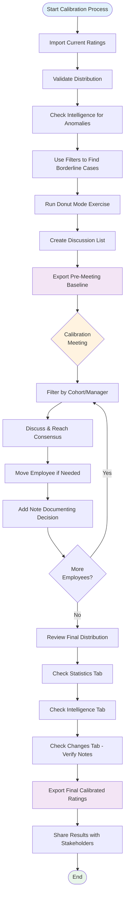
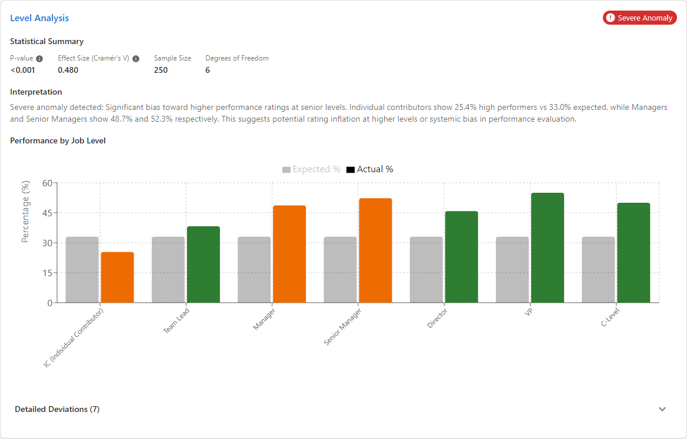
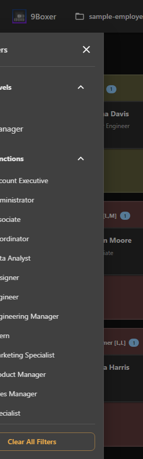
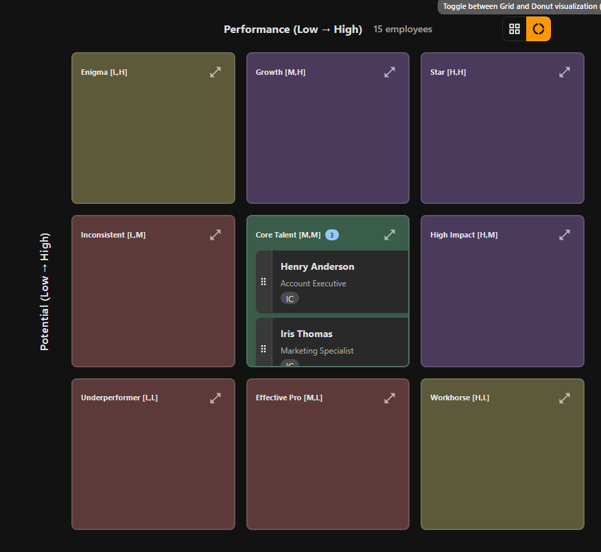
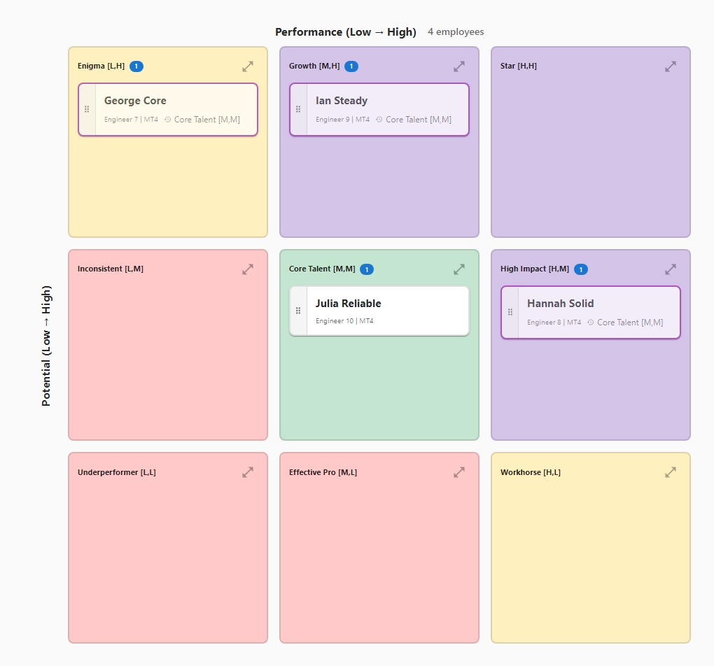

# Complete Calibration Reference

> **Time:** 20-30 minutes to read in full
> **Who this is for:** HR managers, department heads running quarterly/annual talent reviews
> **First time?** Start with [Your First Calibration](../getting-started.md) for a streamlined 15-minute guide

This is the comprehensive reference for talent calibration meetings. It includes complete checklists, common scenarios, troubleshooting, and advanced techniques. Use this guide when you need the full picture or want to handle edge cases.

For a faster, essential-only workflow, see [Your First Calibration](../getting-started.md).

---

## Calibration Workflow Overview

Here's the complete calibration workflow from start to finish:

**Three main phases:**

1. **Pre-Meeting Preparation (20-30 min)** - Import data, validate distribution, identify discussion topics
2. **During Calibration Meeting (60-90 min)** - Review employees, reach consensus, make changes, document decisions
3. **Post-Meeting Follow-Up (10 min)** - Review final distribution, export results, communicate to stakeholders

---

## What You'll Accomplish

By the end of this workflow, you'll have:

- ✅ Imported and validated your current talent ratings
- ✅ Reviewed distribution for red flags and anomalies
- ✅ Identified discussion topics for your calibration meeting
- ✅ Prepared meeting materials and talking points
- ✅ A clean report ready to share with stakeholders

---

## Complete Calibration Checklist

Use this comprehensive checklist to ensure you don't miss critical steps throughout your calibration process.

### Before You Start

- [ ] Prepare your Excel file with current Performance/Potential ratings from all managers
- [ ] Know who will attend the calibration meeting
- [ ] Have your organization's rating criteria defined (what "High Performance" means)
- [ ] Allow 20-30 minutes for preparation
- [ ] Schedule calibration meeting with appropriate stakeholders
- [ ] Set clear meeting objectives and time limits

---

## Pre-Meeting Checklist

Before your calibration session, complete these essential preparation steps to ensure a productive meeting:

### 1. Review Distribution (5 minutes)

- [ ] **Open Statistics tab** - Check overall distribution percentages
- [ ] **Identify clustering** - Flag if >60% are in center box (Position 5)
- [ ] **Check extremes** - Verify Stars (Position 9) percentage is 10-15%
- [ ] **Note imbalances** - Any boxes completely empty or over-populated?

**Why this matters:** Distribution patterns reveal calibration issues before you start. If 70% are in the center, you know differentiation is the main topic.

### 2. Spot Anomalies (5 minutes)

- [ ] **Review Intelligence tab** - Check the quality score (target: 75+)
- [ ] **Note red anomalies** - Critical issues requiring immediate discussion
- [ ] **Note yellow anomalies** - Moderate issues worth reviewing
- [ ] **Identify patterns** - Which managers, departments, or levels show bias?

**Why this matters:** Anomalies give you specific discussion topics with evidence. Instead of "Let's talk about your team," you can say "You have 15 High Performers vs. expected 5 - let's discuss."

### 3. Prepare Talking Points (8 minutes)

- [ ] **List borderline cases** - Employees who might move between boxes
- [ ] **Identify Stars to validate** - Are top performers truly exceptional?
- [ ] **Flag potential mis-ratings** - Anyone in surprising positions?
- [ ] **Note promotion-ready candidates** - Who should move up?
- [ ] **Document manager-specific patterns** - Prepare questions for each manager

**Example talking points:**

- "Alex, you rated 18 of 20 as High Performance. Let's walk through your top 5."
- "Engineering has 85% in center box vs. 50% company-wide. What's driving that?"
- "Sarah was a Star last year but Medium/Medium now. What changed?"

### 4. Test Your Filters (2 minutes)

- [ ] **Practice filtering by manager** - Can you quickly show one person's team?
- [ ] **Test performance filters** - Can you display only High Performers?
- [ ] **Try department filters** - Can you compare teams side-by-side?
- [ ] **Bookmark key views** - Know which filters you'll use during meeting

**Why this matters:** Smooth filter transitions during the meeting keep discussion flowing. Fumbling with filters wastes time and loses attention.

### 5. Prepare Materials (3 minutes)

- [ ] **Export pre-meeting baseline** - Create snapshot before any changes
- [ ] **Share meeting agenda** - Send to attendees with discussion topics
- [ ] **Confirm screen sharing setup** - Test that 9Boxer displays clearly
- [ ] **Have rating criteria handy** - Reference doc defining each performance level

**Pre-meeting baseline export naming:** `talent-ratings-pre-calibration-[YYYY-MM-DD].xlsx`

### Success! You've Prepared for Calibration

You'll see:
- Statistics showing distribution with red flags identified
- Intelligence quality score with anomalies highlighted
- List of borderline employees to discuss
- Pre-meeting baseline file exported and shared

!!! note "Why This Matters"
    Preparation turns calibration meetings from subjective debates into data-driven discussions. You'll walk in with specific examples, statistical evidence, and clear talking points instead of vague concerns.

---

## Step 1: Import Your Data (3 minutes)

### Get the Most Recent Ratings

You need the latest performance and potential ratings from all managers before calibration.

1. **Collect ratings from all managers**
   - Export from your HRIS or gather individual files
   - Ensure all managers have submitted their ratings
   - Combine into a single Excel file if needed

2. **Open 9Boxer and import**
   - Click **File** → **Import Data**
   - Choose your compiled Excel file
   - Wait for the success notification

### ✅ Success Check

You should see:

- The grid displays all employees
- Employee count matches your expectations
- Employees distributed across all 9 boxes

!!! tip "Quick Count Check"
    Check the Statistics tab to see total employee count. If it's lower than expected, some employees might have invalid ratings in your Excel file.

---

## Step 2: Validate Your Distribution (5 minutes)

Now let's check if your ratings look healthy or if there are calibration issues.

### Review Statistics

1. **Click the Statistics tab** in the right panel
2. **Check the distribution table** for red flags

**Healthy distribution typically shows:**

- 10-15% in Stars (top-right corner)
- 50-60% in the middle tier (positions 4-6)
- Less than 10% in bottom-left (Problems/Too New)

**Red flags to watch for:**

- ⚠️ **Too many High ratings** (>25% in top row) - Possible grade inflation
- ⚠️ **Too few Stars** (<5%) - Succession planning risk, possibly too harsh
- ⚠️ **Everyone in the center** (>70% in position 5) - Poor differentiation, need better calibration
- ⚠️ **Empty boxes** - May indicate rating avoidance or unclear criteria

### Check Intelligence Tab

The Intelligence tab uses statistical analysis to spot anomalies you should discuss.

1. **Click the Intelligence tab** in the right panel
2. **Review each analysis section:**

   - **Location Analysis** - Do certain offices rate higher/lower than average?
   - **Function Analysis** - Are some departments inflating ratings?
   - **Level Analysis** - Are senior levels rated more favorably?
   - **Tenure Analysis** - Do new hires get different treatment?

3. **Look for anomalies marked in red/yellow**
   - Red = Significantly above/below baseline (discuss immediately)
   - Yellow = Moderately different (worth reviewing)

The Intelligence tab provides a quality score and anomaly count summary:

For each dimension (Location, Function, Level, Tenure), you'll see detailed statistical analysis:

!!! warning "Common Patterns to Investigate"
    - One manager rates everyone "High" - Leniency bias
    - Engineering has 30% Stars vs. 10% company-wide - Is this justified?
    - Employees with <1 year tenure all rated "Low Potential" - Are we rating too early?

**Make notes** on which anomalies you want to discuss in the meeting.

---

## Step 3: Identify Discussion Topics (8 minutes)

Now you'll use filters and Donut Mode to find specific employees and situations that need calibration.

### Find Borderline Cases

Use filters to identify employees who might move between boxes during calibration.

1. **Click the Filters button** to open the left panel
2. **Filter by specific criteria** to focus your review:

   **Example filter combinations:**

   === "High Performers"
       **Goal:** Review all high performers to validate they truly deserve it

       - Job Levels: (leave all checked)
       - Performance: Check "High" only
       - Review each employee - do they have evidence of high performance?

   === "Borderline Stars"
       **Goal:** Find High Performers who might actually be Stars

       - Performance: "High"
       - Potential: "Medium" or "High"
       - Look for employees ready for promotion

   === "Manager Comparison"
       **Goal:** Compare one manager's ratings to others

       - Managers: Select one manager
       - Review their distribution vs. company averages

3. **Click on employees** to review their details
   - Job level, tenure, manager
   - Any existing notes or history
   - Performance data if available

4. **Document your questions**
   - Keep a separate list of employees to discuss
   - Note why each one needs calibration
   - Prepare specific questions for managers

### Use Donut Mode to Validate Center Box

The center "Core Talent" box often becomes a catch-all. Donut Mode helps you validate these placements.

!!! question "What is Donut Mode?"
    Donut Mode is a validation exercise that asks: "If each employee in the center box couldn't be rated Medium/Medium, where would they actually belong?"

    This helps identify hidden stars or declining performers hiding in the middle.

**How to use it for calibration prep:**

1. **Click the View Mode toggle** in the toolbar and select **Donut** (donut icon)
   - Grid now shows only position 5 employees (Core Talent)
   - All others are temporarily hidden

2. **Review each employee** and ask yourself:
   - If they can't be Medium/Medium, where do they belong?
   - Are they trending upward (High Potential/Star) or downward (Solid Performer)?
   - Is there evidence they're actually exceeding or underperforming?

3. **Drag employees** to their "true" position
   - Move rising stars to High Potential or Stars boxes
   - Move reliable-but-not-growing folks to Solid Performer
   - Move anyone correctly placed back to position 5

4. **Add notes** explaining your reasoning
   - Click employee → Changes tab → Donut Changes
   - Document why you think they should move

5. **Review your Donut Changes**
   - Click Changes tab → Donut Changes subtab
   - See all your exploratory placements
   - These become discussion topics for the meeting

!!! tip "Donut Mode Best Practices"
    - Be honest - this is a private exercise to help you prepare
    - Challenge every placement - even if someone seems "fine" in the center
    - Document specific evidence (projects, metrics, behaviors)
    - Look for patterns (many moving up? many moving down?)

**What you'll learn:**

- If many move UP: Your center box bar is too low (inflated Core Talent ratings)
- If many move DOWN: You may be over-rating average performers
- If evenly split: Good differentiation, center box is well-calibrated
- If most stay at position 5: Either correct OR you need to challenge more

→ [Learn more about Donut Mode](../donut-mode.md)

---

## Step 4: Prepare Meeting Materials (4 minutes)

Before the calibration meeting, prepare your talking points and materials.

### Create Discussion List

Based on your analysis, create a prioritized discussion list:

1. **High-priority issues:**
   - Employees flagged in Intelligence tab (anomalies)
   - Borderline Stars (High Performers who might be promoted)
   - Anyone in top-right or bottom-left (validate extremes)

2. **Medium-priority issues:**
   - Donut Mode findings (center box validation results)
   - Manager-specific patterns (one manager's ratings vs. others)
   - Distribution imbalances (too many/few in certain boxes)

3. **Nice-to-review:**
   - Enigmas (high potential, low performance)
   - Recent promotions or role changes
   - Cross-functional comparisons

### Take Screenshots or Notes

Capture visuals you'll need during the meeting:

- Statistics distribution table (for reference)
- Intelligence anomalies (discussion starters)
- Specific employee tiles you'll discuss
- Filter views showing specific cohorts

!!! tip "Screen Sharing Preparation"
    If you'll share your screen during the meeting, practice your filter combinations now:

    - Save filter settings mentally (which boxes to check)
    - Test switching between filters quickly
    - Know how to toggle Donut Mode on/off

### Formulate Calibration Questions

Prepare specific questions for managers:

- "Manager A, you have 8 Stars but company average is 3. Can you walk us through your top performers?"
- "Why is Employee X rated High Potential when they've been at the same level for 5 years?"
- "Engineering shows 35% High Performers vs. 18% company-wide. Is this justified by business results?"
- "Three employees in position 5 just got promoted. Should they be rated Higher Potential now?"

---

## Step 5: Export Your Pre-Meeting Baseline (2 minutes)

Before the calibration meeting, export the current state as a baseline.

1. **Deactivate Donut Mode** (toggle back to Grid view)
   - You want to export actual ratings, not exercise data
   - Donut findings are for discussion only

2. **Click File** → **Apply Changes to Excel**
   - Even if you haven't made changes, this creates a snapshot
   - File downloads as `modified_[filename].xlsx`

3. **Rename the file** to something clear:
   - Example: `talent-ratings-pre-calibration-2024-Q4.xlsx`

4. **Share with attendees** (optional)
   - Send to meeting participants ahead of time
   - Everyone reviews the same data
   - Come prepared with questions

!!! info "Why Export Before the Meeting?"
    - Creates a timestamped baseline
    - Shows "before" state for comparison
    - Allows offline review by attendees
    - Provides backup if session is lost

---

## 🎉 You're Ready for Your Calibration Meeting!

You've now completed all preparation steps:

- ✅ Imported current ratings
- ✅ Identified distribution red flags
- ✅ Spotted statistical anomalies
- ✅ Validated center box with Donut Mode
- ✅ Created discussion topics
- ✅ Exported baseline for reference

---

## During-Meeting Checklist

Use this checklist during your live calibration session to stay organized and ensure all decisions are properly documented.

### Setup and Preparation

- [ ] Open 9Boxer with your data already loaded
- [ ] Share your screen in the video call
- [ ] Keep the right panel visible (Statistics, Intelligence, or Changes tabs)
- [ ] Have your discussion list ready (separate document or notes)

### For Each Employee Discussion

- [ ] Use filters to focus on the relevant group (manager, department, performance level)
- [ ] Show the employee details (click tile to open right panel)
- [ ] Facilitate discussion with prepared calibration questions
- [ ] Reach consensus or document disagreement professionally
- [ ] Make rating change in real-time if group agrees (drag employee to new box)
- [ ] Add note immediately explaining the calibration decision
- [ ] Include who was involved and why change was made

### Ongoing During Meeting

- [ ] Watch the File menu badge to track how many changes made
- [ ] Check Statistics tab periodically to see distribution shift
- [ ] Use filters liberally to focus discussion one cohort at a time
- [ ] Document action items for tabled discussions
- [ ] Keep discussions moving (2-3 minutes per employee max)
- [ ] Table contentious cases for offline follow-up rather than debating endlessly

### Before Ending Meeting

- [ ] Review Changes tab to ensure all moves have notes
- [ ] Verify Statistics tab shows improved distribution
- [ ] Check Intelligence tab to confirm major anomalies addressed
- [ ] Agree on next steps and communication plan
- [ ] Schedule follow-up meeting if needed

---

## After-Meeting Checklist

Complete these critical steps within 24-48 hours to close the loop on your calibration session.

### Immediate Post-Meeting (Within 10 minutes)

- [ ] Review final distribution in Statistics tab
- [ ] Verify all changes have clear notes in Changes tab
- [ ] Click File → Apply Changes to Excel
- [ ] Rename exported file clearly (e.g., talent-ratings-post-calibration-2024-Q4.xlsx)
- [ ] Open Excel file to verify all changes exported correctly
- [ ] Check "Modified in Session" column shows "Yes" for changed employees
- [ ] Check "9Boxer Change Notes" column has your calibration notes

### Within 24 Hours

- [ ] Send calibrated ratings to meeting attendees for their records
- [ ] Send each manager their team's updated ratings with highlights of changes
- [ ] Provide guidance to managers on communicating changes to employees
- [ ] Set deadline for manager-employee conversations

### Within 48 Hours

- [ ] Import calibrated ratings into your HR system
- [ ] Verify all changes transferred correctly to HRIS
- [ ] Update succession planning dashboards or reports
- [ ] Archive both pre-calibration and post-calibration files

### Within 1 Week

- [ ] Create follow-up list for employees needing development plans
- [ ] Schedule check-ins for contentious cases (tabled discussions)
- [ ] Monitor employees flagged for promotion readiness
- [ ] Send thank-you to meeting attendees
- [ ] Share executive summary with leadership
- [ ] Document lessons learned for next calibration
- [ ] Update calibration process based on feedback
- [ ] Calendar reminder for next calibration session

---

## During the Calibration Meeting (60-90 minutes)

Here's how to use 9Boxer during your live calibration session.

### Set Up for Screen Sharing

1. **Open 9Boxer** with your data already loaded
2. **Share your screen** in the video call
3. **Keep the right panel visible** (Statistics, Intelligence, or Changes)
4. **Have your discussion list ready** (separate document or notes)

### During-Meeting Best Practices

Follow these practices to keep your calibration session focused and productive:

**Use filters to focus the conversation:**

- Filter by one manager at a time to review their full team together
- Filter by performance level (e.g., "High Performance only") to validate a cohort
- Filter by department to compare cross-functional patterns
- Clear filters between discussions to reset the view

**Document decisions immediately:**

- Add notes to every employee you move during the meeting
- Capture WHO made the decision and WHY in the note
- Include dissenting views if consensus wasn't unanimous
- Document action items (e.g., "Follow up with manager in 30 days")

**Keep the discussion moving:**

- Set time limits per employee (2-3 minutes each)
- Table contentious cases for offline follow-up rather than debating endlessly
- Focus on employees where ratings might change - skip obvious correct placements
- Track progress (watch File menu badge showing change count)

**Show the data to support discussions:**

- Reference Statistics tab when discussing overall distribution
- Show Intelligence anomalies to justify questions about manager patterns
- Display employee timeline to show historical rating trends
- Use visual evidence instead of abstract debates

### Work Through Your Discussion List

For each discussion topic:

1. **Use filters** to focus on the relevant employees
   - Filter by manager to review one person's ratings
   - Filter by performance level to validate all High Performers
   - Filter by department to compare across teams

2. **Show the employee details**
   - Click the employee tile
   - Review Details tab (job level, manager, tenure)
   - Show timeline if they have rating history

3. **Facilitate the discussion**
   - Present your calibration question
   - Let the manager explain their rating
   - Ask group for feedback
   - Reach consensus on the correct rating

4. **Make changes in real-time**
   - If the group agrees to change a rating, drag the employee to the new box
   - Employee tile gets orange left border = modified in this session
   - Badge on File menu updates to show change count

5. **Document the decision**
   - Click employee → Changes tab → Regular Changes
   - Add note explaining the calibration decision
   - Example: "Calibration 2024-Q4: Moved to Star - consensus on sustained high performance + demonstrated leadership potential"

### Track Progress During Meeting

As you work through employees:

- **Watch the File menu badge** - Shows how many changes you've made
- **Check Statistics tab** - See distribution shift in real-time
- **Review Changes tab** - Ensure all moves have notes
- **Use filters liberally** - Focus discussion one cohort at a time

!!! tip "Meeting Flow Suggestions"
    **Option 1: Top-down review**
    Start with Stars, validate each one, then work down through High Performers, etc.

    **Option 2: Manager-by-manager**
    Review each manager's team as a group, discuss their distribution patterns.

    **Option 3: Anomaly-driven**
    Start with Intelligence anomalies, then address borderline cases, then validate extremes.

### Handle Disagreements

When managers disagree on a rating:

- Show the Statistics distribution - how does this fit the overall pattern?
- Review Intelligence data - is this an outlier?
- Ask for specific evidence (projects, metrics, behaviors)
- Table the discussion if no consensus - mark for offline follow-up
- Document the disagreement in notes for transparency

---

## After the Calibration Meeting (10 minutes)

Finalize your calibrated ratings and communicate results.

### Review Final Distribution

Before exporting, do a final validation:

1. **Click Statistics tab**
   - Does the distribution look calibrated now?
   - Are red flags resolved?
   - Is it close to your target distribution?

2. **Click Intelligence tab**
   - Are major anomalies addressed?
   - Do patterns make sense now?

3. **Click Changes tab → Regular Changes**
   - Review all changes made during meeting
   - Ensure every move has a note
   - Verify notes are clear and specific

### Export Final Calibrated Ratings

1. **Click File** → **Apply X Changes to Excel**
   - All changes made during meeting are included
   - File downloads automatically

2. **Rename the file** clearly:
   - Example: `talent-ratings-post-calibration-2024-Q4.xlsx`

3. **Review the export**
   - Open the Excel file
   - Check "Modified in Session" column (shows "Yes" for changed employees)
   - Check "9Boxer Change Notes" column (shows your calibration notes)
   - Verify Performance/Potential ratings are updated

### Communicate Results

Share the calibrated ratings with stakeholders:

**Send to:**

- Meeting attendees (for their records)
- HR team (to update HRIS)
- Individual managers (so they can communicate to employees)
- Leadership (for succession planning)

**Include in your email:**

- **Summary:** "We calibrated ratings for 87 employees, making 23 changes to ensure consistency."
- **Key changes:** "Promoted 8 employees to Star/High Potential, recalibrated 12 center-box employees, addressed 3 performance concerns."
- **Next steps:** "Managers: Review your updated ratings and prepare for employee conversations. HR: Update HRIS by [date]."
- **Timeline:** "Next calibration session: [Q1 2025]"

### Post-Meeting Follow-Up

Complete these critical follow-up steps within 24-48 hours:

**1. Update Your HRIS (Within 48 hours)**

- [ ] Import the calibrated ratings into your HR system
- [ ] Verify all changes transferred correctly
- [ ] Update succession planning dashboards or reports
- [ ] Archive the pre-calibration and post-calibration files

**2. Communicate to Managers (Within 24 hours)**

- [ ] Send each manager their team's updated ratings
- [ ] Highlight which of their employees changed and why
- [ ] Provide guidance on communicating changes to employees
- [ ] Set deadline for manager-employee conversations

**Example manager communication:**

> "Hi Alex,
>
> Attached are your team's calibrated ratings from yesterday's session. Three changes for your team:
>
> - **Sarah Chen**: Moved to Star (Position 9) - Ready for promotion, discuss in your next 1:1
> - **David Kumar**: Moved to High Potential (Position 8) - Recognized growth trajectory
> - **Maya Patel**: Moved to Core Performer (Position 5) - Calibrated to match peer standards
>
> Please review with each employee by [date]. See attached notes for full calibration reasoning.
>
> Next calibration: Q1 2025"

**3. Track Action Items (Ongoing)**

- [ ] Create follow-up list for employees needing development plans
- [ ] Schedule check-ins for contentious cases (tabled discussions)
- [ ] Monitor employees flagged for promotion readiness
- [ ] Calendar reminder for next calibration session

**4. Close the Loop (Within 1 week)**

- [ ] Send thank-you to meeting attendees
- [ ] Share executive summary with leadership
- [ ] Document lessons learned for next calibration
- [ ] Update calibration process based on feedback

### Document Learnings

After the meeting, capture insights for next time:

- What patterns did you see? (grade inflation, harsh raters, center-box clustering)
- What criteria worked well for discussion?
- What should you change for the next calibration?
- Are rating criteria clear enough for managers?

!!! tip "Continuous Improvement"
    Use calibration findings to improve your talent management process:

    - If grade inflation is common → Provide clearer rating criteria and examples
    - If center box is overcrowded → Train managers on differentiation
    - If anomalies by manager → Offer coaching on calibration best practices

---

## Success Checklist

Your calibration session is successful when you've achieved:

- ✅ **Consistent ratings** - Eliminated major anomalies and outliers
- ✅ **Documented decisions** - Every change has a clear note explaining why
- ✅ **Balanced distribution** - Ratings reflect a realistic performance spread
- ✅ **Full audit trail** - Exported file shows before/after for transparency
- ✅ **Stakeholder alignment** - All managers agree on final calibrated ratings

---

## Tips from Experienced Users

!!! tip "Before the Meeting"
    **Do your homework** - Review Statistics and Intelligence before the meeting so you have specific questions ready.

    **Use Donut Mode privately** - Run the exercise yourself before the meeting to identify discussion topics.

    **Set expectations** - Tell attendees the meeting goals and how long you'll spend on each section.

!!! tip "During the Meeting"
    **Filter one manager at a time** - Review each manager's team as a group to spot their patterns.

    **Show the data visually** - Share your screen so everyone sees the same distribution.

    **Use zoom and full-screen for better visibility** - Press F11 for full-screen mode in large room presentations. Adjust zoom to 125-150% for better readability on projectors and large screens. See [Zoom and Full-Screen Controls](../tips.md#zoom-and-full-screen-controls) for details.

    **Document everything** - Add notes for every change made during the meeting.

    **Export frequently** - Save progress periodically during long meetings (use different filenames).

!!! tip "After the Meeting"
    **Compare before/after** - Open both pre- and post-calibration exports side-by-side to see total impact.

    **Follow up quickly** - Send results within 24 hours while the discussion is fresh.

    **Plan the next session** - Schedule the next calibration before everyone leaves.

---

## Common Calibration Scenarios

### Scenario 1: Grade Inflation

**Situation:** Statistics show 35% of employees rated "High Performance" (target is 20%).

**How to address:**

1. Filter to Performance: High
2. Review each High Performer as a group
3. Ask: "Who truly exceeds expectations vs. who just meets them?"
4. Recalibrate borderline cases to Medium
5. Document: "Calibrated - Performance is solid but not exceeding goals"

### Scenario 2: Manager Disagreement

**Situation:** Manager A insists Employee X is a Star, but Manager B (their previous manager) rated them as Core Talent.

**How to address:**

1. Click Employee X to show details
2. Review timeline showing the rating history
3. Ask both managers for specific evidence
4. Look at Intelligence data - how do they compare to peers?
5. Reach consensus or table for offline discussion
6. Document the final decision and reasoning

### Scenario 3: Empty Top-Right Corner

**Situation:** Only 2 employees in Stars box (need 8-12 for succession planning).

**How to address:**

1. Use Donut Mode to validate center box
2. Look for High Performers with upward trajectory
3. Discuss each High Performer: "Is this person truly a future leader?"
4. Promote qualified employees to Stars
5. If still too few, this is a succession risk - flag for talent acquisition

### Scenario 4: Overcrowded Center Box

**Situation:** 65 of 90 employees in position 5 (Core Talent).

**How to address:**

1. Activate Donut Mode
2. Work through each position 5 employee
3. Place them where they'd go if they can't stay in center
4. Review the Donut Changes tab
5. In the calibration meeting, discuss the Donut findings
6. Move employees to their actual ratings based on group consensus

---

## Related Workflows

After your calibration meeting:

- **[Making Your First Changes](making-changes.md)** - Detailed guide on moving employees and documenting decisions
- **[Adding Notes & Documentation](adding-notes.md)** - Best practices for note-taking and compliance
- **[Exporting Results](../exporting.md)** - Complete export guide with all column explanations

Related features:

- **[Donut Mode Validation](../donut-mode.md)** - Complete guide to the Donut Exercise
- **[Statistics & Intelligence](../statistics.md)** - Understanding distribution analysis and anomaly detection
- **[Filtering & Focus](../filters.md)** - Advanced filtering techniques for calibration

---

## Frequently Asked Questions

### Can I use 9Boxer during the live meeting?

Yes! 9Boxer is designed for real-time calibration. Share your screen and make changes as the group discusses. The orange border highlights and change count badge help everyone see progress.

### What if we can't finish calibration in one meeting?

Export your progress using File → Apply Changes to Excel. Name it with a date (e.g., `calibration-in-progress-2024-12-20.xlsx`). In the next meeting, re-import that file and continue where you left off.

### Should I use Donut Mode during the meeting or just for prep?

Use it for prep to identify discussion topics. During the meeting, use regular mode so changes actually update ratings. You can reference your Donut findings without activating the mode.

### How do I handle employees who shouldn't be calibrated yet?

Use Exclusions:

1. Open Filters panel
2. Exclusions section → Exclude Employees button
3. Select employees to exclude (e.g., new hires, on leave)
4. They're hidden from the grid but remain in your data

### What if someone's rating changes after the meeting?

Re-import your post-calibration file, make the additional changes, add notes, and export again. The "Modified in Session" column will show the new changes.

---

**Need help?** Check [Troubleshooting](../troubleshooting.md) or review [Tips & Best Practices](../tips.md)
