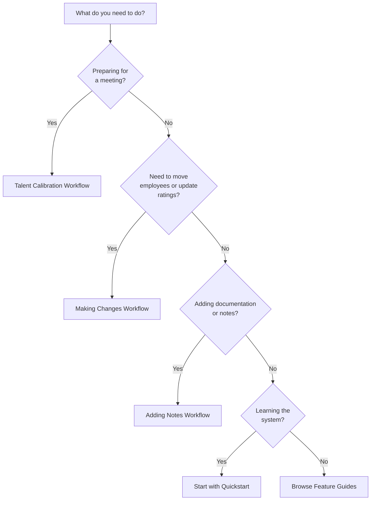

# Choosing Your Workflow

Not sure which guide to follow? This decision tree helps you find the right workflow for your current task.

---

## Quick Decision Tree

---

## When to Use Each Workflow

| Workflow | Best For | Time Required | Key Features Used |
|----------|----------|---------------|-------------------|
| **[2-Minute Quickstart](../quickstart.md)** | First-time users wanting to see the grid quickly | 2 minutes | Upload, basic viewing |
| **[Your First Calibration](../getting-started.md)** | Running your first calibration workflow | 10-15 minutes | Upload, review, change, export |
| **[Talent Calibration](talent-calibration.md)** | Preparing for or conducting calibration meetings | 20-90 minutes | Statistics, Intelligence, Donut Mode, Filters |
| **[Making Changes](making-changes.md)** | Moving employees to update ratings | 5-10 minutes | Drag-and-drop, change tracking |
| **[Adding Notes](adding-notes.md)** | Documenting decisions and creating audit trails | 5 minutes to learn | Changes tab, notes fields |

---

## Common Scenarios

### "I'm preparing for our quarterly talent review meeting"

→ **Follow: [Talent Calibration Workflow](talent-calibration.md)**

This comprehensive guide walks you through:

- Importing and validating current ratings
- Reviewing distribution for red flags
- Using Intelligence to spot anomalies
- Validating center box with Donut Mode
- Conducting the live meeting
- Exporting final calibrated ratings

**Time:** 20-30 minutes prep, 60-90 minutes meeting

---

### "I need to update someone's performance rating"

→ **Follow: [Making Changes Workflow](making-changes.md)**

Learn how to:

- Find and move employees on the grid
- Understand the orange border indicator
- Verify changes were recorded
- Handle multiple changes efficiently

**Time:** 5-10 minutes

---

### "I want to document why I moved this person"

→ **Follow: [Adding Notes Workflow](adding-notes.md)**

This guide shows you:

- When and why to add notes
- How to write effective documentation
- Where notes appear in exports
- Best practices for note-taking

**Time:** 5 minutes

---

### "I've never used 9Boxer before"

→ **Start with: [2-Minute Quickstart](../quickstart.md)**

Get to success fast:

- Upload your first file
- See your team on the grid
- Understand what you're looking at

**Then continue to:** [10-Minute Getting Started Guide](../getting-started.md) for the complete workflow.

---

### "I need to analyze my talent distribution"

→ **Use: [Statistics & Intelligence](../statistics.md)**

Not a workflow, but a feature you'll use:

- Review distribution statistics
- Identify rating anomalies
- Spot bias patterns
- Validate overall talent health

**Pairs well with:** Talent Calibration Workflow

---

### "I want to validate my center box placements"

→ **Use: [Donut Mode Exercise](../donut-mode.md)**

This validation technique helps:

- Identify mis-placed employees in position 5
- Find hidden stars or declining performers
- Quality-check your ratings
- Prepare discussion topics for calibration

**Best used during:** Talent Calibration Workflow preparation

---

## Decision Points by User Role

### HR Manager / Talent Lead

**Your typical tasks:**

- Running calibration sessions → [Talent Calibration Workflow](talent-calibration.md)
- Analyzing distributions → [Statistics & Intelligence](../statistics.md)
- Ensuring compliance → [Adding Notes Workflow](adding-notes.md)
- Validating ratings → [Donut Mode](../donut-mode.md)

---

### Department Head / Manager

**Your typical tasks:**

- Updating team ratings → [Making Changes Workflow](making-changes.md)
- Preparing for calibration → [Talent Calibration Workflow](talent-calibration.md) (Steps 1-5)
- Documenting decisions → [Adding Notes Workflow](adding-notes.md)
- Reviewing your team → [Filters](../filters.md) + [Statistics](../statistics.md)

---

### Executive / Senior Leader

**Your typical tasks:**

- Reviewing org-wide talent → [Statistics & Intelligence](../statistics.md)
- Succession planning → [Filters](../filters.md) (High Potential) + [Making Changes](making-changes.md)
- Final calibration approval → [Talent Calibration Workflow](talent-calibration.md) (review sections)
- Exporting for presentations → [Exporting Results](../exporting.md)

---

## Workflow Combinations

Often, you'll use multiple workflows together. Here are common combinations:

### Combo 1: Full Calibration Session

1. **[Talent Calibration Workflow](talent-calibration.md)** - Main guide
2. **[Making Changes Workflow](making-changes.md)** - Referenced during meeting
3. **[Adding Notes Workflow](adding-notes.md)** - Document all decisions
4. **[Exporting Results](../exporting.md)** - Save final ratings

**Total time:** 2-3 hours (prep + meeting + follow-up)

---

### Combo 2: Quick Rating Updates

1. **[Making Changes Workflow](making-changes.md)** - Move employees
2. **[Adding Notes Workflow](adding-notes.md)** - Document why
3. **[Exporting Results](../exporting.md)** - Save your work

**Total time:** 15-20 minutes

---

### Combo 3: First-Time User Journey

1. **[2-Minute Quickstart](../quickstart.md)** - Get started fast
2. **[Getting Started Guide](../getting-started.md)** - Learn complete workflow
3. **[Making Changes Workflow](making-changes.md)** - Practice moving employees
4. **[Understanding the Grid](../understanding-grid.md)** - Deepen knowledge

**Total time:** 30-40 minutes

---

## Still Not Sure?

### Answer These Questions:

1. **Have you uploaded data yet?**
   - No → Start with [2-Minute Quickstart](../quickstart.md)
   - Yes → Continue below

2. **Do you need to make changes right now?**
   - Yes → [Making Changes Workflow](making-changes.md)
   - No → Continue below

3. **Are you preparing for a meeting?**
   - Yes → [Talent Calibration Workflow](talent-calibration.md)
   - No → Continue below

4. **Do you want to learn how everything works?**
   - Yes → [Your First Calibration](../getting-started.md)
   - No → Browse [Common Tasks](../index.md#common-tasks)

---

## Need Help?

Can't find the right workflow?

- **[Troubleshooting Guide](../troubleshooting.md)** - Solve specific problems
- **[Tips & Best Practices](../tips.md)** - Expert recommendations
- **[Feature Comparison](../feature-comparison.md)** - Understand which feature does what

---

**Quick Links:**

- [← Back to Home](../index.md)
- [Common Tasks](../index.md#common-tasks)
- [Need Help?](../index.md#need-help)
